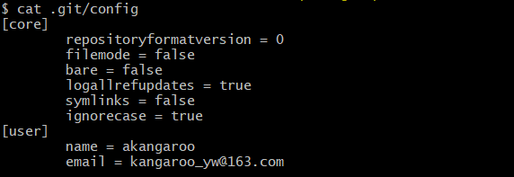
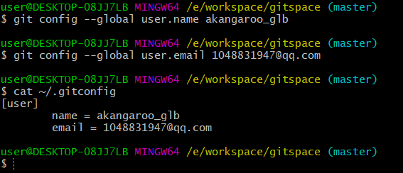
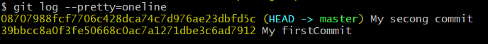
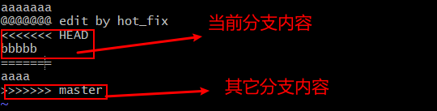

## 三大区域

- 工作区：写代码

- 暂存区：临时存储

- 本地库：历史版本

## 本地库操作

### 本地库初始化

命令： `git init`

### 设置签名

- 形式

  用户名：akangaroo

  邮箱：kangaroo_yw@163.com

- 作用：区别不同开发人员的身份

- 辨析：这里设置的签名和登录远程库（代码托管中心）的账号、密码没有任何关系

- 命令：

  - 项目级别/仓库级别：仅在当前本地库范围内有效
    - `git config user.name akangaroo`
    - `git config user.email kangaroo_yw@163.com`
  - 系统用户级别：登录当前操作系统的用户范围
    - `git config --global user.name akangaroo_glb`
    - `git config --global user.email kangaroo_yw@163.com`
  - 级别优先级：
    - 就近原则：项目级别优先于系统用户级别。
    - 二者都没有不允许，至少设置一个。

- 项目级别：`cat .git/config`查看



- 系统用户级别：`cat ~/.gitconfig`



### 基本操作

#### 添加，提交，查看状态

`git add [filename]`：将工作区的新建/修改添加到暂存区

`git rm --cached [filename]`：暂存区移除文件

`git commit -m "commit message" [filename]`：将暂存区的内容提交到本地库，并命名，[filename]也可以不写，一次性提交所有在暂存区的内容

`git status`：查看工作区，暂存区状态

#### 查看历史记录

`git log`：多屏显示方式，空格向下翻页，b向上翻页，q退出


`git log --pretty=oneline`



`git log --oneline`：只会显示历史版本


`git reflog`：HEAD@{移动当前版本需要的步数}


#### 前进后退

- 基于索引值操作

  ```shell
  git reset --hard [局部索引值]
  ```

- `^`只能后退

  ```shell
  git reset --hard HEAD^
  ```

  一个异或符号就是后退一步

- `~`只能后退

  ```shell
   # n代表后退n步
   git reset --hard HEAD~n
  ```

#### 删除文件找回

- 前提：删除前，文件存在时的状态提交到了本地库
- 操作：`git reset --hard` [指针位置]
  - 删除操作已经提交到本地库：指针位置指向历史记录
  - 删除操作尚未提交到本地库，指针位置使用HEAD

#### 比较文件差异

- `git diff [filename]`
  - 将**工作区**中的文件和**暂存区**中的进行比较
- `git diff [本地库中历史版本] [文件名] `
  - 将工作区中的文件和本地库历史记录进行比较
- 不带文件名比较多个文件
- `git diff HEAD -- [filename]`：比较工作区和版本库的最新版本

### 分支管理

- 什么是分支？

  在版本控制过程中，使用多条线同时推进多个任务。


- 创建分支

  `git branch [分支名]`

- 查看分支

  `git branch -v`

- 切换分支

  `git checkout [分支名]`

- 创建＋切换分支

  `git checkout -b [分支名]`

- 删除分支

  `git branch -d [分支名]`

- 合并分支

  - 第一步：切换到接受修改的分支（被合并，增加新内容）

    `git checkout [分支名]`

  - 第二步：执行merge命令

    `git merge [新内容的分支名]`

- 解决冲突

  - 冲突的表现

  

  - 冲突的解决
    - 第一步：编辑文件，删除特殊符号
    - 第二步：把文件修改到满意程度，保存退出
    - 第三步：git add [文件名]
    - 第四步：git commit -m "日志信息"
      - 注意：此时commit不用加文件名
  
  - `git log --graph`可以查看分支合并图
  
    ```shell
    git log --graph --pretty=oneline --abbrev-commit
    ```
  
    

### Git的文件管理机制

Git把数据看作是小型文件系统的一组快照。每次提交更新时Git都会对当前的全部文件制作一个快照并保存这个快照的索引。为了高效，如果文件没有修改，Git不再重新存储该文件，而是只保留一个链接指向之前存储的文件。所以Git的工作方式可以称之为快照流。

## 远程库操作

​	创建Github账户

​	创建新库`https://github.com/Akangaroo/GitTest.git`

- 起别名

  `git remote add origin https://github.com/Akangaroo/GitTest.git` ：创建新库的别名叫做origin

  `git remote -v`：查看连接的远程库

- 推送

  `git push origin master`

  推送时出现错误：重新设置本机git配置：`git config --global credential.helper store`

- 克隆

  `git clone https://github.com/Akangaroo/AkangarooNote.git`

  特点：

  完整的把远程库下载到本地

  创建AkangarooNote远程地址别名

  初始化本地库

- 拉取

  pull=fetch+merge

  `git fetch [远程库地址别名] [远程分支名]`

  `git merge [远程库地址别名/远程分支名]`
  
  > 多人协作中，如果push出现了问题，先pull，再push

- 变基

  rebase：pull后自动merge了别人的提交，产生了分叉，最后自动产生了一个merge后的新的提交版本

  解决办法push前使用rebase（过程就是：先把刚才自己提交版本临时保存，再把版本更新到最新远程，再把临时保存的提交重新提交）