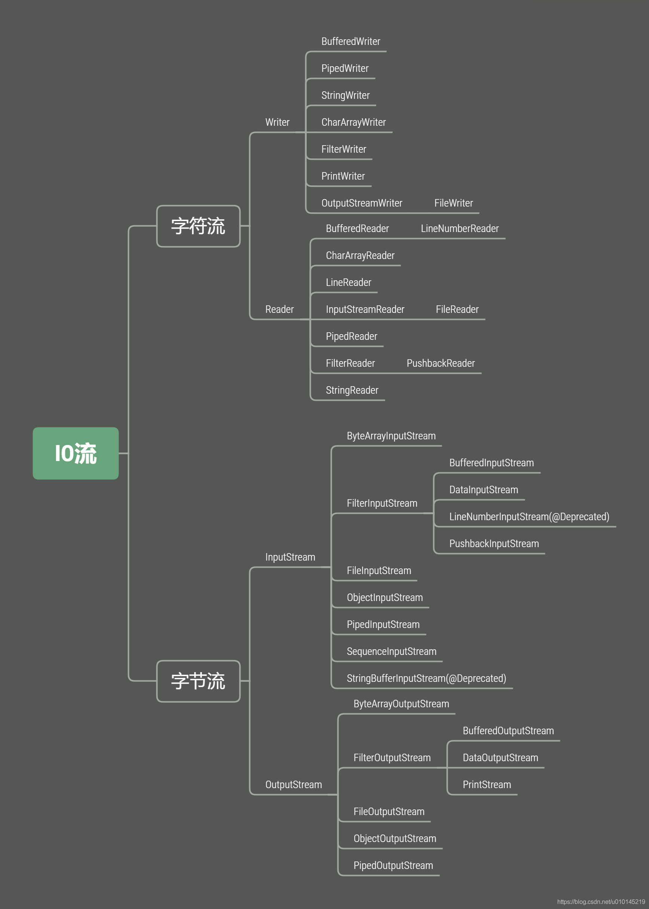

# 文件与IO



## IO介绍

IO流是一种流式的数据输入/输出模型：

- 二进制数据以`byte`为最小单位在`InputStream`/`OutputStream`中单向流动；
- 字符数据以`char`为最小单位在`Reader`/`Writer`中单向流动。

Java标准库的`java.io`包提供了同步IO功能：

- 字节流接口：`InputStream`/`OutputStream`；
- 字符流接口：`Reader`/`Writer`。

同步IO是指，读写IO时代码必须等待数据返回后才继续执行后续代码，它的优点是代码编写简单，缺点是CPU执行效率低。

而异步IO是指，读写IO时仅发出请求，然后立刻执行后续代码，它的优点是CPU执行效率高，缺点是代码编写复杂。

Java标准库的包`java.io`提供了同步IO，而`java.nio`则是异步IO。

## 文件

要构造一个`File`对象，需要传入文件路径

```java
public class Main {
    public static void main(String[] args) {
        File f = new File("C:\\Windows\\notepad.exe");
        System.out.println(f);
    }
}
```

注意Windows平台使用`\`作为路径分隔符，在Java字符串中需要用`\\`表示一个`\`。Linux平台使用`/`作为路径分隔符

如何获取目录和子文件夹：`list()`/`listFiles()`；

## InputStream

`InputStream`并不是一个接口，而是一个抽象类，它是所有输入流的超类。这个抽象类定义的一个最重要的方法就是

`int read()`

```java
public abstract class InputStream implements Closeable
```

在计算机中，类似文件、网络端口这些资源，都是由操作系统统一管理的。应用程序在运行的过程中，如果打开了一个文件进行读写，完成后要及时地关闭，以便让操作系统把资源释放掉，否则，应用程序占用的资源会越来越多，不但白白占用内存，还会影响其他应用程序的运行。

`InputStream`和`OutputStream`都是通过`close()`方法来关闭流，可以在finally中关闭流，更好的写法是利用Java 7引入的新的`try(resource)`的语法，只需要编写`try`语句，让编译器自动为我们关闭资源。

```java
public void readFile() throws IOException {
    try (InputStream input = new FileInputStream("src/readme.txt")) {
        int n;
        while ((n = input.read()) != -1) {
            System.out.println(n);
        }
    } // 编译器在此自动为我们写入finally并调用close()
}
```

实际上，编译器并不会特别地为`InputStream`加上自动关闭。编译器只看`try(resource = ...)`中的对象是否实现了`java.lang.AutoCloseable`接口，如果实现了，就自动加上`finally`语句并调用`close()`方法。`InputStream`和`OutputStream`都实现了这个接口，因此，都可以用在`try(resource)`中。

上方的InputStream实现了Closeable接口，Closeable实现了AutoCloseable接口。

- 缓冲

在读取流的时候，一次读取一个字节并不是最高效的方法，`InputStream`提供了两个重载方法来支持读取多个字节。

1. `int read(byte[] b)`：读取若干字节并填充到`byte[]`数组，返回读取的字节数
2. `int read(byte[] b, int off, int len)`：指定`byte[]`数组的偏移量和最大填充数

```java
public void readFile() throws IOException {
    try (InputStream input = new FileInputStream("src/readme.txt")) {
        // 定义1000个字节大小的缓冲区:
        byte[] buffer = new byte[1000];
        int n;
        while ((n = input.read(buffer)) != -1) { // 读取到缓冲区
            System.out.println("read " + n + " bytes.");
        }
    }
}
```

- 阻塞

```java
int n;
n = input.read(); // 必须等待read()方法返回才能执行下一行代码
int m = n;
```

- 实现类

`FileInputStream`实现了文件流输入；

`ByteArrayInputStream`在内存中模拟一个字节流输入。

## OutPutStream

和`InputStream`类似，`OutputStream`也是抽象类，它是所有输出流的超类。这个抽象类定义的一个最重要的方法就是

`void write(int b)`

签名如下：

```java
public abstract void write(int b) throws IOException;
```

这个方法会写入一个字节到输出流。要注意的是，虽然传入的是`int`参数，但只会写入一个字节，即只写入`int`最低8位表示字节的部分（相当于`b & 0xff`）。

`OutputStream`还提供了一个`flush()`方法，它的目的是将缓冲区的内容真正输出到目的地。调用`flush()`，不管当前缓冲区是否已满，强迫操作系统把缓冲区的内容立刻发送出去。

`write()`方法也是阻塞的

## Filter模式（装饰器模式）

装饰器模式（Decorator Pattern）允许向一个现有的对象添加新的功能，同时又不改变其结构。

[菜鸟教程](https://www.runoob.com/design-pattern/decorator-pattern.html)

```java
package cn.edu;

/**
 * 装饰器模式
 */
public interface Shape {
    void draw();
}
class Circle implements Shape {

    @Override
    public void draw() {
        System.out.println("i am Circle");
    }
}
class Rectangle implements Shape {

    @Override
    public void draw() {
        System.out.println("i am Rectangle");
    }
}
abstract class Decorator implements Shape {
    protected Shape needDecorator;

    public Decorator(Shape needDecorator) {
        this.needDecorator = needDecorator;
    }

    @Override
    public void draw() {
        needDecorator.draw();
    }
}
class RedDecorator extends Decorator {

    public RedDecorator(Shape needDecorator) {
        super(needDecorator);
    }

    @Override
    public void draw() {
        super.draw();
        setRed();
    }

    public void setRed(){
        System.out.println("SetRed");
    }
}
class BlueDecorator extends Decorator {

    public BlueDecorator(Shape needDecorator) {
        super(needDecorator);
    }

    @Override
    public void draw() {
        super.draw();
        setBlue();
    }

    public void setBlue(){
        System.out.println("SetBlue");
    }
}
class Test {
    public static void main(String[] args) {
        Shape circle = new Circle();
        Shape redCircle = new RedDecorator(circle);

        Shape rectangle = new Rectangle();
        Shape blueRectangle = new BlueDecorator(rectangle);

        System.out.println("circle normal");
        circle.draw();
        System.out.println();
        System.out.println("circle with red");
        redCircle.draw();
        System.out.println();
        System.out.println("rectangle normal");
        rectangle.draw();
        System.out.println();
        System.out.println("rectangle with blue");
        blueRectangle.draw();
    }
}

//运行结果如下
circle normal
i am Circle

circle with red
i am Circle
SetRed

rectangle normal
i am Rectangle

rectangle with blue
i am Rectangle
SetBlue

Process finished with exit code 0

```


当我们需要给一个“基础”`InputStream`附加各种功能时，我们先确定这个能提供数据源的`InputStream`，因为我们需要的数据总得来自某个地方，例如，`FileInputStream`，数据来源自文件

```java
InputStream file = new FileInputStream("test.gz");
```

紧接着，我们希望`FileInputStream`能提供缓冲的功能来提高读取的效率，因此我们用`BufferedInputStream`包装这个`InputStream`，得到的包装类型是`BufferedInputStream`，但它仍然被视为一个`InputStream`

```java
InputStream buffered = new BufferedInputStream(file);
```

最后，假设该文件已经用gzip压缩了，我们希望直接读取解压缩的内容，就可以再包装一个`GZIPInputStream`

```java
InputStream gzip = new GZIPInputStream(buffered);
```


上述这种通过一个“基础”组件再叠加各种“附加”功能组件的模式，称之为Filter模式（或者装饰器模式：Decorator）。

## 读取classpath资源

```java
public class HelloWorld {

    public static void main(String[] args) {
        try (InputStream input = HelloWorld.class.getClass().getResourceAsStream("/default.properties")) {
            if (input != null) {
                // TODO:
            }
        } catch (IOException e) {
            e.printStackTrace();
        }
    }

}
```

`Class`对象的`getResourceAsStream()`可以从classpath中读取指定资源；

根据classpath读取资源时，需要检查返回的`InputStream`是否为`null`

## 序列化

序列化是指把一个Java对象变成二进制内容，本质上就是一个`byte[]`数组。

一个Java对象要能序列化，必须实现一个特殊的`java.io.Serializable`接口，它的定义如下：

```java
public interface Serializable {
}
```

`Serializable`接口没有定义任何方法，它是一个空接口。我们把这样的空接口称为“标记接口”（Marker Interface），实现了标记接口的类仅仅是给自身贴了个“标记”，并没有增加任何方法。

Java序列化有关的流：`ObjectInputStream`，`ObjectOutputStream`

Java的序列化机制仅适用于Java，如果需要与其它语言交换数据，必须使用通用的序列化方法，例如JSON。

## Reader和Writer

`Reader`是Java的IO库提供的另一个输入流接口。和`InputStream`的区别是，`InputStream`是一个字节流，即以`byte`为单位读取，而`Reader`是一个字符流，即以`char`为单位读取。

| InputStream                         | Reader                                |
| ----------------------------------- | ------------------------------------- |
| 字节流，以`byte`为单位              | 字符流，以`char`为单位                |
| 读取字节（-1，0~255）：`int read()` | 读取字符（-1，0~65535）：`int read()` |
| 读到字节数组：`int read(byte[] b)`  | 读到字符数组：`int read(char[] c)`    |

```java
try (Reader reader = new FileReader("src/readme.txt", StandardCharsets.UTF_8) {
    // TODO
}
```

- CharArrayReader和StringReader

`CharArrayReader`可以在内存中模拟一个`Reader`，它的作用实际上是把一个`char[]`数组变成一个`Reader`，这和`ByteArrayInputStream`非常类似

`StringReader`可以直接把`String`作为数据源，它和`CharArrayReader`几乎一样

```java
try (Reader reader = new CharArrayReader("Hello".toCharArray())) {
}
```

```java
try (Reader reader = new StringReader("Hello")) {
}
```

- InputStreamReader

除了特殊的`CharArrayReader`和`StringReader`，普通的`Reader`实际上是基于`InputStream`构造的，因为`Reader`需要从`InputStream`中读入字节流（`byte`），然后，根据编码设置，再转换为`char`就可以实现字符流。

```java
try (Reader reader = new InputStreamReader(new FileInputStream("src/readme.txt"), "UTF-8")) {
    // TODO:
}

or
    
// 持有InputStream:
InputStream input = new FileInputStream("src/readme.txt");
// 变换为Reader:
Reader reader = new InputStreamReader(input, "UTF-8");
```

Writer也是同样的

## PrintStream和PrintWriter

`PrintStream`是一种`FilterOutputStream`

我们经常使用的`System.out.println()`实际上就是使用`PrintStream`打印各种数据。其中，`System.out`是系统默认提供的`PrintStream`，表示标准输出

`System.err`是系统默认提供的标准错误输出。

`PrintStream`和`OutputStream`相比，除了添加了一组`print()`/`println()`方法，可以打印各种数据类型，比较方便外，它还有一个额外的优点，就是不会抛出`IOException`。

- PrintWriter

`PrintStream`最终输出的总是byte数据，而`PrintWriter`则是扩展了`Writer`接口，它的`print()`/`println()`方法最终输出的是`char`数据。

```java
public class Main {
    public static void main(String[] args)     {
        StringWriter buffer = new StringWriter();
        try (PrintWriter pw = new PrintWriter(buffer)) {
            pw.println("Hello");
            pw.println(12345);
            pw.println(true);
        }
        System.out.println(buffer.toString());
    }
}
```