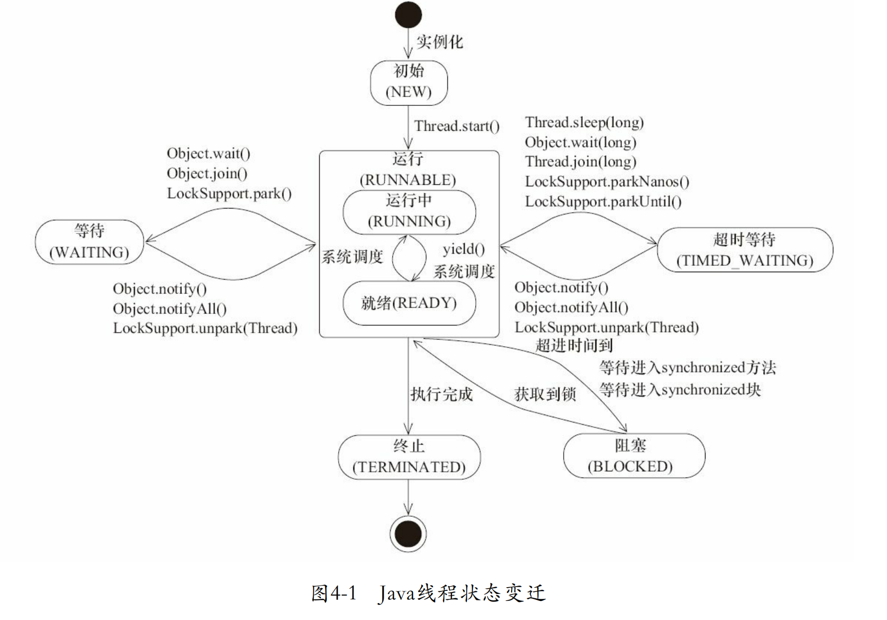
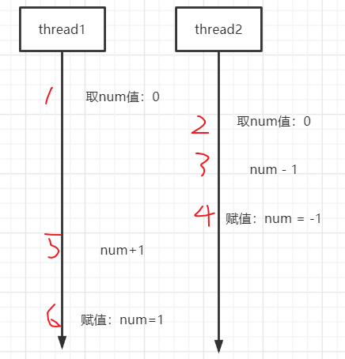

# 多线程基础

## 创建线程

Java用`Thread`对象表示一个线程，通过调用`start()`启动一个新线程；


1. 继承Thread类

   ```java
   public class Test {
       public static void main(String[] args) {
           Thread thread = new MyThread();
           thread.start();
       }
   }
   class MyThread extends Thread {
       @Override
       public void run() {
           System.out.println("启动一个线程");
       }
   }
   ```

2. 实现Runnable接口

   ```java
   public class Test {
       public static void main(String[] args) {
           Thread thread = new Thread(new MyRunnable());
           thread.start();
       }
   }
   class MyRunnable implements Runnable {
       @Override
       public void run() {
           System.out.println("启动一个线程");
       }
   }
   ```

   Java8可以使用lambda表达式创建

   ```java
   public class Test {
       public static void main(String[] args) {
           Thread t1 = new Thread(() -> {
               System.out.println("haha~~");
           }, "A");
           t1.start();
       }
   }
   ```

   

3. 实现Callable接口，对于Callable的说明，详见JUC

   ```java
   public class Test {
       public static void main(String[] args) throws ExecutionException, InterruptedException {
           FutureTask futureTask = new FutureTask(new MyCallable());
           Thread t = new Thread(futureTask);
           t.start();
           System.out.println(futureTask.get());
       }
   }
   class MyCallable implements Callable<Integer> {
   
       @Override
       public Integer call() throws Exception {
           System.out.println("启动一个线程");
           return 1024;
       }
   }
   
   运行结果：
   启动一个线程
   1024
   ```


对于Callable和Runnable，有三点不同之处：

1. 有无返回值
2. 是否可以抛出异常
3. call()方法和run()方法


## 线程状态

下面是`java.lang.Thread.State`枚举类中定义了六种线程的状态，可以调用线程Thread中的`getState()`方法**获取当前线程的状态**。

| 线程状态      | 解释                                                         |
| ------------- | ------------------------------------------------------------ |
| NEW           | 线程对象被创建后，就进入了新建状态。例如，Thread thread = new Thread()。 |
| RUNNABLE      | **就绪状态**（调用start，等待调度）+ **正在运行**            |
| BLOCKED       | **等待监视器锁**时，陷入阻塞状态                             |
| WAITING       | 等待状态的线程正在**等待**另一线程执行特定的操作（如notify） |
| TIMED_WAITING | 具有**指定等待时间**的等待状态                               |
| TERMINATED    | 线程完成执行，**终止状态**                                   |

下图源自《Java并发编程艺术》图4-1



## 常见线程方法

| 关键字      | 简介             |
| ----------- | ---------------- |
| sleep       | 当前线程暂停     |
| join        | 加入到当前线程中 |
| setPriority | 设置线程优先级   |
| yield       | 临时暂停         |
| setDaemon   | 守护线程         |

### sleep

`Thread.sleep(1000); `表示当前线程暂停1000毫秒 ，其他线程不受影响，该语句会抛出InterruptedException中断异常，因为当前线程sleep的时候，有可能被停止，这时就会抛出 InterruptedException

```java
public class Test {
    public static void main(String[] args) {
        Thread t = new Thread(new MyRunnable());
        t.start();

    }
}
class MyRunnable implements Runnable {
    @Override
    public void run() {
        int seconds = 0;
        while (true) {
            try {
                Thread.sleep(1000);
            } catch (InterruptedException e) {
                e.printStackTrace();
            }
            System.out.println("已经过去了" + ++seconds + "秒");
        }
    }
}
```

另外还有一种暂停的方法

```java
TimeUnit.SECONDS.sleep(4);
```


### join

所有进程，至少会有一个线程即主线程，即main方法开始执行，就会有一个**看不见**的主线程存在。

join可以理解为插队，如果没有`t.join();`那么`System.out.println("结束");`这一行语句可能不会在t线程运行结束再运行。

```java
public class Test {
    public static void main(String[] args) throws InterruptedException {
        Thread t = new Thread(new MyRunnable(), "A");
        t.start();
        t.join();
        System.out.println(Thread.currentThread().getName() + "运行结束");

    }
}
class MyRunnable implements Runnable {
    @Override
    public void run() {
        int seconds = 0;
        while (seconds < 3) {
            try {
                Thread.sleep(1000);
            } catch (InterruptedException e) {
                e.printStackTrace();
            }
            System.out.println(Thread.currentThread().getName() + "已经过去了" + ++seconds + "秒");
        }
    }
}

运行结果：
A已经过去了1秒
A已经过去了2秒
A已经过去了3秒
main运行结束
```

### setPriority

线程优先级从1-10，最小的为1，最大的为10，默认为5。可以通过getPriority();

```java
public class Test {
    public static void main(String[] args){
        Thread t1 = new Thread(() -> {
            int seconds = 0;
            while (seconds < 5) {
                System.out.println(Thread.currentThread().getName() + "已经过去了" + ++seconds + "秒");
            }
        }, "A");
        Thread t2 = new Thread(() -> {
            int seconds = 0;
            while (seconds < 5) {
                System.out.println(Thread.currentThread().getName() + "已经过去了" + ++seconds + "秒");
            }
        }, "B");
        t1.setPriority(Thread.MAX_PRIORITY);
        t2.setPriority(Thread.MIN_PRIORITY);
        t1.start();
        t2.start();
    }
}
```

### yield

临时暂停

```java
public class Test {
    public static void main(String[] args){
        Thread t1 = new Thread(() -> {
            int seconds = 0;
            while (seconds < 5) {
                System.out.println(Thread.currentThread().getName() + "已经过去了" + ++seconds + "秒");
            }
        }, "A");
        Thread t2 = new Thread(() -> {
            int seconds = 0;
            while (seconds < 5) {
                Thread.yield();
                System.out.println(Thread.currentThread().getName() + "已经过去了" + ++seconds + "秒");
            }
        }, "B");
        t1.setPriority(Thread.NORM_PRIORITY);
        t2.setPriority(Thread.NORM_PRIORITY);
        t1.start();
        t2.start();

    }
}
```

### setDaemon

守护线程是为其他线程服务的线程。

在JVM中，所有非守护线程都执行完毕后，无论有没有守护线程，虚拟机都会自动退出。

守护线程通常会被用来做日志，性能统计等工作。

```java
Thread t = new MyThread();
t.setDaemon(true);
t.start();
```


## 线程同步

多个线程同时读写共享变量的时候，会出现数据不一致的问题。

如下述代码所示，两个线程同时操作一个资源时，一个自增，一个自减，循环1000次，按道理来说应该是0，实际上最后的结果不一定为0。

```java
public class Test 
    public static void main(String[] args) throws InterruptedException {
        Thread t1 = new Thread(() -> {
            for (int i = 0; i < 1000; i++) {
                ++Count.num;
            }
        }, "A");
        Thread t2 = new Thread(() -> {
            for (int i = 0; i < 1000; i++) {
                ++Count.num;
            }
        }, "A");
        t1.start();
        t2.start();
        t1.join();
        t2.join();
        System.out.println("over，num = " + Count.num);
    }
}

class Count {
    public static int num = 0;
}
```

这是因为++Count.num操作是不具有原子性的，所谓**原子性操作是指不可中断的操作**，比如赋值操作，**原子操作是线程安全的**。

```java
int n = 1;
```

而++Count.num这个操作，实际上由三个原子操作组成

> 1. 取num的值
> 2. num + 1
> 3. 把新值赋予 num

举例：

假如t1线程取num的值，还没有进行第二步操作，t2线程也取了num的值，此时线程就是不安全的。

如下图所示，两个线程一个自增一个自减，最终结果为1.




Java程序可以使用`synchronized`关键字**对一个对象**进行加锁。

```java
public class Test {
    public static void main(String[] args) throws InterruptedException {
        Thread t1 = new Thread(() -> {
            synchronized (Count.num) {
                for (int i = 0; i < 100; i++) {
                    ++Count.num;
                }
            }

        }, "A");
        Thread t2 = new Thread(() -> {
            synchronized (Count.num) {
                for (int i = 0; i < 100; i++) {
                    --Count.num;
                }
            }
        }, "B");
        t1.start();
        t2.start();
        t1.join();
        t2.join();
        System.out.println("over，num = " + Count.num);
    }
}

class Count {
    public static Integer num = 0;
}
```


## 同步方法

因为`synchronized`锁住的是一个对象，让线程自己选择锁对象往往会使得代码逻辑混乱，也不利于封装。建议把`synchronized`逻辑封装起来。

```java
public class Test {
    public static void main(String[] args) throws InterruptedException {
        Count count = new Count();

        Thread t1 = new Thread(() -> {
            for (int i = 0; i < 100; i++) {
                count.add();
            }
        });

        Thread t2 = new Thread(() -> {
            for (int i = 0; i < 100; i++) {
                count.dec();
            }
        });

        t1.start();
        t2.start();
        t1.join();
        t2.join();
        System.out.println(count.get());
    }
}

class Count {
    public static Integer num = 0;

    public void add() {
        synchronized (this) {
            ++this.num;
        }
    }

    public void dec() {
        synchronized (this) {
            --this.num;
        }
    }

    public int get() {
        return this.num;
    }
} 
```

上述代码中，`synchronized`锁住的对象是`this`，即是当前实例，下面两种写法是等价的。

```java
public void add() {
    synchronized(this) {
        ++this.num;
    } 
}
```

```java
public synchronized void add() { 
    ++this.num;
} 
```


如果对一个静态方法使用`synchronized`修饰时，对于静态方法，是没有`this`实例的，因为静态方法是针对类而不是实例，所以对静态方法添加`synchronized`，锁住的是该类的`Class`实例，即下面两者是相等的。

```java
    public synchronized static void add() {
        // ...
    }
```

```java
    public static void add() {
        synchronized (Count.class) {
            // ...
        }
    }
```


## 死锁

在死锁之前，首先要知道可重入锁的概念。

Java的线程锁是可重入的锁。可重入锁意味着能被同一个线程反复获取的锁，就叫做可重入锁，如下代码所示

```java
public class Test {
    public static void main(String[] args)  {
        new Thread(new Runnable() {
            @Override
            public void run() {
                synchronized (this) {
                    System.out.println("第1次获取锁，这个锁是：" + this);
                    int index = 1;
                    while (true) {
                        synchronized (this) {
                            System.out.println("第" + (++index) + "次获取锁，这个锁是：" + this);
                        }
                        if (index == 5) {
                            break;
                        }
                    }
                }
            }
        }).start();
    }
}
```

上述代码如果使用lambda表达式创建，会出现语法报错，因为**lambda表达式中的this指向的是所在外部类，而匿名内部类中this指的是匿名内部类当前对象。**

```java
        new Thread(()->{
            synchronized (this){ // 此处报错
                // do something
            }
        }).start();
```


一个线程可以获取一个锁后，再继续获取另一个锁，如下代码可能发生死锁。

```java
public class Test {
    public static void main(String[] args) {
        Zone z1 = new Zone("z1");
        Zone z2 = new Zone("z2");

        new Thread(()->{
            synchronized (z1) {
                System.out.println("占据z1");
                try {
                    Thread.sleep(100);
                } catch (InterruptedException e) {
                    e.printStackTrace();
                }
                System.out.println("尝试占据z2");
                synchronized (z2) {
                    System.out.println("成功占据z2");
                }
            }
        }).start();

        new Thread(()->{
            synchronized (z2) {
                System.out.println("占据z2");
                try {
                    Thread.sleep(100);
                } catch (InterruptedException e) {
                    e.printStackTrace();
                }
                System.out.println("尝试占据z1");
                synchronized (z1) {
                    System.out.println("成功占据z1");
                }
            }
        }).start();
    }
}
class Zone {
    String name;

    public Zone(String name) {
        this.name = name;
    }
}
```

如何解决，使两个线程获取的锁的顺序一致即可。

```java
public class Test {
    public static void main(String[] args) {
        Zone z1 = new Zone("z1");
        Zone z2 = new Zone("z2");

        new Thread(()->{
            synchronized (z1) {
                System.out.println("占据z1");
                try {
                    Thread.sleep(100);
                } catch (InterruptedException e) {
                    e.printStackTrace();
                }
                System.out.println("尝试占据z2");
                synchronized (z2) {
                    System.out.println("成功占据z2");
                }
            }
        }).start();

        new Thread(()->{
            synchronized (z1) {
                System.out.println("占据z1");
                try {
                    Thread.sleep(100);
                } catch (InterruptedException e) {
                    e.printStackTrace();
                }
                System.out.println("尝试占据z2");
                synchronized (z2) {
                    System.out.println("成功占据z2");
                }
            }
        }).start();
    }
}
class Zone {
    String name;

    public Zone(String name) {
        this.name = name;
    }
}
```


## 线程交互(wait和notify)

百度百科：生产者消费者问题（英语：Producer-consumer problem），也称有限缓冲问题（英语：Bounded-buffer problem），是一个多线程同步问题的经典案例。该问题描述了两个共享固定大小缓冲区的线程——即所谓的“生产者”和“消费者”——在实际运行时会发生的问题。生产者的主要作用是生成一定量的数据放到缓冲区中，然后重复此过程。与此同时，消费者也在缓冲区消耗这些数据。该问题的关键就是要保证生产者不会在缓冲区满时加入数据，消费者也不会在缓冲区中空时消耗数据。

java中使用wait和notify来解决线程交互的问题

```java
public class Test {
    public static void main(String[] args) {
        TaskQueue taskQueue = new TaskQueue();
        new Thread(() -> {
            for (int i = 0; i < 20; i++) {
                try {
                    Thread.sleep(10);
                    taskQueue.put();
                } catch (InterruptedException e) {
                    e.printStackTrace();
                }
            }
        }, "生产者").start();
        new Thread(() -> {
            for (int i = 0; i < 20; i++) {
                try {
                    Thread.sleep(100);
                    taskQueue.get();
                } catch (InterruptedException e) {
                    e.printStackTrace();
                }
            }
        }, "消费者").start();
    }
}

class TaskQueue {
    private LinkedList<Integer> list = new LinkedList<>();
    private static int MAX_SIZE = 10;

    public synchronized void put() throws InterruptedException {
        // 判断
        while (list.size() == MAX_SIZE) {
            System.out.println("容量已满~~");
            this.wait();
        }
        // 添加
        int item = (int) (Math.random() * 10);
        list.add(item);
        System.out.println(Thread.currentThread().getName() + "添加了" + item);
        // 通知
        this.notifyAll();
    }

    public synchronized void get() throws InterruptedException {
        // 判断
        while (list.isEmpty()) {
            this.wait();
        }
        // 消费
        Integer remove = list.remove();
        System.out.println(Thread.currentThread().getName() + "消费了" + remove);
        // 通知
        this.notifyAll();
    }
}

```


## 参考

[可重入锁详解（什么是可重入）](https://blog.csdn.net/u010434924/article/details/46332953)

[Java教程](https://www.liaoxuefeng.com/wiki/1252599548343744)

[Lambda表达式和匿名内部类](https://blog.csdn.net/u013096088/article/details/70475981)