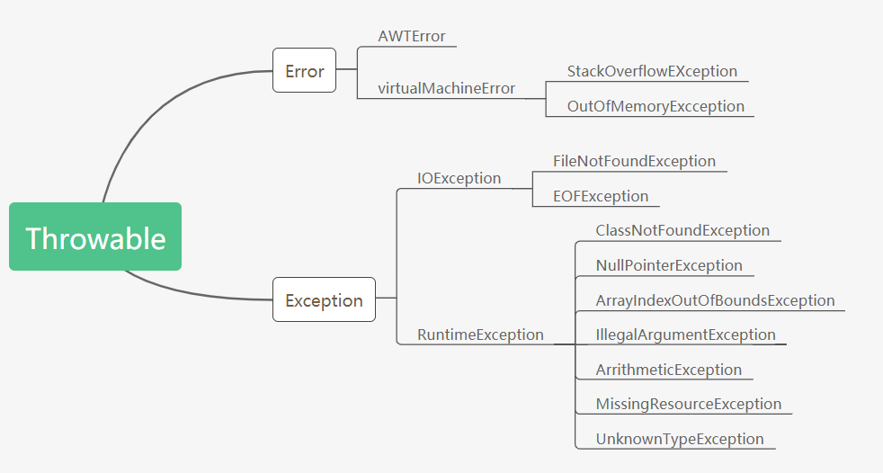

# 异常处理

## 异常的体系结构




Throwable是异常体系的根，Error和Exception继承自它

Error表示严重的错误，是由JVM产生和抛出的，无需我们处理。

Exception是程序本身可以处理的异常，这种异常分两大类运行时异常和非运行时异常。程序中应当尽可能去处理这些异常。

java规定：

1. 必须捕获的异常，包括`Exception`及其子类，但不包括`RuntimeException`及其子类，这种类型的异常称为`Checked Exception`。
2. 不需要捕获的异常，包括`Error`及其子类，`RuntimeException`及其子类。

## 异常的捕获

1. 捕获异常使用`try...catch`语句，把可能发生异常的代码放到`try {...}`中，然后使用`catch`捕获对应的`Exception`及其子类。

2. 多`catch`语句：`catch`的顺序非常重要，子类必须写在前面。

3. `finally`语句块保证有无错误都会执行
   - `finally`语句不是必须的，可写可不写；
   - `finally`总是最后执行。

## 异常的抛出

1. 当某个方法抛出了异常时，如果当前方法没有捕获异常，异常就会被抛到上层调用方法，直到遇到某个`try ... catch`被捕获为止

2. 通过`printStackTrace()`可以打印出方法的调用栈

   ```java
   java.lang.NumberFormatException: null
       at java.base/java.lang.Integer.parseInt(Integer.java:614)
       at java.base/java.lang.Integer.parseInt(Integer.java:770)
       at Main.process2(Main.java:16)
       at Main.process1(Main.java:12)
       at Main.main(Main.java:5)
   ```

   `printStackTrace()`对于调试错误非常有用，上述信息表示：`NumberFormatException`是在`java.lang.Integer.parseInt`方法中被抛出的，从下往上看，调用层次依次是:

   1. `main()`调用`process1()`；
   2. `process1()`调用`process2()`；
   3. `process2()`调用`Integer.parseInt(String)`；
   4. `Integer.parseInt(String)`调用`Integer.parseInt(String, int)`。

3. throw和throws的区别：

   - throw：一个具体的动作

     ```java
     throw new RuntimeException("找不到");
     ```

   - throw：声明将要抛出哪个异常

     ```java
     public String hello throws IOException(){
         ...
     }
     ```

## 自定义异常

1. 一般选择继承自RuntimeException

   ```java
   public class BaseException extends RuntimeException {
       ...
   }
   ```