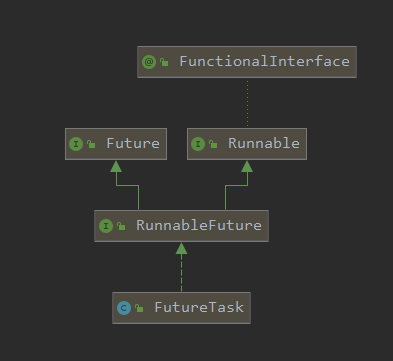

# Callable

## 是什么

Callable 接口类似于 Runnable，两者都是为那些其实例可能被另一个线程执行的类设计的。但是 Runnable 不会返回结果，并且无法抛出经过检查的异常。


## 设计思想

如果要启动一个线程，一般是`new thread(new Runnable()).start()`，但是没法传入`Callable()`。如下图所示，RunnableFuture同时实现了Runnable和Future接口，而FutureTask又实现了RunnableFuture接口。



所以如果想启动一个线程，需要通过`RunnableFuture`接口和`FutureTask`实现类。

`FutureTask`实现类构造方法中有

```java
FutureTask(Callable<V> callable)
// 创建一个 FutureTask，一旦运行就执行给定的 Callable。
FutureTask(Runnable runnable, V result)
// 创建一个 FutureTask，一旦运行就执行给定的 Runnable，并安排成功完成时 get 返回给定的结果 。    
```

可以传入一个Callable。

然后再将`FutureTask`传入new thread()中。

涉及到的知识点：Java多态，面向接口编程。


## 与Runnable的区别

Callable和Runnable的区别：

- 有返回值
- 可能存在异常
- call()方法和run()方法

## FutureTask

未来任务，用它就干一件事，异步调用
main方法就像一个冰糖葫芦，一个个方法由main串起来。


例子：

1. 老师上着课，口渴了，去买水不合适，讲课线程继续，我可以单起个线程找班长帮忙买水，
   水买回来了放桌上，我需要的时候再去get。
2. 4个同学，A算1+20,B算21+30,C算31*到40,D算41+50，是不是C的计算量有点大啊，
   FutureTask单起个线程给C计算，我先汇总ABD，最后等C计算完了再汇总C，拿到最终结果


> 在主线程中需要执行比较耗时的操作时，但又不想阻塞主线程时，可以把这些作业交给Future对象在后台完成，当主线程将来需要时，就可以通过Future对象获得后台作业的计算结果或者执行状态。
>
> 一般FutureTask多用于耗时的计算，主线程可以在完成自己的任务后，再去获取结果。
>
> 仅在计算完成时才能检索结果；如果计算尚未完成，则阻塞 get 方法。一旦计算完成，就不能再重新开始或取消计算。get方法而获取结果只有在计算完成时获取，否则会一直阻塞直到任务转入完成状态，然后会返回结果或者抛出异常。 
>
> 只计算一次
>
> get方法放到最后


```java
class MyThread implements Callable<Integer> {

    @Override
    public Integer call() throws Exception { // 有返回值，call()方法，抛出异常
        System.out.println("****come in here");
        return 1024;
    }
}

public class CallableDemo {
    public static void main(String[] args) throws ExecutionException, InterruptedException {
        FutureTask futureTask = new FutureTask(new MyThread());
        new Thread(futureTask, "A").start();
        System.out.println(futureTask.get());// 不能放在上一行，放在最后一行
    }

}
```


