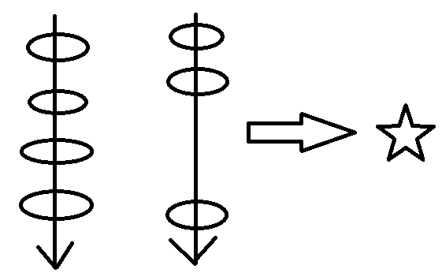

# JUC

## JUC是什么？

`java.util.concurrent`在并发编程中使用的工具类

### 线程状态


还有一种说法是：

1. 新建（NEW）：线程对象被创建后，就进入了新建状态。例如，Thread thread = new Thread()。
2. 就绪（RUNNABLE）：也被称为“可执行状态”。线程对象被创建后，其它线程调用了该对象的start()方法，从而来启动该线程。例如，thread.start()。处于就绪状态的线程，随时可能被CPU调度执行。
3. 运行（RUNNING）：线程获取CPU权限进行执行。需要注意的是，线程只能从就绪状态进入到运行状态。
4. 阻塞（BLOCKED）： 阻塞状态是线程因为某种原因放弃CPU使用权，暂时停止运行。直到线程进入就绪状态，才有机会转到运行状态。
5. 死亡（DEAD）：线程执行完了或者因异常退出了run()方法，该线程结束生命周期。


## Lock接口

`java.util.concurrent.locks` 包下的。

多线程编程：**线程** **操作** **资源类**

​	实现步骤：1. 创建资源类，2. 资源类里创建同步方法，同步代码块。

​	这样用来达到**高内聚低耦合**的目的。


### ReentrantLock可重入锁

Lock的实现类。

可重入锁：什么是 “可重入”，可重入就是说某个线程已经获得某个锁，可以再次获取锁而不会出现死锁。

[可重入锁介绍](https://blog.csdn.net/w8y56f/article/details/89554060)

```java
class X {
   private final Lock lock = new ReentrantLock();
   // ...
 
   public void m() {
     lock.lock();  // 
     try {
       // ... method body
     } finally {
       lock.unlock(); // 释放锁
     }
   }
 }

```

### synchronized和Lock区别

| synchronized                                                 | Lock                                                         |
| ------------------------------------------------------------ | ------------------------------------------------------------ |
| java内置关键字                                               | java类                                                       |
| 无法判断是否获取锁的状态                                     | 可以判断是否获取到锁（tryLock()方法）                        |
| synchronized会自动释放锁(a 线程执行完同步代码会释放锁 ；b 线程执行过程中发生异常会释放锁) | Lock需在finally中手工释放锁（unlock()方法释放锁），否则容易造成线程死锁 |
| 用synchronized关键字的两个线程1和线程2，如果当前线程1获得锁，线程2线程等待。如果线程1阻塞，线程2则会一直等待下去 | Lock锁就不一定会等待下去，如果尝试获取不到锁，线程可以不用一直等待就结束了 |
| synchronized的锁可重入、不可中断、非公平                     | Lock锁可重入、可判断、可公平                                 |
| synchronized锁适合代码少量的同步问题                         | Lock锁适合大量同步的代码的同步问题                           |


```java
Lock lock = ...;
if(lock.tryLock()) {
      try{
         //处理任务
　　 }catch(Exception ex){
     }finally{
          lock.unlock();   //释放锁
　　}
}else {
  //如果不能获取锁，则直接做其他事情
}
```


> 通过`public static native boolean holdsLock(Object obj);`方法可以判断当前线程是否获取到锁。
>
> ```java
> public class Demo02 {
> 
>     private static  Object lock = new Object();
> 
>     public static void main(String[] args) {
>         new Thread(() -> {
>             synchronized (lock) {
>                 System.out.println("A:" + Thread.holdsLock(lock));
>             }
>         }, "A").start();
>         System.out.println("main:" + Thread.holdsLock(lock));
>     }
> }
> 
> 结果：
> main:false
> A:true
> 
> 结论：
> 判断的是当前线程是否持有锁
> ```


### SaleTicket


```java
class Ticket {

    private int number = 30;
    private Lock lock = new ReentrantLock();

    public void saleTicket() {
        lock.lock();
        try {
            if (number > 0) {
                System.out.println(Thread.currentThread().getName() + "---" + number--);
            }
        } catch (Exception e) {
            e.printStackTrace();
        } finally {
            lock.unlock();
        }
    }
}

public class SaleTicket {
    public static void main(String[] args) {
        Ticket t = new Ticket();
        new Thread(() -> { for (int i = 0; i < 40; i++) { t.saleTicket(); } }, "AA").start();
        new Thread(() -> { for (int i = 0; i < 40; i++) { t.saleTicket(); } }, "BB").start();
        new Thread(() -> { for (int i = 0; i < 40; i++) { t.saleTicket(); } }, "CC").start();
    }
}

```


## 线程间通信

### 面试题

两个线程，一个线程打印1-52，另一个打印字母A-Z打印顺序为12A34B...5152Z,
要求用线程间通信

```java
class Print {
    private Integer count = 1;
    private Integer num = 1;
    private char letter = 'A';

    public synchronized void printNum() throws InterruptedException {
        while (count % 3 == 0) {
            this.wait();
        }
        count++;
        System.out.print(num++);
        this.notifyAll();
    }

    public synchronized void printLetter() throws InterruptedException {
        while (count % 3 != 0) {
            this.wait();
        }
        count++;
        System.out.print(letter++);
        this.notifyAll();
    }
}

public class Test {
    public static void main(String[] args) {
        Print print = new Print();

        new Thread(() -> {
            for (int i = 0; i < 52; i++) {
                try {
                    print.printNum();
                } catch (InterruptedException e) {
                    e.printStackTrace();
                }
            }
        }).start();

        new Thread(() -> {
            for (int i = 0; i < 26; i++) {
                try {
                    print.printLetter();
                } catch (InterruptedException e) {
                    e.printStackTrace();
                }
            }
        }).start();

    }
}

```


多线程的编程模板：

1. 判断
2. 干活
3. 通知


### synchronized实现

需求：多线程操作资源类，一个+1，另外一个-1。

```java
class Item {
    private int number = 0;

    public synchronized void increment() throws InterruptedException {
        // 判断
        while (number != 0) {
            this.wait();
        }
        // 干活
        this.number++;
        System.out.println(Thread.currentThread().getName() + "-->" + number);
        // 通知
        this.notifyAll();
    }

    public synchronized void decrement() throws InterruptedException {
        // 判断
        while (number == 0) {
            this.wait();
        }
        // 干活
        this.number--;
        System.out.println(Thread.currentThread().getName() + "-->" + number);
        // 通知
        this.notifyAll();
    }
}
public class ThreadWaitNotify {
    public static void main(String[] args) {
        Item item = new Item();
        new Thread(() -> {
            for (int i = 0; i < 10; i++) {
                try {
                    Thread.sleep(400);
                    item.increment();
                } catch (InterruptedException e) {
                    e.printStackTrace();
                }
            }
        }, "A").start();
        new Thread(() -> {
            for (int i = 0; i < 10; i++) {
                try {
                    Thread.sleep(400);
                    item.decrement();
                } catch (InterruptedException e) {
                    e.printStackTrace();
                }
            }
        }, "B").start();
        new Thread(() -> {
            for (int i = 0; i < 10; i++) {
                try {
                    Thread.sleep(400);
                    item.decrement();
                } catch (InterruptedException e) {
                    e.printStackTrace();
                }
            }
        }, "C").start();
        new Thread(() -> {
            for (int i = 0; i < 10; i++) {
                try {
                    Thread.sleep(400);
                    item.increment();
                } catch (InterruptedException e) {
                    e.printStackTrace();
                }
            }
        }, "D").start();
    }
}

```


注意：**判断的时候用while而不能使用if**。

原因：因为线程同步必需保证获得锁后从上到下完整的执行,如wait()期间,另外线程notify()后,不能保证获得锁后条件是否成立。

例子：考虑两个+1线程的同样的方法**先后获得了锁**，然后都调用了wait进入阻塞队列（wait会释放锁），然后-1线程消耗了一个资源后唤醒所有。如果使用if的话，那么两个线程就不会判断，直接再次+1。这时候需要再进行一次判断，即当wait()被唤醒之后，再次判断一遍条件是否成立，所以需要使用while。


Synchronized实现使用`wait`和`notify`来进行线程间的通信。

### Lock实现

`Condition` 将 `Object` 监视器方法（`wait`、`notify` 和 `notifyAll`）分解成截然不同的对象，以便通过将这些对象与任意 `Lock` 实现组合使用，为每个对象提供多个等待 set（wait-set）。其中，`Lock` 替代了 `synchronized` 方法和语句的使用，`Condition` 替代了 Object 监视器方法的使用。

```java
class Item2 {
    private int number = 0;//初始值为零的一个变量

    private Lock lock = new ReentrantLock();
    private Condition condition = lock.newCondition();

    public void increment() throws InterruptedException {

        lock.lock();
        try {
            while (number != 0) {
                condition.await();
            }
            ++number;
            System.out.println(Thread.currentThread().getName() + " \t " + number);
            condition.signalAll();
        } catch (Exception e) {
            e.printStackTrace();
        } finally {
            lock.unlock();
        }
    }


    public void decrement() throws InterruptedException {
        lock.lock();
        try {
            while (number != 1) {
                condition.await();
            }
            --number;
            System.out.println(Thread.currentThread().getName() + " \t " + number);
            //通知
            condition.signalAll();
        } catch (Exception e) {
            e.printStackTrace();
        } finally {
            lock.unlock();
        }
    }
    
}

```


### 精准通知精准唤醒

需求：

多个线程间按顺序调用，实现A-B-C

三个线程启动，要求如下：

AA打印5次，BB打印10次，CC打印15次

```java
public class ThreadOrderAccess {
    public static void main(String[] args) {
        ShareResource shareResource = new ShareResource();

        new Thread(() -> {
            shareResource.print5();
        }, "A").start();
        new Thread(() -> {
            shareResource.print10();
        }, "B").start();
        new Thread(() -> {
            shareResource.print15();
        }, "C").start();
    }
}
class ShareResource {
    private int number = 1; // 1:A,2:B,3:C
    private Lock lock = new ReentrantLock();
    private Condition condition1 = lock.newCondition();
    private Condition condition2 = lock.newCondition();
    private Condition condition3 = lock.newCondition();
	
    // 打印五次
    public void print5() {
        lock.lock();
        try {
            while (number != 1) {
                condition1.await();
            }
            for (int i = 0; i < 5; i++) {
                System.out.println(Thread.currentThread().getName() + "-->" + number);
            }
            number = 2;
            condition2.signal();// 这时候只唤醒number等于2的
        } catch (Exception e) {
            e.printStackTrace();
        } finally {
            lock.unlock();
        }
    }
    // 打印10次
    public void print10() {
        lock.lock();
        try {
            while (number != 2) {
                condition2.await();
            }
            for (int i = 0; i < 10; i++) {
                System.out.println(Thread.currentThread().getName() + "-->" + number);
            }
            number = 3;
            condition3.signal();
        } catch (Exception e) {
            e.printStackTrace();
        } finally {
            lock.unlock();
        }
    }
    
    // 打印15次
    public void print15() {
        lock.lock();
        try {
            while (number != 3) {
                condition3.await();
            }
            for (int i = 0; i < 15; i++) {
                System.out.println(Thread.currentThread().getName() + "-->" + number);
            }
            number = 1;
            condition1.signal();
        } catch (Exception e) {
            e.printStackTrace();
        } finally {
            lock.unlock();
        }
    }
}


程序运行结果：
A-->1
A-->1
A-->1
A-->1
A-->1
B-->2
B-->2
B-->2
B-->2
B-->2
B-->2
B-->2
B-->2
B-->2
B-->2
C-->3
C-->3
C-->3
C-->3
C-->3
C-->3
C-->3
C-->3
C-->3
C-->3
C-->3
C-->3
C-->3
C-->3
C-->3
```


## 多线程锁的问题


7. one是静态同步方法，two是普通同步方法，一部手机，请问先打印one还是two

   ---sendTwo
   ---sendOne

8. one是静态同步方法，two是普通同步方法，两部手机，请问先打印one还是two

   ---sendTwo
   ---sendOne

   


### 标准访问，无暂停

```java
class Phone {
    public synchronized void sendOne() throws Exception {
        System.out.println("---sendOne");
    }

    public synchronized void sendTwo() throws Exception {
        System.out.println("---sendTwo");
    }
}
public class Lock8 {
    public static void main(String[] args) throws InterruptedException {
        Phone phone = new Phone();

        new Thread(() -> {
            try {
                phone.sendOne();
            } catch (Exception e) {
                e.printStackTrace();
            }
        }, "One").start();

        Thread.sleep(200);

        new Thread(() -> {
            try {
                phone.sendTwo();
            } catch (Exception e) {
                e.printStackTrace();
            }
        }, "Two").start();
    }
}

结果：
---sendOne
---sendTwo
    中间加了sleep，所以才会出现这样的情况。一般来说，不能确定。
```


### One方法暂停

```java
class Phone {
    public synchronized void sendOne() throws Exception {
        try {
            TimeUnit.SECONDS.sleep(4);
        } catch (InterruptedException e) {
            e.printStackTrace();
        }
        System.out.println("---sendOne");
    }

    public synchronized void sendTwo() throws Exception {
        System.out.println("---sendTwo");
    }
}
public class Lock8 {
    public static void main(String[] args) throws InterruptedException {
        Phone phone = new Phone();

        new Thread(() -> {
            try {
                phone.sendOne();
            } catch (Exception e) {
                e.printStackTrace();
            }
        }, "One").start();

        Thread.sleep(200);

        new Thread(() -> {
            try {
                phone.sendTwo();
            } catch (Exception e) {
                e.printStackTrace();
            }
        }, "Two").start();
    }
}

结果：
---sendOne
---sendTwo
```

原因：**一个对象里面如果有多个synchronized方法，某一时刻内，只能有一个线程去调用其中的一个synchronized方法。因为synchronized锁的是当前对象this，被锁定后，其它线程都不能进入到当前对象的其它synchronized方法。**


### 普通方法hello()和One()

```java
class Phone {
    public synchronized void sendOne() throws Exception {
        try {
            TimeUnit.SECONDS.sleep(4);
        } catch (InterruptedException e) {
            e.printStackTrace();
        }
        System.out.println("---sendOne");
    }

    public synchronized void sendTwo() throws Exception {
        System.out.println("---sendTwo");
    }

    public void hello() {
        System.out.println("----hello");
    }
}
public class Lock8 {
    public static void main(String[] args) throws InterruptedException {
        Phone phone = new Phone();

        new Thread(() -> {
            try {
                phone.sendOne();
            } catch (Exception e) {
                e.printStackTrace();
            }
        }, "One").start();

        Thread.sleep(100);

        new Thread(() -> {
            try {
                // phone.sendTwo();
                phone.hello();
            } catch (Exception e) {
                e.printStackTrace();
            }
        }, "Two").start();
    }
}

结果：
----hello
---sendOne
```

原因：加的普通方法和同步锁没有关系


### 两个对象，One暂停

```java
class Phone {
    public synchronized void sendOne() throws Exception {
        try {
            TimeUnit.SECONDS.sleep(4);
        } catch (InterruptedException e) {
            e.printStackTrace();
        }
        System.out.println("---sendOne");
    }

    public synchronized void sendTwo() throws Exception {
        System.out.println("---sendTwo");
    }

    public void hello() {
        System.out.println("----hello");
    }
}
public class Lock8 {
    public static void main(String[] args) throws InterruptedException {
        Phone phone = new Phone();
        Phone phone2 = new Phone();

        new Thread(() -> {
            try {
                phone.sendOne();
            } catch (Exception e) {
                e.printStackTrace();
            }
        }, "One").start();

        Thread.sleep(100);

        new Thread(() -> {
            try {
                // phone.sendTwo();
                // phone.hello();
                phone2.sendTwo();
            } catch (Exception e) {
                e.printStackTrace();
            }
        }, "Two").start();
    }
}

结果：
---sendTwo
---sendOne
```

原因：两个对象，不是同一个锁。


### 两个静态同步方法，同一对象

```java
class Phone {
    public static synchronized void sendOne() throws Exception {
        try {
            TimeUnit.SECONDS.sleep(4);
        } catch (InterruptedException e) {
            e.printStackTrace();
        }
        System.out.println("---sendOne");
    }

    public static synchronized void sendTwo() throws Exception {
        System.out.println("---sendTwo");
    }

    public void hello() {
        System.out.println("----hello");
    }
}
public class Lock8 {
    public static void main(String[] args) throws InterruptedException {
        Phone phone = new Phone();
        Phone phone2 = new Phone();

        new Thread(() -> {
            try {
                phone.sendOne();
            } catch (Exception e) {
                e.printStackTrace();
            }
        }, "One").start();

        Thread.sleep(100);

        new Thread(() -> {
            try {
                phone.sendTwo();
                // phone.hello();
                // phone2.sendTwo();
            } catch (Exception e) {
                e.printStackTrace();
            }
        }, "Two").start();
    }
}

结果：
---sendOne
---sendTwo
```

下面的案例的原因和这个一样。

原因：锁的不是实例，而是phone.class文件（相当于锁的是模板）

### 两个静态同步方法，两个对象

```java
class Phone {
    public static synchronized void sendOne() throws Exception {
        try {
            TimeUnit.SECONDS.sleep(4);
        } catch (InterruptedException e) {
            e.printStackTrace();
        }
        System.out.println("---sendOne");
    }

    public static synchronized void sendTwo() throws Exception {
        System.out.println("---sendTwo");
    }

    public void hello() {
        System.out.println("----hello");
    }
}
public class Lock8 {
    public static void main(String[] args) throws InterruptedException {
        Phone phone = new Phone();
        Phone phone2 = new Phone();

        new Thread(() -> {
            try {
                phone.sendOne();
            } catch (Exception e) {
                e.printStackTrace();
            }
        }, "One").start();

        Thread.sleep(100);

        new Thread(() -> {
            try {
                // phone.sendTwo();
                // phone.hello();
                phone2.sendTwo();
            } catch (Exception e) {
                e.printStackTrace();
            }
        }, "Two").start();
    }
}

结果：
---sendOne
---sendTwo
```


### one是静态同步方法，two是普通同步方法，一个对象

```java
class Phone {
    public static synchronized void sendOne() throws Exception {
        try {
            TimeUnit.SECONDS.sleep(4);
        } catch (InterruptedException e) {
            e.printStackTrace();
        }
        System.out.println("---sendOne");
    }

    public synchronized void sendTwo() throws Exception {
        System.out.println("---sendTwo");
    }

    public void hello() {
        System.out.println("----hello");
    }
}
public class Lock8 {
    public static void main(String[] args) throws InterruptedException {
        Phone phone = new Phone();
        Phone phone2 = new Phone();

        new Thread(() -> {
            try {
                phone.sendOne();
            } catch (Exception e) {
                e.printStackTrace();
            }
        }, "One").start();

        Thread.sleep(100);

        new Thread(() -> {
            try {
                phone.sendTwo();
                // phone.hello();
                // phone2.sendTwo();
            } catch (Exception e) {
                e.printStackTrace();
            }
        }, "Two").start();
    }
}

结果:
---sendTwo
---sendOne
```

原因：下面的和这个一样

原因：静态同步方法锁的是class，普通同步方法锁的是对象，不冲突，所以先打印Two

### one是静态同步方法，two是普通同步方法，两个对象

```java
class Phone {
    public static synchronized void sendOne() throws Exception {
        try {
            TimeUnit.SECONDS.sleep(4);
        } catch (InterruptedException e) {
            e.printStackTrace();
        }
        System.out.println("---sendOne");
    }

    public synchronized void sendTwo() throws Exception {
        System.out.println("---sendTwo");
    }

    public void hello() {
        System.out.println("----hello");
    }
}
public class Lock8 {
    public static void main(String[] args) throws InterruptedException {
        Phone phone = new Phone();
        Phone phone2 = new Phone();

        new Thread(() -> {
            try {
                phone.sendOne();
            } catch (Exception e) {
                e.printStackTrace();
            }
        }, "One").start();

        Thread.sleep(100);

        new Thread(() -> {
            try {
                // phone.sendTwo();
                // phone.hello();
                phone2.sendTwo();
            } catch (Exception e) {
                e.printStackTrace();
            }
        }, "Two").start();
    }
}

结果：
---sendTwo
---sendOne
```


## CopyOnWrite

[Copy on Write](http://ifeve.com/java-copy-on-write/)

add的时候，不直接往里面加入数据，而是将当前的容器进行copy，往copy的的容器添加数据，最后将引用指向这个copy的容器。

好处是：在**读**的时候，不需要加锁。也是一种读写分离的思想。

[Collections.synchronized](https://blog.csdn.net/weixin_38575051/article/details/94000044)是读和写都加锁的。

源码：

```java
    public boolean add(E e) {
        final ReentrantLock lock = this.lock;
        lock.lock();
        try {
            Object[] elements = getArray();
            int len = elements.length;
            Object[] newElements = Arrays.copyOf(elements, len + 1);
            newElements[len] = e;
            setArray(newElements);
            return true;
        } finally {
            lock.unlock();
        }
    }


=================
    
    
    private E get(Object[] a, int index) {
    	return (E) a[index];
    }
```


案例：

```java
public class NotSafeDemo {
    public static void main(String[] args) {
        List<String> list = new CopyOnWriteArrayList<>();
        // List<String> list1 = Collections.synchronizedList(new ArrayList<>());


        for (int i = 0; i < 30; i++) {
            new Thread(()->{
                list.add(UUID.randomUUID().toString().substring(0,8));
                System.out.println(Thread.currentThread().getName() + "-->" +list);
            }, String.valueOf(i)).start();
        }
    }
}
```


## ConcurrentHashMap

```java
public class NotSafeDemo2 {
    public static void main(String[] args) {
        // Map<String, String> map = new HashMap<>();
        // Map<String, String> map = Collections.synchronizedMap(new HashMap<>());
        Map<String, String> map = new ConcurrentHashMap<>();

        for (int i = 0; i < 30; i++) {
            new Thread(()->{
                map.put(Thread.currentThread().getName(), UUID.randomUUID().toString().substring(0,8));
                System.out.println(map);
            }, String.valueOf(i)).start();
        }
    }
}
```


## Callable

### 是什么

Callable 接口类似于 Runnable，两者都是为那些其实例可能被另一个线程执行的类设计的。但是 Runnable 不会返回结果，并且无法抛出经过检查的异常。


### 设计思想

如果要启动一个线程，一般是`new thread(new Runnable()).start()`，但是没法传入`Callable()`。如下图所示，RunnableFuture同时实现了Runnable和Future接口，而FutureTask又实现了RunnableFuture接口。


所以如果想启动一个线程，需要通过`RunnableFuture`接口和`FutureTask`实现类。

`FutureTask`实现类构造方法中有

```java
FutureTask(Callable<V> callable)
// 创建一个 FutureTask，一旦运行就执行给定的 Callable。
FutureTask(Runnable runnable, V result)
// 创建一个 FutureTask，一旦运行就执行给定的 Runnable，并安排成功完成时 get 返回给定的结果 。    
```

可以传入一个Callable。

然后再将`FutureTask`传入new thread()中。

涉及到的知识点：Java多态，面向接口编程。


### 与Runnable的区别

Callable和Runnable的区别：

- 有返回值
- 可能存在异常
- call()方法和run()方法

### FutureTask

未来任务，用它就干一件事，异步调用
main方法就像一个冰糖葫芦，一个个方法由main串起来。



例子：

1. 老师上着课，口渴了，去买水不合适，讲课线程继续，我可以单起个线程找班长帮忙买水，
   水买回来了放桌上，我需要的时候再去get。
2. 4个同学，A算1+20,B算21+30,C算31*到40,D算41+50，是不是C的计算量有点大啊，
   FutureTask单起个线程给C计算，我先汇总ABD，最后等C计算完了再汇总C，拿到最终结果


> 在主线程中需要执行比较耗时的操作时，但又不想阻塞主线程时，可以把这些作业交给Future对象在后台完成，当主线程将来需要时，就可以通过Future对象获得后台作业的计算结果或者执行状态。
>
> 一般FutureTask多用于耗时的计算，主线程可以在完成自己的任务后，再去获取结果。
>
> 仅在计算完成时才能检索结果；如果计算尚未完成，则阻塞 get 方法。一旦计算完成，就不能再重新开始或取消计算。get方法而获取结果只有在计算完成时获取，否则会一直阻塞直到任务转入完成状态，然后会返回结果或者抛出异常。 
>
> 只计算一次
>
> get方法放到最后


```java
class MyThread implements Callable<Integer> {

    @Override
    public Integer call() throws Exception { // 有返回值，call()方法，抛出异常
        System.out.println("****come in here");
        return 1024;
    }
}

public class CallableDemo {
    public static void main(String[] args) throws ExecutionException, InterruptedException {
        FutureTask futureTask = new FutureTask(new MyThread());
        new Thread(futureTask, "A").start();
        System.out.println(futureTask.get());// 不能放在上一行，放在最后一行
    }

}
```


## 常用辅助类

### CountDownLatch（减少计数）

> 一个同步辅助类，在完成一组正在其他线程中执行的操作之前，它允许一个或多个线程一直等待。
>
> 用给定的*计数* 初始化 `CountDownLatch`。由于调用了 `countDown()`方法，所以在当前计数到达零之前，`await` 方法会一直受阻塞。之后，会释放所有等待的线程，`await` 的所有后续调用都将立即返回。这种现象只出现一次——计数无法被重置。如果需要重置计数，请考虑使用 [CyclicBarrier](#CyclicBarrier)。
>
> `CountDownLatch` 是一个通用同步工具，它有很多用途。将计数 1 初始化的 `CountDownLatch` 用作一个简单的开/关锁存器，或入口：在通过调用 `countDown()` 的线程都一直在入口处等待。用 *N* 初始化的 `CountDownLatch` 可以使一个线程在 *N* 个线程完成某项操作之前一直等待，或者使其在某项操作完成 N 次之前一直等待。

可以通过main函数的和demo2方法中的案例进行比较。

```java
public class CountDownLatchDemo {
    public static void main(String[] args) throws InterruptedException {
        CountDownLatch countDownLatch = new CountDownLatch(6);

        for (int i = 0; i < 6; i++) {
            new Thread(()->{
                System.out.println(Thread.currentThread().getName() + "--> O(∩_∩)O" );
                countDownLatch.countDown();
            }, String.valueOf(i)).start();
        }
        
        countDownLatch.await();
        System.out.println("gogogo");
    }
    
    public static void demo2() {
        for (int i = 0; i < 6; i++) {
            new Thread(()->{
                System.out.println(Thread.currentThread().getName() + "--> O(∩_∩)O" );
            }, String.valueOf(i)).start();
        }

        System.out.println("gogogo");
    }

}
```


### CyclicBarrier（循环栅栏）

> 一个同步辅助类，它允许一组线程互相等待，直到到达某个公共屏障点 (common barrier point)。在涉及一组固定大小的线程的程序中，这些线程必须不时地互相等待，此时 CyclicBarrier 很有用。因为该 barrier 在释放等待线程后可以重用，所以称它为*循环* 的 barrier。
>
> `CyclicBarrier` 支持一个可选的 `Runnable`命令，在一组线程中的最后一个线程到达之后（但在释放所有线程之前），该命令只在每个屏障点运行一次。若在继续所有参与线程之前更新共享状态，此*屏障操作* 很有用。

构造函数说明：

```java
CyclicBarrier(int parties)
// 创建一个新的 CyclicBarrier，它将在给定数量的参与者（线程）处于等待状态时启动，但它不会在启动 barrier 时执行预定义的操作。

CyclicBarrier(int parties, Runnable barrierAction)
// 创建一个新的 CyclicBarrier，它将在给定数量的参与者（线程）处于等待状态时启动，并在启动 barrier 时执行给定的屏障操作，该操作由最后一个进入 barrier 的线程执行。
```


```java
public class CyclicBarrierDemo {
    public static void main(String[] args) {
        CyclicBarrier cyclicBarrier = new CyclicBarrier(7, ()->{
            System.out.println("****召唤神龙");
        });
        for (int i = 1; i <= 7; i++) {
            new Thread(()->{
                System.out.println(Thread.currentThread().getName()+"收集龙珠");
                try {
                    cyclicBarrier.await();
                } catch (InterruptedException e) {
                    e.printStackTrace();
                } catch (BrokenBarrierException e) {
                    e.printStackTrace();
                }
            }, String.valueOf(i)).start();
        }
    }
}
```


### Semaphore（信号灯）

> 一个计数信号量。从概念上讲，信号量维护了一个许可集。如有必要，在许可可用前会阻塞每一个 `acquire()`，然后再获取该许可。每个 `release()`添加一个许可，从而可能释放一个正在阻塞的获取者。但是，不使用实际的许可对象，`Semaphore` 只对可用许可的号码进行计数，并采取相应的行动。


 在信号量上我们定义两种操作：
 * acquire（获取） 当一个线程调用acquire操作时，它要么通过成功获取信号量（信号量减1），要么一直等下去，直到有线程释放信号量，或超时。
 * release（释放）实际上会将信号量的值加1，然后唤醒等待的线程。
 * 信号量主要用于两个目的，一个是用于多个共享资源的互斥使用，另一个用于并发线程数的控制。

```java
public class SemaphoreDemo {
    public static void main(String[] args) {
        Semaphore semaphore = new Semaphore(2);

        for (int i = 0; i < 6; i++) {
            new Thread(()->{
                try {
                    semaphore.acquire();
                    System.out.println(Thread.currentThread().getName() + "---> O(∩_∩)O");
                    TimeUnit.SECONDS.sleep(2);
                    System.out.println(Thread.currentThread().getName() + "gogogo");
                } catch (InterruptedException e) {
                    e.printStackTrace();
                } finally {
                    semaphore.release();
                }
            }, String.valueOf(i)).start();
        }
    }
}
```


## ReadWriteLock读写锁

> `ReadWriteLock` 维护了一对相关的`锁`，一个用于只读操作，另一个用于写入操作。只要没有 writer，`读取锁`可以由多个 reader 线程同时保持。`写入锁`是独占的。
>
> 所有 `ReadWriteLock` 实现都必须保证 `writeLock` 操作的内存同步效果也要保持与相关 `readLock` 的联系。也就是说，成功获取读锁的线程会看到写入锁之前版本所做的所有更新。
>
> 与互斥锁相比，读-写锁允许对共享数据进行更高级别的并发访问。虽然一次只有一个线程（*writer* 线程）可以修改共享数据，但在许多情况下，任何数量的线程可以同时读取共享数据（*reader* 线程），读-写锁利用了这一点。从理论上讲，与互斥锁相比，使用读-写锁所允许的并发性增强将带来更大的性能提高。在实践中，只有在多处理器上并且只在访问模式适用于共享数据时，才能完全实现并发性增强。
>
> 

```java
class MyCache {
    private volatile Map<String, Object> map = new HashMap<>();
    private ReadWriteLock readWriteLock = new ReentrantReadWriteLock();

    public void put(String key, Object value) {
        readWriteLock.writeLock().lock();
        try {
            System.out.println(Thread.currentThread().getName() + "---写入数据");
            try { TimeUnit.SECONDS.sleep(1); } catch (InterruptedException e) { e.printStackTrace(); }
            map.put(key,value);
            System.out.println(Thread.currentThread().getName() + "---完成");
        } catch (Exception e) {
            e.printStackTrace();
        } finally {
            readWriteLock.writeLock().unlock();
        }

    }

    public void get(String key) {
        readWriteLock.readLock().lock();
        try {
            System.out.println(Thread.currentThread().getName() + "读取");
            try { TimeUnit.SECONDS.sleep(1); } catch (InterruptedException e) { e.printStackTrace(); }
            map.get(key);
            System.out.println(Thread.currentThread().getName() + "读取完成");
        } catch (Exception e) {
            e.printStackTrace();
        } finally {
            readWriteLock.readLock().unlock();
        }
    }
}
public class ReadWriteLockDemo {
    public static void main(String[] args) {
        MyCache myCache = new MyCache();

        for (int i = 0; i < 5; i++) {
            final int temp = i;
            new Thread(()->{
                myCache.put(temp + " ", temp + " ");
            }, String.valueOf(i)).start();
        }

        for (int i = 0; i < 5; i++) {
            final int temp = i;
            new Thread(()->{
                myCache.get(temp + " ");
            }, String.valueOf(i)).start();
        }
    }
}
```


## BlockQueue阻塞队列

### 是什么

阻塞：必须要阻塞/不得不阻塞


当队列是空的，从队列中获取元素的操作将会被阻塞

当队列是满的，从队列中添加元素的操作将会被阻塞

试图从空的队列中获取元素的线程将会被阻塞，直到其他线程往空的队列插入新的元素

试图向已满的队列中添加新元素的线程将会被阻塞，直到其他线程从队列中移除一个或多个元素或者完全清空，使队列变得空闲起来并后续新增

### 实现方式

所有已知的实现类：

`ArrayBlockingQueue`：==由数组结构组成的有界阻塞队列==

`LinkedBlockingDeque`：==由链表结构组成的有界（但大小默认值为integer.MAX_VALUE）阻塞队列==

`PriorityBlockingQueue`：支持优先级排序的无界阻塞队列

`DelayQueue`：使用优先级队列实现的延迟无界阻塞队列

`SynchronousQueue`：==不存储元素的阻塞队列，也即单个元素的队列==

`LinkedTransferQueue`：由链表组成的无界阻塞队列

`LinkedBlockingDeque`：由链表组成的双向阻塞队列


`BlockingQueue` 方法以**四种形式**出现，对于不能立即满足但可能在将来某一时刻可以满足的操作，这四种形式的处理方式不同：第一种是抛出一个异常，第二种是返回一个特殊值（`null` 或 `false`，具体取决于操作），第三种是在操作可以成功前，无限期地阻塞当前线程，第四种是在放弃前只在给定的最大时间限制内阻塞。下表中总结了这些方法：

|    -     | 抛出异常  |  特殊值  |  阻塞  | 超时                 |
| :------: | :-------: | :------: | :----: | -------------------- |
| **插入** |  add(e)   | offer(e) | put(e) | offer(e, time, unit) |
| **移除** | remove()  |  poll()  |  take  | poll(time, unit)     |
| **取值** | element() |  peek()  |   \    | \                    |

`BlockingQueue` **不接受 null 元素**。试图 add、put 或 offer 一个 null 元素时，某些实现会抛出 NullPointerException。null 被用作指示 poll 操作失败的警戒值。

`BlockingQueue` 可以是限定容量的。它在任意给定时间都可以有一个 remainingCapacity，超出此容量，便无法无阻塞地 put 附加元素。没有任何内部容量约束的 BlockingQueue 总是报告 Integer.MAX_VALUE 的剩余容量。

`BlockingQueue` 实现主要用于生产者-使用者队列

```java
public class BlockQueueDemo {
    public static void main(String[] args) throws InterruptedException {

        BlockingQueue<String> blockingQueue = new ArrayBlockingQueue<>(3);
        /*System.out.println(blockingQueue.add("aaa"));
        System.out.println(blockingQueue.add("bbb"));
        System.out.println(blockingQueue.add("ccc"));
        // System.out.println(blockingQueue.add("dddd"));// 超过Queue的长度会报异常
        blockingQueue.remove("bbb");
        blockingQueue.remove();
        blockingQueue.remove();
        blockingQueue.remove();// 如果没有值的时候也会报异常
        System.out.println(blockingQueue.add("ddd"));
        System.out.println(blockingQueue);
        System.out.println(blockingQueue.element());// 查看队首的元素*/

        /*System.out.println(blockingQueue.offer("a"));
        System.out.println(blockingQueue.offer("b"));
        System.out.println(blockingQueue.offer("c"));
        System.out.println(blockingQueue.offer("d"));// 返回false
        System.out.println(blockingQueue.poll());
        System.out.println(blockingQueue.poll());
        System.out.println(blockingQueue.poll());
        System.out.println(blockingQueue.poll());// null*/

        /*blockingQueue.put("a");
        blockingQueue.put("a");
        blockingQueue.put("a");
        // blockingQueue.put("a");

        System.out.println(blockingQueue.take());
        System.out.println(blockingQueue.take());
        System.out.println(blockingQueue.take());
        System.out.println(blockingQueue.take());// 会一直等待*/

        System.out.println(blockingQueue.offer("a"));
        System.out.println(blockingQueue.offer("b"));
        System.out.println(blockingQueue.offer("c"));
        blockingQueue.offer("d", 3L, TimeUnit.SECONDS);
    }
}

```


## 线程池

### 为什么使用线程池

线程池的优势：线程池做的工作只要是控制运行的线程数量，处理过程中将任务放入队列，然后在线程创建后启动这些任务，如果线程数量超过了最大数量，超出数量的线程排队等候，等其他线程执行完毕，再从队列中取出任务来执行。

它的主要特点为：线程复用；控制最大并发数；管理线程。

- 第一：降低资源消耗。通过重复利用已创建的线程降低线程创建和销毁造成的销耗。

- 第二：提高响应速度。当任务到达时，任务可以不需要等待线程创建就能立即执行。

- 第三：提高线程的可管理性。线程是稀缺资源，如果无限制的创建，不仅会销耗系统资源，还会降低系统的稳定性，使用线程池可以进行统一的分配，调优和监控。

### 简介

Java中的线程池是通过Executor框架实现的，该框架中用到了Executor，Executors，ExecutorService，ThreadPoolExecutor这几个类


```java
public class MyThreadPoolDemo {
    public static void main(String[] args) {
        // 创建一个可重用固定线程数的线程池，以共享的无界队列方式来运行这些线程。
        // ExecutorService threadPool = Executors.newFixedThreadPool(5); // 1池子5个受理线程

        // 创建一个使用单个 worker 线程的 Executor，以无界队列方式来运行该线程。
        // ExecutorService threadPool = Executors.newSingleThreadExecutor();

        // 创建一个可根据需要创建新线程的线程池，但是在以前构造的线程可用时将重用它们。
        ExecutorService threadPool = Executors.newCachedThreadPool();

        try {
            // 模拟十五个顾客来办理业务
            for (int i = 0; i < 15; i++) {
                // TimeUnit.SECONDS.sleep(1);
                threadPool.execute(()->{
                    System.out.println(Thread.currentThread().getName() + "\t 办理业务");
                });
                // TimeUnit.SECONDS.sleep(1);
            }
        } catch (Exception e) {
            e.printStackTrace();
        } finally {
            threadPool.shutdown();
        }
    }
}
```

三种线程创建的源码，这些参数，看下一篇。

```java
public static ExecutorService newSingleThreadExecutor() {
    return new FinalizableDelegatedExecutorService
        (new ThreadPoolExecutor(1, 1,
                                0L, TimeUnit.MILLISECONDS,
                                new LinkedBlockingQueue<Runnable>()));
}

==============

public static ExecutorService newFixedThreadPool(int nThreads) {
    return new ThreadPoolExecutor(nThreads, nThreads,
                                  0L, TimeUnit.MILLISECONDS,
                                  new LinkedBlockingQueue<Runnable>());
}

=============
    
public static ExecutorService newCachedThreadPool() {
    return new ThreadPoolExecutor(0, Integer.MAX_VALUE,
                                  60L, TimeUnit.SECONDS,
                                  new SynchronousQueue<Runnable>());
}
```


### 线程池的参数

```java
public ThreadPoolExecutor(int corePoolSize,
                          int maximumPoolSize,
                          long keepAliveTime,
                          TimeUnit unit,
                          BlockingQueue<Runnable> workQueue) {
    this(corePoolSize, maximumPoolSize, keepAliveTime, unit, workQueue,
         Executors.defaultThreadFactory(), defaultHandler);
}


public ThreadPoolExecutor(int corePoolSize,
                          int maximumPoolSize,
                          long keepAliveTime,
                          TimeUnit unit,
                          BlockingQueue<Runnable> workQueue,
                          ThreadFactory threadFactory,
                          RejectedExecutionHandler handler) {
    if (corePoolSize < 0 ||
        maximumPoolSize <= 0 ||
        maximumPoolSize < corePoolSize ||
        keepAliveTime < 0)
        throw new IllegalArgumentException();
    if (workQueue == null || threadFactory == null || handler == null)
        throw new NullPointerException();
    this.acc = System.getSecurityManager() == null ?
        null :
    AccessController.getContext();
    this.corePoolSize = corePoolSize;
    this.maximumPoolSize = maximumPoolSize;
    this.workQueue = workQueue;
    this.keepAliveTime = unit.toNanos(keepAliveTime);
    this.threadFactory = threadFactory;
    this.handler = handler;
}
```

corePoolSize：常驻核心线程数

maximumPoolSize：最大线程数

keepAliveTime：留存时间；当某个时间内的请求数量没有超过corePoolSize时，多余的线程会被销毁。

unit：keepAliveTime的单位

workQueue：任务队列，被提交但尚未执行的任务。

threadFactory：表示线程池中工作线程的线程工厂，用于创建线程，一般默认的即可。

handler：拒绝策略。表示当队列满了，并且工作线程大于等于线程池的最大线程数（maximumPoolSize）时如何来拒绝请求执行的runnable的策略


### 线程池底层工作原理


1. 在创建了线程池后，开始等待请求。
2. 当调用execute()方法添加一个请求任务时，线程池会做出如下判断：
   1. 如果正在运行的线程数量小于corePoolSize，那么马上创建线程运行这个任务；
   2. 如果正在运行的线程数量大于或等于corePoolSize，那么将这个任务放入阻塞队列；
   3. 如果这个时候队列满了且正在运行的线程数量还小于maximumPoolSize，那么还是要创建非核心线程立刻运行这个任务；
   4. 如果队列满了且正在运行的线程数量大于或等于maximumPoolSize，那么线程池会启动饱和拒绝策略来执行。
3. 当一个线程完成任务时，它会从队列中取下一个任务来执行。
4. 当一个线程无事可做超过一定的时间（keepAliveTime）时，线程会判断：
   1. 如果当前运行的线程数大于corePoolSize，那么这个线程就被停掉。
   2. 所以线程池的所有任务完成后，它最终会收缩到corePoolSize的大小。


### 线程池如何设置

#### 四种内置的拒绝策略

- AbortPolicy(默认)：直接抛出RejectedExecutionException异常阻止系统正常运行
- CallerRunsPolicy：“调用者运行”一种调节机制，该策略既不会抛弃任务，也不会抛出异常，而是将某些任务回退到调用者，从而降低新任务的流量。
- DiscardOldestPolicy：抛弃队列中等待最久的任务，然后把当前任务加人队列中尝试再次提交当前任务。
- DiscardPolicy：该策略默默地丢弃无法处理的任务，不予任何处理也不抛出异常。如果允许任务丢失，这是最好的一种策略。


#### 自定义线程池


代码部分，演示了四种拒绝策略：

1. 第一种运行结果：java.util.concurrent.RejectedExecutionException

2. 第二种运行结果：会将任务回退

   ```java
   pool-1-thread-1	 办理业务
   pool-1-thread-3	 办理业务
   pool-1-thread-3	 办理业务
   pool-1-thread-2	 办理业务
   pool-1-thread-3	 办理业务
   pool-1-thread-1	 办理业务
   main	 办理业务
   pool-1-thread-5	 办理业务
   pool-1-thread-4	 办理业务
   pool-1-thread-5	 办理业务
   ```

3. 第三种和第四种就不演示，结果不唯一。

```java
public class MyThreadPoolDemo {
    public static void main(String[] args) {

        System.out.println(Runtime.getRuntime().availableProcessors());

        ExecutorService threadPool = new ThreadPoolExecutor(
            	2,
                5,
            	2,
            	TimeUnit.SECONDS,
                new LinkedBlockingDeque<>(3),
                Executors.defaultThreadFactory(),
                // new ThreadPoolExecutor.AbortPolicy());
                // new ThreadPoolExecutor.CallerRunsPolicy());
                // new ThreadPoolExecutor.DiscardOldestPolicy();
                new ThreadPoolExecutor.DiscardPolicy());

        try {
            // 模拟二十个顾客来办理业务
            for (int i = 0; i < 20; i++) {
                // TimeUnit.SECONDS.sleep(1);
                threadPool.execute(()->{
                    System.out.println(Thread.currentThread().getName() + "\t 办理业务");
                });
                // TimeUnit.SECONDS.sleep(1);
            }
        } catch (Exception e) {
            e.printStackTrace();
        } finally {
            threadPool.shutdown();
        }
    }
}
```


#### 核心线程数如何设置

[参考](https://blog.csdn.net/zhuimeng_by/article/details/107891268)


## 分支合并之ForkJoin

### 简介

[可以参考的博客](https://blog.csdn.net/tyrroo/article/details/81390202)

Fork：把一个复杂任务进行分拆，大事化小

Join：把分拆任务的结果进行合并


### 相关类

ForkJoinPool：分支合并池    类比=>   线程池


ForkJoinTask：ForkJoinTask    类比=>   FutureTask


RecursiveTask：递归任务：继承后可以实现递归(自己调自己)调用的任务


### 案例

```java
class Fibonacci extends RecursiveTask<Integer> {
    final int n;
    Fibonacci(int n) { this.n = n; }

    @Override
    protected Integer compute() {
        if (n <= 1)
            return n;
        Fibonacci f1 = new Fibonacci(n - 1);
        f1.fork();
        Fibonacci f2 = new Fibonacci(n - 2);
        f2.fork();
        return f2.join() + f1.join();
    }
}
```


```java
class MyTask extends RecursiveTask<Integer> {

    private static final Integer ADJUST_VALUE = 10;
    private int begin;
    private int end;
    private int result;

    public MyTask(int begin, int end) {
        this.begin = begin;
        this.end = end;
    }

    @Override
    protected Integer compute() {
        if (end - begin <= ADJUST_VALUE) {
            for (int i = begin; i < end; i++) {
                result = result + i;
            }
        } else {
            int middle = (end + begin) / 2;
            MyTask task01 = new MyTask(begin, middle);
            MyTask task02 = new MyTask(middle + 1, end);
            task01.fork();
            task02.fork();
            result = task01.join() + task02.join();
        }
        return null;
    }
}

public class ForkJoinPoolDemo {
    public static void main(String[] args) throws ExecutionException, InterruptedException {
        MyTask myTask = new MyTask(0, 100);
        ForkJoinPool threadPool = new ForkJoinPool();
        ForkJoinTask<Integer> forkJoinTask = threadPool.submit(myTask);
        System.out.println(forkJoinTask.get());
        threadPool.shutdown();
    }
}
```


## 异步回调

[学习博客](https://www.cnblogs.com/cjsblog/p/9267163.html)

所谓**异步调用**其实就是**实现一个可无需等待被调用函数的返回值而让操作继续运行**的方法。在 Java 语言中，简单的讲就是另启一个线程来完成调用中的部分计算，使调用继续运行或返回，而不需要等待计算结果。但调用者仍需要取线程的计算结果。


案例：

```java
public class CompletableFutureDemo {
    public static void main(String[] args) throws ExecutionException, InterruptedException {
        // 没有返回值
        CompletableFuture<Void> completableFuture = CompletableFuture.runAsync(() -> {
            System.out.println(Thread.currentThread().getName() + "--> 没有返回值");
        });
        completableFuture.get();

        // 异步回调, 需要返回值
        CompletableFuture<Integer> completableFuture2 = CompletableFuture.supplyAsync(() -> {
            System.out.println(Thread.currentThread().getName() + "--> CompletableFuture2");
            int t = 10 / 0;
            return 1024;
        });
        completableFuture2.whenComplete((t, u) -> {
            System.out.println("****t : " + t);
            System.out.println("****u : " + u); //代表异常返回
        }).exceptionally(f -> {
            System.out.println("**** exception : " + f.getMessage());
            return 404;
        });

    }
}

运行结果：
ForkJoinPool.commonPool-worker-1--> 没有返回值
ForkJoinPool.commonPool-worker-1--> CompletableFuture2
****t : null
****u : java.util.concurrent.CompletionException: java.lang.ArithmeticException: / by zero
**** exception : java.lang.ArithmeticException: / by zero
```


