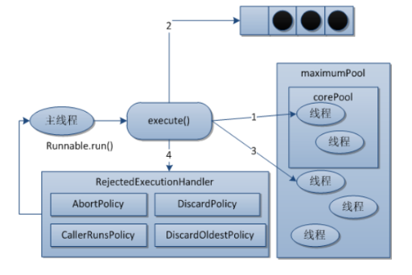
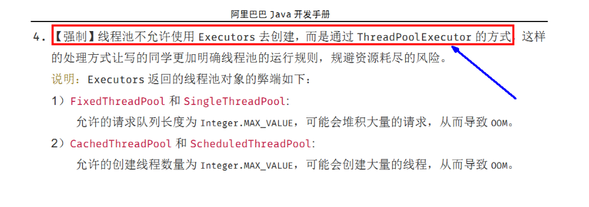

# BlockQueue阻塞队列

## 是什么

阻塞：必须要阻塞/不得不阻塞


当队列是空的，从队列中获取元素的操作将会被阻塞

当队列是满的，从队列中添加元素的操作将会被阻塞

试图从空的队列中获取元素的线程将会被阻塞，直到其他线程往空的队列插入新的元素

试图向已满的队列中添加新元素的线程将会被阻塞，直到其他线程从队列中移除一个或多个元素或者完全清空，使队列变得空闲起来并后续新增

## 实现方式

所有已知的实现类：

`ArrayBlockingQueue`：==由数组结构组成的有界阻塞队列==

`LinkedBlockingDeque`：==由链表结构组成的有界（但大小默认值为integer.MAX_VALUE）阻塞队列==

`PriorityBlockingQueue`：支持优先级排序的无界阻塞队列

`DelayQueue`：使用优先级队列实现的延迟无界阻塞队列

`SynchronousQueue`：==不存储元素的阻塞队列，也即单个元素的队列==

`LinkedTransferQueue`：由链表组成的无界阻塞队列

`LinkedBlockingDeque`：由链表组成的双向阻塞队列


`BlockingQueue` 方法以**四种形式**出现，对于不能立即满足但可能在将来某一时刻可以满足的操作，这四种形式的处理方式不同：第一种是抛出一个异常，第二种是返回一个特殊值（`null` 或 `false`，具体取决于操作），第三种是在操作可以成功前，无限期地阻塞当前线程，第四种是在放弃前只在给定的最大时间限制内阻塞。下表中总结了这些方法：

|    -     | 抛出异常  |  特殊值  |  阻塞  | 超时                 |
| :------: | :-------: | :------: | :----: | -------------------- |
| **插入** |  add(e)   | offer(e) | put(e) | offer(e, time, unit) |
| **移除** | remove()  |  poll()  |  take  | poll(time, unit)     |
| **取值** | element() |  peek()  |   \    | \                    |

`BlockingQueue` **不接受 null 元素**。试图 add、put 或 offer 一个 null 元素时，某些实现会抛出 NullPointerException。null 被用作指示 poll 操作失败的警戒值。

`BlockingQueue` 可以是限定容量的。它在任意给定时间都可以有一个 remainingCapacity，超出此容量，便无法无阻塞地 put 附加元素。没有任何内部容量约束的 BlockingQueue 总是报告 Integer.MAX_VALUE 的剩余容量。

`BlockingQueue` 实现主要用于生产者-使用者队列

```java
public class BlockQueueDemo {
    public static void main(String[] args) throws InterruptedException {

        BlockingQueue<String> blockingQueue = new ArrayBlockingQueue<>(3);
        /*System.out.println(blockingQueue.add("aaa"));
        System.out.println(blockingQueue.add("bbb"));
        System.out.println(blockingQueue.add("ccc"));
        // System.out.println(blockingQueue.add("dddd"));// 超过Queue的长度会报异常
        blockingQueue.remove("bbb");
        blockingQueue.remove();
        blockingQueue.remove();
        blockingQueue.remove();// 如果没有值的时候也会报异常
        System.out.println(blockingQueue.add("ddd"));
        System.out.println(blockingQueue);
        System.out.println(blockingQueue.element());// 查看队首的元素*/

        /*System.out.println(blockingQueue.offer("a"));
        System.out.println(blockingQueue.offer("b"));
        System.out.println(blockingQueue.offer("c"));
        System.out.println(blockingQueue.offer("d"));// 返回false
        System.out.println(blockingQueue.poll());
        System.out.println(blockingQueue.poll());
        System.out.println(blockingQueue.poll());
        System.out.println(blockingQueue.poll());// null*/

        /*blockingQueue.put("a");
        blockingQueue.put("a");
        blockingQueue.put("a");
        // blockingQueue.put("a");

        System.out.println(blockingQueue.take());
        System.out.println(blockingQueue.take());
        System.out.println(blockingQueue.take());
        System.out.println(blockingQueue.take());// 会一直等待*/

        System.out.println(blockingQueue.offer("a"));
        System.out.println(blockingQueue.offer("b"));
        System.out.println(blockingQueue.offer("c"));
        blockingQueue.offer("d", 3L, TimeUnit.SECONDS);
    }
}

```


# 线程池

## 为什么使用线程池

线程池的优势：线程池做的工作只要是控制运行的线程数量，处理过程中将任务放入队列，然后在线程创建后启动这些任务，如果线程数量超过了最大数量，超出数量的线程排队等候，等其他线程执行完毕，再从队列中取出任务来执行。

它的主要特点为：线程复用；控制最大并发数；管理线程。

- 第一：降低资源消耗。通过重复利用已创建的线程降低线程创建和销毁造成的销耗。

- 第二：提高响应速度。当任务到达时，任务可以不需要等待线程创建就能立即执行。

- 第三：提高线程的可管理性。线程是稀缺资源，如果无限制的创建，不仅会销耗系统资源，还会降低系统的稳定性，使用线程池可以进行统一的分配，调优和监控。

## 简介

Java中的线程池是通过Executor框架实现的，该框架中用到了Executor，Executors，ExecutorService，ThreadPoolExecutor这几个类


```java
public class MyThreadPoolDemo {
    public static void main(String[] args) {
        // 创建一个可重用固定线程数的线程池，以共享的无界队列方式来运行这些线程。
        // ExecutorService threadPool = Executors.newFixedThreadPool(5); // 1池子5个受理线程

        // 创建一个使用单个 worker 线程的 Executor，以无界队列方式来运行该线程。
        // ExecutorService threadPool = Executors.newSingleThreadExecutor();

        // 创建一个可根据需要创建新线程的线程池，但是在以前构造的线程可用时将重用它们。
        ExecutorService threadPool = Executors.newCachedThreadPool();

        try {
            // 模拟十五个顾客来办理业务
            for (int i = 0; i < 15; i++) {
                // TimeUnit.SECONDS.sleep(1);
                threadPool.execute(()->{
                    System.out.println(Thread.currentThread().getName() + "\t 办理业务");
                });
                // TimeUnit.SECONDS.sleep(1);
            }
        } catch (Exception e) {
            e.printStackTrace();
        } finally {
            threadPool.shutdown();
        }
    }
}
```

三种线程创建的源码，这些参数，看下一篇。

```java
public static ExecutorService newSingleThreadExecutor() {
    return new FinalizableDelegatedExecutorService
        (new ThreadPoolExecutor(1, 1,
                                0L, TimeUnit.MILLISECONDS,
                                new LinkedBlockingQueue<Runnable>()));
}

==============

public static ExecutorService newFixedThreadPool(int nThreads) {
    return new ThreadPoolExecutor(nThreads, nThreads,
                                  0L, TimeUnit.MILLISECONDS,
                                  new LinkedBlockingQueue<Runnable>());
}

=============
    
public static ExecutorService newCachedThreadPool() {
    return new ThreadPoolExecutor(0, Integer.MAX_VALUE,
                                  60L, TimeUnit.SECONDS,
                                  new SynchronousQueue<Runnable>());
}
```


## 线程池的参数

```java
public ThreadPoolExecutor(int corePoolSize,
                          int maximumPoolSize,
                          long keepAliveTime,
                          TimeUnit unit,
                          BlockingQueue<Runnable> workQueue) {
    this(corePoolSize, maximumPoolSize, keepAliveTime, unit, workQueue,
         Executors.defaultThreadFactory(), defaultHandler);
}


public ThreadPoolExecutor(int corePoolSize,
                          int maximumPoolSize,
                          long keepAliveTime,
                          TimeUnit unit,
                          BlockingQueue<Runnable> workQueue,
                          ThreadFactory threadFactory,
                          RejectedExecutionHandler handler) {
    if (corePoolSize < 0 ||
        maximumPoolSize <= 0 ||
        maximumPoolSize < corePoolSize ||
        keepAliveTime < 0)
        throw new IllegalArgumentException();
    if (workQueue == null || threadFactory == null || handler == null)
        throw new NullPointerException();
    this.acc = System.getSecurityManager() == null ?
        null :
    AccessController.getContext();
    this.corePoolSize = corePoolSize;
    this.maximumPoolSize = maximumPoolSize;
    this.workQueue = workQueue;
    this.keepAliveTime = unit.toNanos(keepAliveTime);
    this.threadFactory = threadFactory;
    this.handler = handler;
}
```

corePoolSize：常驻核心线程数

maximumPoolSize：最大线程数

keepAliveTime：留存时间；当某个时间内的请求数量没有超过corePoolSize时，多余的线程会被销毁。

unit：keepAliveTime的单位

workQueue：任务队列，被提交但尚未执行的任务。

threadFactory：表示线程池中工作线程的线程工厂，用于创建线程，一般默认的即可。

handler：拒绝策略。表示当队列满了，并且工作线程大于等于线程池的最大线程数（maximumPoolSize）时如何来拒绝请求执行的runnable的策略


## 线程池底层工作原理




1. 在创建了线程池后，开始等待请求。
2. 当调用execute()方法添加一个请求任务时，线程池会做出如下判断：
   1. 如果正在运行的线程数量小于corePoolSize，那么马上创建线程运行这个任务；
   2. 如果正在运行的线程数量大于或等于corePoolSize，那么将这个任务放入阻塞队列；
   3. 如果这个时候队列满了且正在运行的线程数量还小于maximumPoolSize，那么还是要创建非核心线程立刻运行这个任务；
   4. 如果队列满了且正在运行的线程数量大于或等于maximumPoolSize，那么线程池会启动饱和拒绝策略来执行。
3. 当一个线程完成任务时，它会从队列中取下一个任务来执行。
4. 当一个线程无事可做超过一定的时间（keepAliveTime）时，线程会判断：
   1. 如果当前运行的线程数大于corePoolSize，那么这个线程就被停掉。
   2. 所以线程池的所有任务完成后，它最终会收缩到corePoolSize的大小。


## 线程池如何设置

### 四种内置的拒绝策略

- AbortPolicy(默认)：直接抛出RejectedExecutionException异常阻止系统正常运行
- CallerRunsPolicy：“调用者运行”一种调节机制，该策略既不会抛弃任务，也不会抛出异常，而是将某些任务回退到调用者，从而降低新任务的流量。
- DiscardOldestPolicy：抛弃队列中等待最久的任务，然后把当前任务加人队列中尝试再次提交当前任务。
- DiscardPolicy：该策略默默地丢弃无法处理的任务，不予任何处理也不抛出异常。如果允许任务丢失，这是最好的一种策略。


### 自定义线程池



代码部分，演示了四种拒绝策略：

1. 第一种运行结果：java.util.concurrent.RejectedExecutionException

2. 第二种运行结果：会将任务回退

   ```java
   pool-1-thread-1	 办理业务
   pool-1-thread-3	 办理业务
   pool-1-thread-3	 办理业务
   pool-1-thread-2	 办理业务
   pool-1-thread-3	 办理业务
   pool-1-thread-1	 办理业务
   main	 办理业务
   pool-1-thread-5	 办理业务
   pool-1-thread-4	 办理业务
   pool-1-thread-5	 办理业务
   ```

3. 第三种和第四种就不演示，结果不唯一。

```java
public class MyThreadPoolDemo {
    public static void main(String[] args) {

        System.out.println(Runtime.getRuntime().availableProcessors());

        ExecutorService threadPool = new ThreadPoolExecutor(
            	2,
                5,
            	2,
            	TimeUnit.SECONDS,
                new LinkedBlockingDeque<>(3),
                Executors.defaultThreadFactory(),
                // new ThreadPoolExecutor.AbortPolicy());
                // new ThreadPoolExecutor.CallerRunsPolicy());
                // new ThreadPoolExecutor.DiscardOldestPolicy();
                new ThreadPoolExecutor.DiscardPolicy());

        try {
            // 模拟二十个顾客来办理业务
            for (int i = 0; i < 20; i++) {
                // TimeUnit.SECONDS.sleep(1);
                threadPool.execute(()->{
                    System.out.println(Thread.currentThread().getName() + "\t 办理业务");
                });
                // TimeUnit.SECONDS.sleep(1);
            }
        } catch (Exception e) {
            e.printStackTrace();
        } finally {
            threadPool.shutdown();
        }
    }
}
```


### 核心线程数如何设置

[参考](https://blog.csdn.net/zhuimeng_by/article/details/107891268)