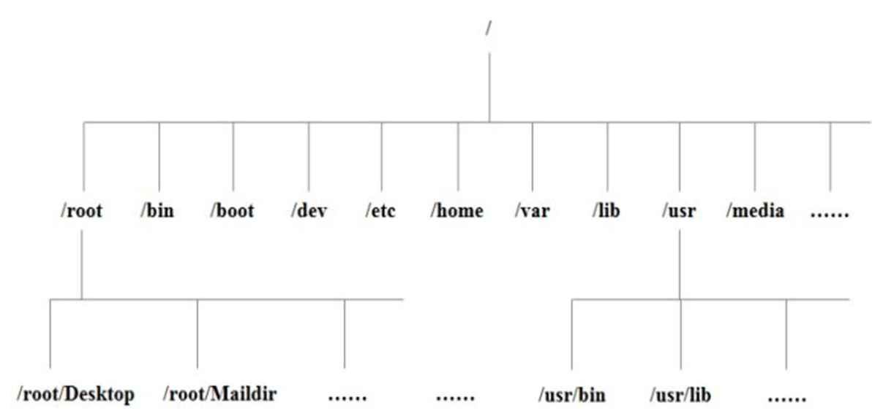
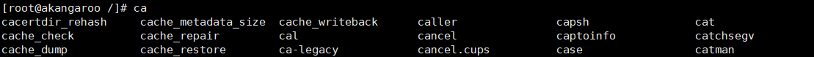
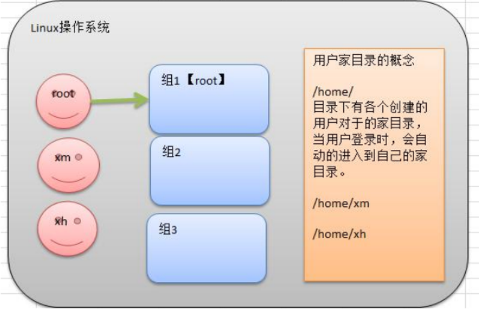
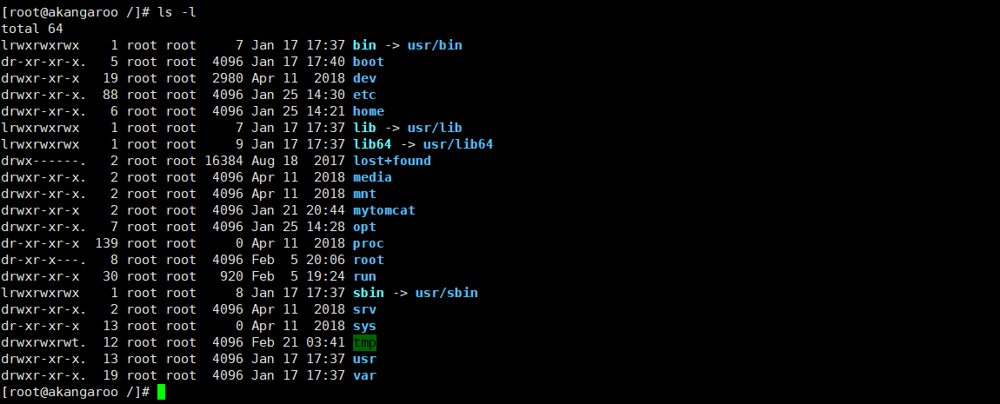
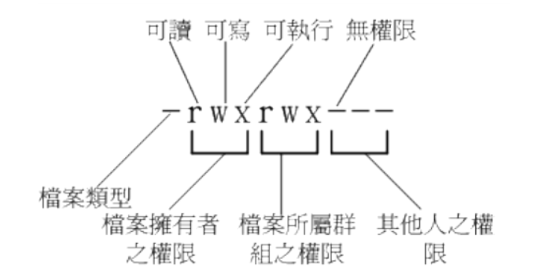
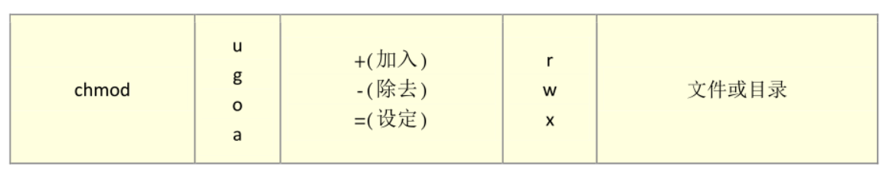
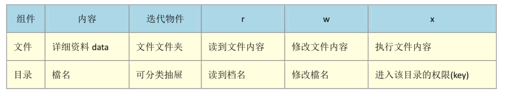
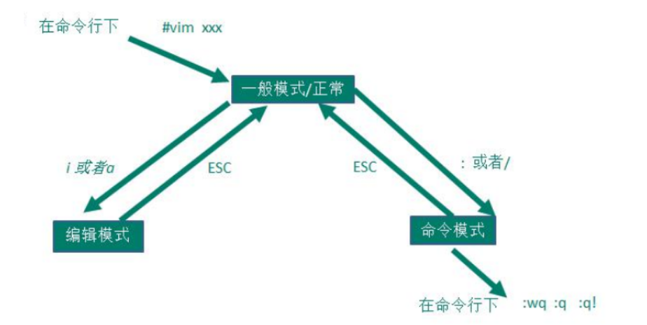

# Linux基础

## 目录结构



| 目录      | 详情                                                         |
| --------- | ------------------------------------------------------------ |
| ==/bin==  | 系统有很多放置执行文件的目录，但/bin比较特殊。因为/bin放置的是在单人维护模式下还能够被操作的指令。在/bin底下的指令可以被root与一般账号所使用，主要有: cat, chmod, chown, date, mv, mkdir,cp, bash等等常用的指令。 |
| /sbin     | s就是Super User的意思，这里存放的是系统管理员使用的系统管理程序。 |
| ==/root== | 该目录为系统管理员目录，也称作超级权限者的用户主目录         |
| ==/home== | 存放普通用户的主目录，在Linux中每个用户都有一个自己的目录，一般该目录名是以用户的账号命名的。 |
| ==/boot== | 存放用于系统引导时使用的各种文件，包括一些连接文件以及镜像文件 |
| /proc     | 这个目录是一个虚拟的目录，它是系统内存的映射，访问这个目录来获取系统信息。 |
| /srv      | service缩写，该目录存放一些服务启动之后需要提取的数据。      |
| /tmp      | 用于存放各种临时文件                                         |
| /dev      | 用于存放设备文件，类似Windows系统的设备管理器，把所有的硬件用文件形式存储 |
| /media    | Linux系统会识别一些设备，例如U盘，光驱，识别后，Linux会把识别的设备挂载到该目录下。 |
| /etc      | 存放系统配置文件                                             |
| /opt      | 额外安装的可选应用程序包所放置的位置                         |
| /var      | 用于存放运行时需要改变数据的文件，例如日志文件等             |
| /mnt      | 系统管理员安装临时文件系统的安装点                           |
| /usr      | 与软件安装/执行有关                                          |


## 常用按键

- `tab`：命令补全，文件补齐

  输入`ca[tab] [tab]`即可显示所有关于ca开头的指令，[tab]是紧跟着ca后面的。

  

  输入`ls -al ~/.bash[tab\][tab]`即可显示家目录下所有以.bash开头的文件

  

- `ctrl c`：中断程序

- `ctrl d`：键盘输入结束，另外也可以取代exit的输入

- `shift+[PageUp][PageDown]`：翻页

## 帮助指令

**help**

```shell
date --help
```

**man**

```shell
man date
# 空格翻页，q退出
```

## 关机重启注销

Linux的七个运行级别：

- 0：关机

- **1：单用户级别**（找回丢失用户）

- 2：多用户无网络

- **3：多用户有网络**

- 4：保留级别

- **5：图形界面**

- 6：重启

> 可以修改默认级别

只有root用户可以关机，切换root用户输入`su -`

- shutdown
  - `shutdown -h now`		（立刻关机）
  - `shutdown -h 1`             （一分钟之后关机）
  - `shutdown -r now`		（立刻重启）
- `halt`：等价于关机
- `reboot`：重启
- `sync`：把内存的数据同步到磁盘，一般会在关机之前同步
- `logout`：注销（在运行级别3下有效）


## 用户管理



说明：

1. Linux系统是一个多用户多任务的操作系统，任何一个要使用系统资源的用户，都必须先向系统管理员申请一个账号，然后以这个账号的身份进入系统
2. Linux的用户需要至少要属于一个组。
3. 家目录：/home/用户名


**用户配置文件（记录用户信息）**

> /etc/passwd

**组配置文件（组信息）**

>  /etc/group

**口令配置文件（密码）**

>  /etc/shadow


**添加组**

```shell
groupadd 组名
```

**删除组**

```shell
groupdel 组名
```

**修改用户所在组**

```shell
usermod -g 组名 用户名
```

**查看当前登录用户**

```shell
whoami
```

**创建用户**

```shell
useradd [参数]
‐s # 指定新用户登陆时shell类型
‐g # 指定所属组，该组必须已经存在, 不指定的时候自动创建一个与用户名重名的用户组。
‐d # 指定用户目录，该目录必须存在
‐m # 用户目录不存在时，自动创建该目录

useradd akangaroo -s /bin/bash -g akangaroo -m
```

**删除用户**

```shell
userdel 用户名 #删除用户但不删除家目录
userdel -r 用户名 # 删除用户并且删除家目录（一般不删除家目录）
```

**给用户指定密码**

```shell
passwd 用户名
```

**查询用户信息**

```shell
id 用户名
```

**切换用户**

```shell
su -用户名
# su就是switch user的意思
# 从权限高的用户切换到权限低的用户，不需要输入密码，反之需要
# 当需要返回到原来用户时，使用exit指令
```


## 文件权限和目录配置

在Linux 里面，任何一个文件都具有「User, Group及Others」 三种身份的个别权限



1. 第一栏表示权限

2. 第二栏表示多少档名连结到此节点

3. 第三栏表示这个文件（或目录）的拥有者账号

4. 第四栏表示这个文件的所属群组

5. 第五栏为这个文件的容量大小，默认单位为bytes

6. 第六栏为这个文件的建档日期或者是最近修改日期

7. 第七栏为这个文件的档名

如果档名之前多一个`.`则代表隐藏文件



第一栏第一个

> 当为[ d ] (directory)则是目录 
>
> 当为[- ]则是文件
>
> 若是[ 1] (link) 则表示为连结档(link file)，类似于windows下的快捷方式
>
> 若是[b] (block) 则表示为装置文件里面的可供储存的接口设备(可随机存取装置) 
>
> 若是[c ] (character) 则表示为装置文件里面的串行端口设备，例如键盘、鼠标(一次性读取装置)。


群组修改(change group)，其中在/etc/group下需要有该群组

```shell
chgrp [-R] filename/dirname # r代表递归（recursive）
# 例如 
chgrp akangaroo text.txt
```

拥有者修改change owner，其中在/etc/passwd需要有该用户

```shell
chown [-R] 账号名称 文件或目录
chown [-R] 账号名称:组名 文件或目录
chown [-R] 账号名称.组名 文件或目录也可以用.表示
# 一般在复制文件时，会将使用者权限和组权限一起复制，所以需要使用`chgrp` `chown`来修改权限
```


**修改文件权限**

```shell
chmod [-R] xyz 文件或目录
# 一般来说 r:4		w:2		x:1
# rwx = 4+2+1
# rw- = 4+2
# --- =  0+0+0
# 常用的有 755 即-rwxr-xr-x，740 即 `-rwxr-----

chomod 755 test.txt
chmod u=rwx,go=rx test.txt

# 在原有权限上添加权限
chmod a+w test.txt

# 在原有权限上删除权限
chmod a-x test.txt
```



文件和目录中权限的含义




## 文件目录操作

|            | 介绍                                               |
| ---------- | -------------------------------------------------- |
| `.`        | 此层目录                                           |
| `..`       | 上一层目录                                         |
| `-`        | 前一个工作目录                                     |
| `~`        | 代表目前用户身份所在的家目录                       |
| `~account` | 代表account这个用户的家目录（account是个账号名称） |

**cd：目录切换指令**

```shell
cd xxx # 切换到当前目录下的xxx目录
cd ..(cd ../) # 切换到上级目录
cd / # 切换到根目录
cd ~ # 切换到用户主目录
cd - # 切换到上个操作所在的目录
```

**pwd(print working directory)：显示当前工作目录**

**mkdir：创建目录**

```shell
mkdir [参数] 目录名称
m # 配置文件案的权限
p # 帮助直接将所需要的目录递归建立起来
mkdir -p test1/test2/test3
mkdir -m 744 test1
```

**rmdir：目录删除**

```shell
rmdir[-pr] 目录名称
# -p：代表连同上层的空目录也一起删除
# -r：递归删除下方的所有目录，比较危险
```

**cp：复制**

**ls：显示文件和目录**

```shell
-a # 全部的文件，连同隐藏档(开头为，的文件)一起列出来(常用)
-A # 全部的文件，连同隐藏档，但不包括，与.. 这两个目录仅列出目录本身，而不是列出目录内的文件数据(常用)
-f # 直接列出结果，而不进行排序(ls 预设会以档名排序! )
-r # 将排序结果反向输出，例如:原本档名由小到大，反向则为由大到小;
-R # 连同子目录内容起列出来，等于该目录下的所有文件都会显示出来;
-S # 以文件容量大小排序，而不是用档名排序: 
-t # 依时间排序，而不是用档名。
```

**rm：删除指令**

```shell
-f # 就是force 的意思，忽略不存在的文件，不会出现警告讯息;
-i # 互动模式，在删除前会询问使用者是否动作
-r # 递归删除
```

**mv：移动文件或目录，或重命名**

```shell
-f # force 强制的意思，如果目标文件已经存在，不会询问而直接覆盖;
-i # 若目标文件(destination) 已经存在时，就会询问是否覆盖!
-u # 若目标文件已经存在，且source 比较新，才会更新(update)

```

**touch：创建一个文件**

**cat：浏览一个文件**

```shell
cat -n /ect/issue
# n表示显示行号
```

**tac：从最后一行开始显示文件**

```shell
tac test.txt
```

**more：一页一页的显示文件内容**

```shell
空格键(space)：代表向下翻一页;
Enter  代表向下翻一行」;
/字符串：代表在这个显示的内容当中，向下搜寻【字符串】这个关键词;
:f 立刻显示出文件名以及目前显示的行数;
q  代表立刻离开more，不再显示该文件内容。
b或[ctrl]-b：代表往回翻页，不过这动作只对文件有用，对管线无用。
```

**less：同more，但是可以向前翻页**

```shell
空格键:向下翻动一页;
[pagedown]:向下翻动一页;
[pageup] : 向上翻动-页;
/字符串:向下搜寻「字符串」的功能;
?字符串:向上搜寻[字符串」的功能;
n:重复前一个搜寻(与/或?有关!)
N:反向的重复前一个搜寻(与/或?有关! )
g:前进到这个资料的第一-行去;
G:前进到这个数据的最后一行去(注意大小写);
q:离开less这个程序;
```

**head：只显示头几行**

```shell
head -3 test.txt
# -3表示只显示前三行
```

**tail：只显示尾巴几行**

```shell
tail -3 test.txt
tail -f nohup.out # 表示持续侦测后面所接的档名，要等到按下F[ctrl]-c 才会结束tail 的侦测
```

**\>：输出重定向       \>>：追加**

```shell
ls -l > a.txt：如果a.txt不存在，就创建该文件。如果存在，会覆盖。
cat 文件1 > 文件2	例如：cat /etc/profile > c.txt
```

**echo：输出内容到控制台**


**ln：软链接指令**

```shell
ln -s /root linkToRoot
```

**history：显示历史执行的指令**

```shell
-n # 表示历史执行的n条指令
history -10
!100 # 执行编号为100的指令
```


## 压缩和解压缩

```shell
gzip # 压缩，不会保留原来的文件
gzip a.txt
gunzip # 解压
gunzip a.txt.gz
```

```shell
zip
zip -r mypackage.zip /home/	# -r 递归
unzip
unzip -d /opt/temp mypackage.zip # -d 指定目录
```

```shell
tar[选项] XXX.tar.gz 打包的内容

-c # 产生.tar打包文件
-x # 解包.tar文件
-v # 显示详细信息
-f # 指定压缩后的文件名
-z # 打包同时压缩

tar -zcvf myhome.tar.gz  /home/*
tar -zxvf a.tar.gz # 解压到当前目录
tar -zxvf myhome.tar.gz -C /opt/tmp2/	# 目录需要存在
```


## 搜索查找类

**find：从指定目录向下递归地遍历其各个子目录，将满足条件的文件或者目录显示在终端。**

```shell
find [搜索范围] [选项]

-name # 按照指定的文件名查找模式查找文件
-user # 查找属于指定用户名所有文件
-size # 按照指定的文件大小查找文件。

find /opt -user root  
find / -size +20M
find / -name *.txt 
```

**locate：快速定位文件路径**

```shell
# 需要先用updatedb 命令用来创建或更新 slocate/locate 命令所必需的数据库文件。
# 没有locate和updatedb，使用如下安装
yum install mlocate
```


**grep：查找文件内部的关键字**

```shell
# | 代表管道符号：将前面的命令的结果交给后面的指令处理
-n # 显示行号
-i # 忽略大小写
```


# 常用操作

## 日志操作

**日志监控**

```shell
tail -f 日志名
# 实时监控100行日志
tail -100f test.log
# 查询日志最后十行
tail -10 test.log 
tail -n 10 test.log
# 查询十行之后的所有日志
tail -n +10 test.log
```

**关键字监控**

```shell
tail -f 日志名 | grep "关键字"
```


应用场景1：按照行号查看-过滤出关键字附近的日志

```shell
cat -n test.log |grep "debug"  # 得到关键日志的行号

cat -n test.log |tail -n +92|head -n 20  # 选择关键字所在的中间一行. 然后查看这个关键字前10行和后10行的日志

# tail -n +92表示查询92行之后的日志
# head -n 20 则表示在前面的查询结果里再查前20条记录
```

应用场景2：根据日期查询日志

```shell
# 下面两个是等价的
grep '2020-11-12 14:57:49.007' blog-prod.log
cat blog-prod.log | grep'2020-11-12 14:57:49.007'

sed -n '/2020-11-12 14:57:49.008/p' blog-prod.log
```

应用场景3：查询某个时间段的日志

```shell
# sed -n '/起始时间/,/结束时间/p' 日志文件
sed -n '/2020-11-12 14:57:49/,/2020-11-12 14:57:50/p' blog-prod.log
```

应用场景4：日志内容特别多，打印在屏幕上不方便查看

```shell
# 使用more和less命令,
cat -n test.log |grep "debug" |more     这样就分页打印了,通过点击空格键翻页

# 使用 >xxx.txt 将其保存到文件中,到时可以拉下这个文件分析
cat -n test.log |grep "debug"  >debug.txt
```


## 进程管理

**进程查看**

```shell
ps -aux 
a # 显示当前终端的所有进程信息
u # 以用户的格式显示进程信息
x # 显示后台进程运行的参数

ps -ef
e # 显示所有进程
f # 全格式
```

**终止进程**

```shell
kill [选项] 进程号 # 常用选项-9，表示强迫进程立即停止，即kill -9 进程号
killall 进程名称
```


## 服务管理

服务的本质就是进程，但是是在后台运行的，通常都会监听某个端口，等待其他进程的请求，比如（mysql，sshd，防火墙），因此我们又称为守护进程。

`service 服务名[start| stop | restart | reload | status]`
在CentOS7.0后不再使用`service` ，而是`systemctl`

**centos7防火墙相关使用**

```shell
firewalld的基本使用
# 启动
systemctl start firewalld
# 关闭
systemctl stop firewalld
# 查看状态
systemctl status firewalld
# 开机禁用
systemctl disable firewalld
# 开机启用
systemctl enable firewalld
# 查看开放的端口
firewall-cmd --list-ports
```

当关闭`stop`或者启动`start`防火墙之后，立即生效。可以通过windows的dos窗口测试

```shell
telnet ip port
```

但是这种方式只是临时生效，重启系统后，还是回归以前对服务的设置。可以使用`enable`指令设为开机启动


## 端口管理

```shell
netstat -tunlp | grep 端口号

-t # 仅显示TCP相关选项
-u # 仅显示UDP相关选项
-n # 拒绝显示别名，能显示数字的全部转换为数字
-l # 在Listen（监听）的服务状态
-p # 立相关链接的程序名
```

```shell
lsof -i:端口号
# centos需要安装lsof
yum install lsof
```

# 其它

## Vim



常用的一些快捷键：

- `yy`：拷贝当前行**yy**，拷贝当前行向下的5行**5yy**并粘贴（p）

- `dd`：删除当前行**dd**，删前行向下的5行**5dd**

- `/xxx`：查找某个关键字，n（下一个），N（上一个）

- `:set nu`：设置文件的行号

- `:set nonu`：取消文件的行号

- `G`：跳转到文件最下面，`gg`：跳转到文件最上面

- `u`：在一个文件中输入内容，ESC到正常模式，u撤回

- `shift+g`----移动到指定行：

  - 第一步：显示行号:set nu
  - 第二步：输入要到的行20
  - 第三步：shift+g

  


## centos7下安装JDK

1. 通过Xftp将jdk传输到/opt目录下

2. 解压到/opt

   ```shell
   tar -zxvf jdk-8u261-linux-x64.tar.gz
   ```

3. 来到jdk的bin目录下

   ```shell
   cd jdk
   cd bin
   ./java
   ```

     ./XX表示运行该目录下的可执行文件

4. 配置环境变量  vim /etc/profile

   ```shell
   JAVA_HOME=/opt/jdk1.8.0_281
   PATH=/opt/jdk1.8.0_281/bin:$PATH
   export JAVA_HOME PATH
   ```

   注意需要添加:$PATH，此命令相等于将原来的PATH也加上，和windows目录下类似

   export是让环境变量生效

6. 需要注销用户环境变量才能生效


## centos7下安装Tomcat

1. 解压缩到/opt		tar -zxvf apache-tomcat-8.5.57.tar.gz

2. 检测防火墙是否启动成功        firewall-cmd --state

3. 检测8080端口是否开放           firewall-cmd --permanent --zone=public --list-ports

   1. 8080端口没有开放则输入    firewall-cmd --zone=public --add-port=8080/tcp --permanent

4. 重新启动防火墙，出现succes则表示启动成功          firewall-cmd --reload

5. 验证8080端口是否生效     firewall-cmd --zone=public --query-port=8080/tcp

6. 在阿里云管理控制台上将8080端口设置为可访问

7. 进去tomcat的bin目录，运行./startup.sh启动服务器

8. 输入公网地址+8080端口即可访问

## centos7下安装Mysql

[CSDN](https://blog.csdn.net/EB_NUM/article/details/105425622)

阿里云中的centos7，需要在安全组中设置开放3306端口

以及centos7的防火墙为firewall，上述文章中防火墙为iptables

防火墙那一步的操作应该为

```shell
# 开启3306端口
firewall-cmd --zone=public --add-port=3306/tcp --permanent
# 查询是否开启
 firewall-cmd --query-port=3306/tcp
# 重启防火墙
firewall-cmd --reload
# 查看已开放的端口
firewall-cmd --list-port

--zone #作用域
--add-port=80/tcp #添加端口，格式为：端口/通讯协议
--permanent #永久生效，没有此参数重启后失效
```


## 


