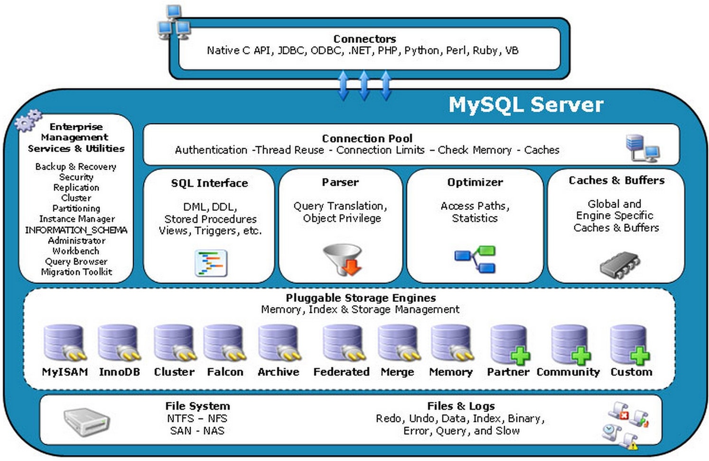
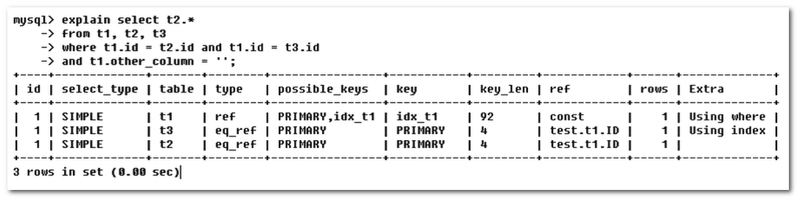
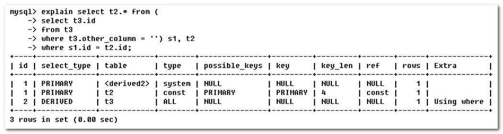
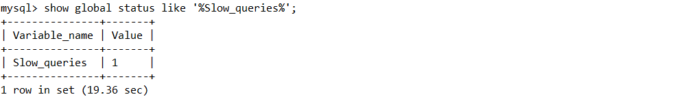

[TOC]

## MySQL基础介绍

### 配置文件

```mysql
# 查看字符集
show variables like '%char%';

# 结果如下图所示，客户端和服务端的连接为latin1编码，不支持中文

+--------------------------+----------------------------+
| Variable_name            | Value                      |
+--------------------------+----------------------------+
| character_set_client     | utf8mb4                    |
| character_set_connection | utf8mb4                    |
| character_set_database   | latin1                       |
| character_set_filesystem | binary                     |
| character_set_results    | utf8mb4                    |
| character_set_server     | latin1                     |
| character_set_system     | utf8                       |
| character_sets_dir       | /usr/share/mysql/charsets/ |
+--------------------------+----------------------------+
```

修改MySQL的默认编码，我是用docker安装的。

```shell
docker exec -it mysql /bin/bash

# 该目录下存储着mysql的配置文件，通过/etc/mysql/my.cnf文件可得知
cd /etc/mysql/mysql.conf.d

# 输入vim的时候，显示没装，于是
apt-get update
apt-get install vim
vim mysqld.conf

# 添加如下内容
[client]
default-character-set=utf8mb4
[mysql]
default-character-set=utf8mb4
[mysqld]
character-set-server=utf8mb4
init-connect='SET NAMES utf8mb4'


# 退出容器，重启mysql，修改成功
docker restart mysql
```


-----------


- 二进制日志文件 log-bin：用于主从复制

- 错误日志 log-error：默认是关闭的，记录严重的警告和错误信息，每次启动和关闭的详细信息等

- 查询日志 log：默认关闭，记录查询的sql语句，如果开启会减低mysql的整体性能，因为记录日志也是需要消耗系统资源的

- 数据文件：
  - 数据库文件：默认路径：/var/lib/mysql
  - frm文件：存放表结构
  - myd文件：存放表数据
  - myi文件：存放表索引


### 逻辑架构介绍

> MySQL四层架构



1. 和其它数据库相比，MySQL有点与众不同，它的架构可以在多种不同场景中应用并发挥良好作用，主要体现在存储引擎的架构上。
2. 插件式的存储引擎架构将查询处理和其它的系统任务以及数据的存储提取相分离。这种架构可以根据业务的需求和实际需要选择合适的存储引擎。


- **连接层**：最上层是一些客户端和连接服务，包含本地sock通信和大多数基于客户端/服务端工具实现的类似于tcp/ip的通信。
- **服务层**：可以完成大多数核心的功能，如SQL接口，SQL解析，优化，缓存等。
- **引擎层**：存储引擎层，存储引擎真正的负责了MySQL中数据的存储和提取，服务器通过APl与存储引擎进行通信。
- **存储层**：主要是将数据存储在运行于裸设备的文件系统之上，并完成与存储引擎的交互。


### 存储引擎

```mysql
# 查看mysql支持的存储引擎
show engines

# 查看默认的存储引擎
show variables like '%storage_engine%'
```


**MyISAM 和 InnoDB 对比**

|        | MyISAM                     | InnoDB                                   |
| ------ | -------------------------- | ---------------------------------------- |
| 主外键 | 不支持                     | 支持                                     |
| 事务   | 不支持                     | 支持                                     |
| 行表锁 | 表锁                       | 行锁                                     |
| 缓存   | 只缓存索引，不缓存真实数据 | 不仅缓存索引还缓存真实数据，对内存要求高 |
| 表空间 | 小                         | 大                                       |
| 关注点 | 性能                       | 事务                                     |


## 索引优化分析

### 性能下降的原因

- 查询语句写的有问题
- 索引失效
- 关联查询（join语句）太多，这是设计上的缺陷或者不得已的需求。
- 服务器调优和各个参数的设置（缓冲，线程数）

### SQL语句执行顺序

- mysql 执行的顺序：随着 Mysql 版本的更新换代， 其优化器也在不断的升级， 优化器会分析不同执行顺序产生的性能消耗不同而动态调整执行顺序。下面是常见的SQL执行顺序

  ```SQL
  FROM <left_table>
  ON <join_condition>
  <join_type> JOIN <right_type>
  WHERE <where_condition>
  GROUP BY <group_by_list>
  HAVING <having_conditon>
  SELECT 
  DISTINCT <select_list>
  ORDER BY <order_by_condition>
  LIMIT <limit_number>
  ```

  

  

### 常见的JOIN查询


- 笛卡尔积：结果集个数为左表行数 * 右表行数

- INNER JOIN：左表和右表的交集部分

- LEFT JOIN：左表和右表的交集部分 + 左表独有部分

- RIGHT JOIN：左表和右表的交集部分 + 右表独有部分

- FULL JOIN：两表的独有部分 + 公共部分（MySQL不支持全连接）

  ```mysql
  # 可以通过union语句实现全连接，union关键字用于连接结果集，并且自动去重。
  select * from table1 t1 left join table2 t2 on t1.id = t2.id
  union
  select * from table1 t1 right join table2 t2 on t1.id = t2.id;
  ```

### 索引

#### 简介

1. MySQL官方对索引的定义为：索引(Index)是帮助MySQL高效获取数据的数据结构。可以得到索引的本质：**索引是数据结构**

2. 可以简单的理解为**排好序的快速查找数据结构**，即 索引 = **排序** + **查找**  的 数据结构。
3. 一般来说索引本身占用内存空间也很大，不可能全部存储在内存中，因此**索引往往以文件形式存储在硬盘上**
4. 我们平时所说的索引，如果没有特别指明，都是指B树(多路搜索树，并不一定是二叉树)结构组织的索引，如下图所示。


图中，浅蓝色的部分表示一个磁盘块，深蓝色的部分表示数据项，黄色的部分表示指针。如磁盘块1所示，P1指向的是比17小的磁盘块，P2指向的是介于17和35之间的磁盘块，P3指向的是比35大的磁盘块。

如果查询的数据为28，先从磁盘块1查询，发现指向磁盘块3，接着，继续发现最终指向的是磁盘块8。总共进行了3次IO（有几层就最多进行几次IO）。


-----------

**索引的优势**：

- 降低数据库的IO成本
- 降低数据排序成本

**索引的劣势**：

- 索引列是占用空间的。
- 虽然提高了查询效率，但是降低了**更新效率**。因为更新的时候，不只是要保存数据，还要保存索引项。


#### MySQL索引的分类

[参考文章](https://blog.csdn.net/weixin_30672019/article/details/96877150?utm_medium=distribute.pc_relevant.none-task-blog-BlogCommendFromBaidu-1.control&depth_1-utm_source=distribute.pc_relevant.none-task-blog-BlogCommendFromBaidu-1.control)

1. 单值索引：一个索引只包含单个列，仅仅加速查询。
2. 唯一索引：加速查询 + 列值唯一（可以为null）
3. 主键索引：加速查询 + 列值唯一（不能为null）+ 表中只有一个
4. 组合索引：多列值组成一个索引，专门用于组合搜索，其效率大于索引合并
5. 全文索引：对文本的内容进行分词，进行搜索 

>ps:
>
>索引合并，使用多个单列索引组合搜索
>
>覆盖索引，select的数据列只用从索引中就能够取得，不必读取数据行，换句话说查询列要被所建的索引覆盖

#### 操作索引

1. **创建索引**

   ```mysql
   --创建普通索引
   CREATE INDEX index_name ON table_name(col_name);
   
   --创建唯一索引
   CREATE UNIQUE INDEX index_name ON table_name(col_name);
   
   --创建普通组合索引
   CREATE INDEX index_name ON table_name(col_name_1,col_name_2);
   
   --创建唯一组合索引
   CREATE UNIQUE INDEX index_name ON table_name(col_name_1,col_name_2);
   ```

2. **通过修改表结构创建索引**

   ```mysql
   ALTER TABLE table_name ADD INDEX index_name(col_name);
   ```

3. **创建表时直接指定索引**

   ```mysql
   CREATE TABLE table_name (
       ID INT NOT NULL,
       col_name VARCHAR (16) NOT NULL,
       INDEX index_name (col_name)
   );
   ```

4. **删除索引**

   ```mysql
   --直接删除索引
   DROP INDEX index_name ON table_name;
   
   --修改表结构删除索引
   ALTER TABLE table_name DROP INDEX index_name;
   ```

5. **其它相关命令**

   ```mysql
   --查看表结构
       desc table_name;
    
   --查看生成表的SQL
       show create table table_name;
    
   --查看索引
       show index from  table_name;
    
   --查看执行时间
       set profiling = 1;
       SQL...
       show profiles;
   ```


#### 索引建立时机

**哪些情况需要建立索引**

1. 主键自动建立主键索引
2. 频繁作为查询条件的字段应该创建索引
3. 查询中与其它表关联的字段，外键关系建立索引
4. 单键/组合索引的选择问题， (在高并发下倾向创建组合索引)
5. 查询中排序的字段，排序字段若通过索引去访问将大大提高排序速度
6. 查询中统计或者分组字段


**哪些情况不需要建立索引**

1. 频繁更新的字段不适合创建索引，因为每次更新不单单是更新了记录还会更新索引，加重了IO负担
2. where条件里用不到的字段不创建索引
3. 表记录太少不需要创建索引
4. 经常增删改的表不需要创建索引
5. 数据重复且平均的字段不需要创建索引。


### 性能分析之EXPLAIN

#### 简介

使用EXPLAIN关键字可以模拟优化器执行SQL查询语句，从而知道MySQL是如何处理你的SQL语句的，借此来分析你的查询语句或是表结构的性能瓶颈。

**作用**

1. 表的读取顺序（id）
2. 数据读取操作的操作类型（select_type）
3. 哪些索引可以使用（possible_keys）
4. 哪些索引被实际使用（key）
5. 表之间的引用（ref）
6. 每张表有多少行被优化器查询（rows）

**如何操作？**

```mysql
EXPLAIN + SQL语句
```

**执行计划包含的信息**


#### 执行计划的字段说明

**id：select查询的序列号,包含一组数字，表示查询中执行select子句或操作表的顺序**

1. id相同的情况，执行顺序从上往下

   

2. id不同的情况，如果是子查询，id的序号会递增，id值越大优先级越高，越先被执行

   

3. 同时存在id相同和不同的情况，那么就是id大的先执行，id相同的则被认为同一组，从上往下执行。DERIVED=衍生表

   

------

**select_type：查询的类型，主要用于区别普通查询、联合查询、子查询等复杂查询**

1. SIMPLE：简单的select查询，查询中不包含子查询或者UNION
2. PRIMARY：查询中若包含任何复杂的子部分，最外层查询则被标记为PRIMARY
3. SUBQUERY：在SELECT或者WHERE列表中包含了子查询
4. DERIVED：在FROM列表中包含的子查询被标记为DERIVED（衍生）MySQL会递归执行这些子查询，把结果放在临时表里
5. UNION：若第二个SELECT出现在UNION之后，则被标记为UNION；若UNION包含在FROM子句的子查询中，外层SELECT将被标记为：DERIVED
6. UNION RESULT：从UNION表获取结果的SELECT

--------------------

**table：显示这一行的数据是关于哪张表的**

--------

**type：访问类型排列，显示查询使用了何种类型**

常用的几种类型，性能从上往下排列。

| 类型   | 说明                                                         |
| ------ | ------------------------------------------------------------ |
| system | 表只有一行记录(等于系统表)，这是const类型的特列，平时不会出现，这个可以忽略不计。 |
| const  | 表示通过索引一次就找到了，const用于比较primary key或者unique索引。因为只匹配一行数据， 所以很快。**如将主键置于where列表中，MySQL就能将该查询转换为一个常量** |
| eq_ref | 唯一性索引扫描，对于每个索引键，表中只有一条记录与之匹配。**常见于主键或唯一索引扫描** |
| ref    | 出现该连接类型的条件是： **查找条件列使用了索引而且不为主键和unique**。其实，意思就是虽然使用了索引，但该索引列的值并不唯一，有重复。这样即使使用索引快速查找到了第一条数据，仍然不能停止，要进行目标值附近的小范围扫描。但它的好处是它并不需要扫全表，因为索引是有序的，即便有重复值，也是在一个非常小的范围内扫描。 |
| range  | 指的是**有范围的索引扫描**，相对于index的全索引扫描，它有范围限制，因此要优于index。关于range比较容易理解，需要记住的是出现了range，则一定是基于索引的。同时除了显而易见的between，and以及'>','<'外，in和or也是索引范围扫描。 |
| index  | Full Index Scan, index 与ALL区别为index类型只遍历索引树。这通常比ALL快，因为索引文件通常比数据文件小。(也就是说虽然all和lIndex都是读全表，但index是 从索引中读取的，而all是 从硬盘中读的)。 |
| all    | Full Table Scan，将遍历全表以找到匹配的行。                  |

-----

**possible_keys：显示可能被使用到的索引，一个或多个，但不一定被使用**

---------

**key：显示被用到的索引**

- 如果为null，则显示没有用到索引

- 若查询中使用了覆盖索引，则该索引仅出现在key列表中

-----

**key_len：表示索引中使用的字节数**

- 表示索引中使用的字节数，可通过该列计算查询中使用的索引的长度。在不损失精确性的情况下，长度越短越好。
- key_ len显示的值为索引字段的最大可能长度，并非实际使用长度，即key_Ien是 根据表定义计算而得，不是通过表内检索出的。

-------------

**ref：显示索引的哪一列被使用了， 如果可能的话，是一个常数。哪些列或常量被用于查找索引列上的值**

- 如果不是const，那么结构为`库名.表名.列名`

  

-----

**rows：根据表统计信息及索引选用情况，大致估算出找到所需的记录所需要读取的行数**

----

**Extra：包含不适合在其他列中显示但十分重要的额外信息**

| 值              | 说明                                                         |
| --------------- | ------------------------------------------------------------ |
| Using filesort  | 说明mysql会对数据使用一一个外部的索引排序，而不是按照表内的索引顺序进行读取。MySQL中无法利用索引完成的排序操作称为“文件排序” |
| Using temporary | 使了用临时表保存中间结果,MySQL在对查询结果排序时使用临时表。常见于排序order by和分组查询group by. |
| Using index     | 表示相应的select操作中使用了覆盖索引(Covering Index)， 避免访问表的数据行，效率不错! <br/>如果同时出现using where，表明索引被用来执行索引键值的查找;<br/>如果没有同时出现usingwhere，表明索引用来读取数据而非执行查找动作。 |
| Using where     | 表明使用了where过滤                                          |


### 索引优化

1. **全值匹配**

2. **遵循最佳左前缀法则**：如果索引了多列，要遵守最左前缀法则。指的是查询**从索引的最左前列**开始并且**不跳过索引中**的列。

   > 如果create index name_age_sex on tb1(name, age, sex);
   >
   > select name, sex from tb1where name = 'zhangsan' and sex = '男';
   >
   > 此时sex列的索引会丢失。
   >
   > select age, sex from tb1 where age = 20 and sex = '男';
   >
   > 此时整个索引都会失效

3. 不在索引列上做任何操作（计算，函数，（自动，手动）类型转换），会导致索引失效

4. 存储引擎不能使用索引中范围条件右边的列，即范围之后的列都会失效。

   > 如果create index name_age_sex on tb1(name, age, sex);
   >
   > select name, age, sex from tb1where name = 'zhangsan' and age > 20 and sex = '男';
   >
   > 那么age之后的索引都会失效

5. 尽量使用覆盖索引（只访问索引的查询（索引列和查询列一致）），减少select *

6. mysql在使用不等于（!= || <>）无法使用索引

7. is null 和 is not null 也无法使用索引

8. like以通配符开头的索引会失效，即%aabbcc这种会失效。通配符%放在右边索引没事（即aa%）

   > 如何解决%aabb%这种问题？
   >
   > 查询列建立覆盖索引

9. 字符串不加单引号会导致索引失效

   > 原因：第三条原则。
   >
   > 例如：select age from student where age = 20；age是个varchar类型。
   >
   > mysql底层会进行一次隐式的类型转换，这就导致索引失效。

10. 少用or，这会导致索引失效。


## 查询截取分析

> MySQL的调优步骤

1. 慢查询的开启并捕获
2. explain+慢SQL分析
3. show profile查询SQL在Mysql服务器里面的执行细节和生命周期情况
4. SQL数据库服务器的参数调优

### 查询优化

#### 小表驱动大表

如下图所示，分析下第一个。

B是小表，A是大表。

第一步：先`select id from B`，查询到B中所有的id。

第二步：将查询到的B中的所有id与A表中的id进行匹配。

由于B是小表，A是大表，所以B中的数目肯定是小于A的。

那么在第二步的时候，根据[查询方式（ctrl后再点击）](# 索引)，操作的步骤肯定是少的。


#### order by 关键字优化


#### group by 关键字优化

1. group by实质是**先排序后进行分组，遵照索引的最佳左前缀**
2. where高于having，能写在where限定的条件就不要去having限定了
3. 其余的规则均和 order by 一致

### 慢查询日志

#### 介绍

1. MySQL的慢查询日志是MySQL提供的一种日志记录，它用来**记录在MySQL中响应时间超过阀值的语句**，具体指运行时间超过**long_query_time**值的SQL，则会被记录到慢查询日志中。
2. long_query_time的默认值为10，意思是运行10秒以上的SQL语句会被记录下来
3. 由它来查看哪些SQL超出了我们的最大忍耐时间值，比如一条sql执行超过5秒钟，我们就算慢SQL，希望能收集超过5秒的sql，结合之前explain进行全面分析。

#### 操作

**查看是否开启慢查询日志**

- `show variables like '%slow_query_log%';`

  

**开启慢查询日志**

- `set global slow_query_log = 1;`开启慢查询日志

- 使用`set global slow_query_log=1`开启了慢查询日志只对当前数据库生效，如果MySQL重启后则会失效。

  > 如果想永久开启，则需要更改配置文件，不建议。


**多久算是慢查询**

- `show variables like '%long_query_time%';`

  

- 可以使用命令修改，也可以在配置文件中修改。
- 假如运行时间正好等于long_query_time的情况，并不会被记录下来。也就是说，在mysql源码里是判断大于long_query_time，而非大于等于。


#### 案例

- 修改慢查询的时间`set global long_query_time=3;`

- 设置后需要重新打开一个会话才能看见修改值`show variables like 'long_query_time';`

  

- 使用`select sleep(4)`执行一条语句，可以看见执行时间为4.11s

  

- 慢查询日志在`/var/lib/mysql`路径下，后缀是-slow.log，可以通过命令``show variables like '%slow_query_log%'`找到。通过下图可以发现select sleep(4)确实被记录了。

  

- 查询系统中有多少条慢查询记录

  `show global status like '%Slow_queries%';`

  


#### mysqldumpslow

在生产环境中，如果要手工分析日志，查找、分析SQL，显然是个体力活，MySQL提供了日志分析工具mysqldumpslow。


通过`mysqldumpslow --help`可查看帮助信息

**常用参数**

1. s：是表示按何种方式排序
2. c：访问次数
3. l：锁定时间
4. r：返回记录
5. t：查询时间
6. al：平均锁定时间
7. ar：平均返回记录数
8. at：平均查询时间
9. t：即为返回前面多少条的数据
10. g：后边搭配一个正则匹配模式，大小写不敏感的

```shell
# 得到返回记录集最多的10个SQL
mysqldumpslow -s -r -t 10 /var/lib/mysql/d25d8ea50241-slow.log | more

# 得到访问次数最多的10个SQL
mysqldumpslow -s -c -t 10 /var/lib/mysql/d25d8ea50241-slow.log | more

```


### Show Profile

#### 介绍

1. show profile是mysql提供可以用来分析当前会话中语句执行的资源消耗情况。可以用于SQL的调优测量
2. 默认情况下，参数处于关闭状态，并保存最近15次的运行结果

#### 操作

- 查看是否开启`show variables like '%profiling%';`

  

- 开启`set profiling = on;`开启show profile

  

- 随便建立一张表，查询数据，例如`select * from tbl_stu;`

- `show profile`

  

  上述的Query_ID执行的顺序，Duration是所用时间，Query是执行的语句。

- 可以通过`show profile cpu, block io for query Query_ID;`查看 SQL 语句执行的具体流程以及每个步骤花费的时间

  

  以上的Status代表的是执行的阶段，除了cpu，block io之外，还有别的参数

  ```
  ALL：显示所有的开销信息
  BLOCK IO：显示块IO相关开销
  CONTEXT SWITCHES：上下文切换相关开销
  CPU：显示CPU相关开销信息
  IPC：显示发送和接收相关开销信息
  MEMORY：显示内存相关开销信息
  PAGE FAULTS：显示页面错误相关开销信息
  SOURCE：显示和Source_function，Source_file，Source_line相关的开销信息
  SWAPS：显示交换次数相关开销的信息
  ```

- 日常开发的时候，需要注意的Status：

  - converting HEAP to MyISAM：查询结果太大，内存都不够用，往磁盘上搬。

  - Creating tmp table：创建临时表，mysql 先将拷贝数据到临时表，然后用完再将临时表删除。

  - Copying to tmp table on disk：把内存中临时表复制到磁盘。

  - locked：锁表

    > 例如下图的Status中的creating tmp table，临时表的操作，极其耗时。

    


## MySQL锁机制


## 主从复制


参考：

[CSDN](https://blog.csdn.net/oneby1314/category_10278969.html)