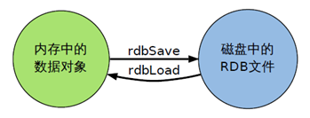

[TOC]

# Redis简介

## 概念

Redis:**REmote DIctionary Server**(远程字典服务器)是完全开源免费的，用C语言编写的，遵守BSD协议，是一个高性能的(key/value)分布式内存数据库，基于内存运行 并支持持久化的NoSQL数据库，是当前最热门的NoSql数据库之一，也被人们称为数据结构服务器。

Redis 与其他 key - value 缓存产品有以下三个特点：

- Redis支持数据的持久化，可以将内存中的数据保持在磁盘中，重启的时候可以再次加载进行使用
- Redis不仅仅支持简单的key-value类型的数据，同时还提供list，set，zset，hash等数据结构的存储
- Redis支持数据的备份，即master-slave模式的数据备份

## 作用

- 内存存储和持久化：redis支持异步将内存中的数据写到硬盘上，同时不影响继续服务
- 取最新N个数据的操作，如：可以将最新的10条评论的ID放在Redis的List集合里面
- 模拟类似于HttpSession这种需要设定过期时间的功能
- 发布、订阅消息系统
- 定时器、计数器

## Redis的安装

### 正常安装

1. 下载后放到/opt目录下

2. tar -zxvf  redis-5.0.2.tar.gz 解压到当前目录

3. 解压后cd redis-5.0.2

4. 在redis-5.0.2目录下执行make命令

   运行make命令时出现的错误解析

   ​	安装gcc：yum -y install gcc-c++  

   ​	再次make

   ​	如果遇到Jemalloc/jemalloc.h:没有那个目录，运行make distclean之后再make

5. make完之后make install

6. 查看默认安装目录

   - Redis-benchmark：性能测试
   - Redis-check-aof：修复有问题的aof文件
   - Redis-check-dump：修复有问题的dump.rdb文件
   - Redis-cli：客户端操作入口
   - Redis-server：Redis服务器启动命令
   - Redis-sentinel：redis集群使用

7. 安装后

   将默认的redis.conf复制到myredis，来到myredis目录，vim redis.conf，将damonized设置为yes，让服务在后台启动

   ps -ef | grep redis：检查redis是否启动。

   启动服务器和客户端，发送ping，会收到PONG


8. 关闭

   单实例关闭：redis-cli shutdown

   多实例关闭：redis-cli -p 6379 shutdown

### docker安装


```shell
# 将redis.conf文件拷贝到/opt/myredis/conf文件夹下，并将其中的bind 127.0.0.1注释，设置protected-mode no
docker pull redis

docker run -p 6379:6379 --name redis -v /opt/myredis/data:/data -v /opt/myredis/conf:/usr/local/redis/conf -d redis redis-server /usr/local/redis/conf/redis.conf --appendonly yes

# 通过如下命令进入终端
docker exec -it redis redis-cli
```


## Redis启动后杂项基础知识

- `redis-benchmark.exe` 测试redis在机器运行的效能

- 它是单进程

- 默认16个数据库，可以在redis.conf配置文件中查看修改。


- `select`命令切换数据库

- `dbsize`查看当前数据库的key的数量

- `flushdb`：清空当前库

- `flushall`：通杀全部库

- 统一密码管理，16个库都是同样密码，要么都OK要么一个也连接不上

- Redis索引都是从零开始

# Redis的数据类型

## 五大数据类型

- String(字符串)
  - 一个key对应一个value，是二进制安全的，意思是String可以包含任何数据类型，比如jpg图片或者序列化的对象
  - string类型是Redis最基本的数据类型，一个redis中字符串value最多可以是512M

- List
  - Redis 列表是简单的字符串列表，按照插入顺序排序。你可以添加一个元素导列表的头部（左边）或者尾部（右边）。
  - 它的底层实际是个链表

- Set
  - Redis的Set是string类型的无序集合。它是通过HashTable实现实现的

- hash
  - Redis hash 是一个键值对集合。
  - Redis hash是一个string类型的field和value的映射表，hash特别适合用于存储对象。
  - 类似Java里面的Map<String,Object>

- SortedSet(Zset)
  - Redis zset 和 set 一样也是string类型元素的集合，且不允许重复的成员。
  - ==不同的是每个元素都会关联一个double类型的分数==。
  - redis正是通过分数来为集合中的成员进行从小到大的排序。zset的成员是唯一的，但==分数(score)却可以重复==。

## key关键字

```shell
# 常用操作
keys * # 获得所有的key
exists k1 # 判断k1是否存在，存在返回1，不存在返回0
move k1 2 # 将k1移到2号库
expire key seconds # 给指定的key设置存活时间
ttl key # 查看还有多久过期，-1代表永不过期，-2代表已经过期。
# 过期之后keys * 无法查看，get key也查询不到，如果想删除用del key
type key # 查看key是什么类型
```

## 五大数据类型的操作

[Redis命令参考](http://redisdoc.com/)

# 配置文件

可以通过 CONFIG 命令查看或设置配置项

```shell
redis 127.0.0.1:6379> CONFIG GET CONFIG_SETTING_NAME
```

**General通用**

| 配置项                     | 说明                                                         |
| -------------------------- | :----------------------------------------------------------- |
| daemonize no               | Redis 默认不是以守护进程的方式运行，可以通过该配置项修改，使用 yes 启用守护进程（Windows 不支持守护线程的配置为 no ） |
| pidfile /var/run/redis.pid | 当 Redis 以守护进程方式运行时，Redis 默认会把 pid 写入 /var/run/redis.pid 文件，可以通过 pidfile 指定 |
| port 6379                  | 指定 Redis 监听端口，默认端口为 6379，作者在自己的一篇博文中解释了为什么选用 6379 作为默认端口，因为 6379 在手机按键上 MERZ 对应的号码，而 MERZ 取自意大利歌女 Alessia Merz 的名字 |
| bind 127.0.0.1             | 绑定的主机地址                                               |
| timeout 300                | 当客户端闲置多长秒后关闭连接，如果指定为 0 ，表示关闭该功能  |
| loglevel notice            | 指定日志记录级别，Redis 总共支持四个级别：debug、verbose、notice、warning，默认为 notice |
| logfile stdout             | 日志记录方式，默认为标准输出，如果配置 Redis 为守护进程方式运行，而这里又配置为日志记录方式为标准输出，则日志将会发送给 /dev/null |
| databases 16               | 设置数据库的数量，默认数据库为0，可以使用SELECT 命令在连接上指定数据库id |

**SECURITY安全**


# Redis持久化

## RDB(Redis DataBase)

### 简介

在指定的时间间隔内将内存中的数据集快照写入磁盘，也就是行话讲的Snapshot快照，它恢复时是将快照文件直接读到内存里

Redis会**单独创建一个子进程来进行持久化，会先将数据写入到 一个临时文件**中，待持久化过程都结束了，再用这个临时文件替换上次持久化好的文件。 整个过程中，主进程是不进行任何IO操作的，这就确保了极高的性能。如果需要进行大规模数据的恢复，且对于数据恢复的完整性不是非常敏感，那RDB方式要比AOF方式更加的高效。**RDB的缺点是最后一次持久化后的数据可能丢失**。

> Fork的作用是复制一个与当前进程一样的进程。新进程的所有数据（变量、环境变量、程序计数器等） 数值都和原进程一致，但是是一个全新的进程，并作为原进程的子进程

rdb 保存的是dump.rdb文件

相关配置在配置文件的位置 - 在redis.conf搜寻`### SNAPSHOTTING ###`

### 如何触发RDB快照

RDB是整个内存的压缩过的Snapshot，RDB的数据结构，可以配置复合的快照触发条件，默认

> 1分钟内改了1万次
>
> 5分钟内改了10次
>
> 15分钟内改了1次

配置文件中默认的快照配置`dbfilename dump.rdb`

- 冷拷贝后重新使用
     - 可以cp dump.rdb dump_new.rdb

命令save或者是bgsave

- Save：save时只管保存，其它不管，全部阻塞
- BGSAVE：Redis会在后台异步进行快照操作， 快照同时还可以响应客户端请求。可以通过lastsave 命令获取最后一次成功执行快照的时间
 - 执行flushall命令，也会产生dump.rdb文件，但里面是空的，无意义

### 如何恢复

将备份文件 (dump.rdb) 移动到 redis 安装目录并启动服务即可

### 优势与劣势

- 优势
  - 适合大规模的数据恢复
  - 对数据完整性和一致性要求不高
- 劣势
  - 在一定间隔时间做一次备份，所以如果redis意外down掉的话，就 会丢失最后一次快照后的所有修改
  - Fork的时候，内存中的数据被克隆了一份，大致2倍的膨胀性需要考虑

### 如何停止

动态所有停止RDB保存规则的方法：`redis-cli config set save ""`

### 小结



- RDB是一个非常紧凑的文件。
- RDB在保存RDB文件时父进程唯一需要做的就是创建出一个子进程，接下来的工作全部由子进程来做，父进程不需要再做其他IO操作，所以RDB持久化方式可以最大化redis的性能。
- 与AOF相比，在恢复大的数据集的时候，RDB方式会更快一些。
- 数据丢失风险大。
- RDB需要经常创建子进程来保存数据集到硬盘上，当数据集比较大的时候fork的过程是非常耗时的，可能会导致Redis在一些毫秒级不能回应客户端请求。

## AOF(Append Only File)

### 简介

以日志的形式来**记录每个写操作**，将Redis执行过的所有写指令记录下来(读操作不记录)， **只许追加文件但不可以改写文件**，redis启动之初会读取该文件重新构建数据，换言之，redis 重启的话就根据日志文件的内容将写指令从前到后执行一次以完成数据的恢复工作

### AOF配置

相关配置在redis.conf搜寻`### APPEND ONLY MODE ###`

aof保存的是appendonly.aof文件（在配置文件可修改文件名）

### AOF启动/恢复

- 正常恢复
  - 启动：设置Yes
    - 修改默认的appendonly no，改为yes
  - 将有数据的aof文件复制一份保存到对应目录(config get dir)
  - 恢复：重启redis然后重新加载
- 异常恢复
  - 启动：设置Yes
    - 修改默认的appendonly no，改为yes
  - 备份被写坏的AOF文件
  - 修复：
    - `Redis-check-aof --fix`进行修复
  - 恢复：重启redis然后重新加载

### rewrite

- 是什么：

  AOF采用文件追加方式，文件会越来越大。为避免出现此种情况，新增了重写机制， 当AOF文件的大小超过所设定的阈值时，Redis就会启动AOF文件的内容压缩， 只保留可以恢复数据的最小指令集。可以使用命令bgrewriteaof

- 重写原理

  AOF文件持续增长而过大时，会fork出一条新进程来将文件重写(也是先写临时文件最后再rename)， 遍历新进程的内存中数据，每条记录有一条的Set语句。重写aof文件的操作，并没有读取旧的aof文件， 而是将整个内存中的数据库内容用命令的方式重写了一个新的aof文件，这点和快照有点类似

- 触发机制

  Redis会记录上次重写时的AOF大小，默认配置是当AOF文件大小是上次rewrite后大小的一倍且文件大于64M时触发

  

### 优势与劣势

- 优势
  - 每修改同步：appendfsync always 同步持久化 每次发生数据变更会被立即记录到磁盘 性能较差但数据完整性比较好
  - 每秒同步：appendfsync everysec 异步操作，每秒记录 如果一秒内宕机，有数据丢失
  - 不同步：appendfsync no 从不同步
- 劣势
  - 相同数据集的数据而言aof文件要远大于rdb文件，恢复速度慢于rdb
  - Aof运行效率要慢于rdb,每秒同步策略效率较好，不同步效率和rdb相同

### 小结


- AOF文件是一个只进行追加的日志文件
- Redis可以在AOF文件体积变得过大时，自动地在后台对AOF进行重写
- AOF文件有序地保存了对数据库执行的所有写入操作，这些写入操作以Redis协议的格式保存，因此AOF文件的内容非常容易被人读懂，对文件进行分析也很轻松
- 对于相同的数据集来说，AOF文件的体积通常要大于RDB文件的体积
- 根据所使用的fsync 策略，AOF的速度可能会慢于RDB

## 持久化总结

- RDB持久化方式能够在**指定的时间间隔**对数据**进行快照存储**

  > 1分钟1万次，10分钟10次，15分钟1次

- AOF持久化方式**记录每次对服务器写的操作**，当服务器重启的时候会执行这些命令来恢复原始的数据，AOF命令以redis协议追加保存每次写的操作到文件末尾。Redis还能对AOF文件进行后台重写，使得AOF文件的体积不至于过大。

- 只做缓存：如果只希望数据在运行的时候存在，也可以不使用任何持久化方式。

- 同时开启两种持久化方式，在这种时候，当redis重启的时候会优先载入AOF文件来恢复原始的数据，因为通常情况下AOF文件保存的数据集要比RDB文件保存的数据集要完整


性能建议：

因为RDB文件只用作后备用途，建议只在 Slave上持久化RDB文件，而且只要15分钟备份一次就够了只保留save 9001 这条规则


# 事务

## 简介

可以一次执行多个命令，本质是一组命令的集合。一个事务中的所有命令都会序列化，按顺序地串行化执行而不会被其它命令插入，不许加塞

```shell
multi # 标记一个事务块的开始
exec # 执行所有事务块内的命令
discard # 取消事务，放弃执行事务块内的所有命令
watch key [key...] # 监视一个或多个key
unwatch # 取消watch命令对所有key的监视
```

## 案例

### 正常执行


### 放弃事务


### 事务失败

`set email`这句话本来就是有问题的，语法都存在问题，自然不可能执行。类似java中的编译异常


整个语法是没什么问题的，但是执行中出现了问题，因为email无法加一。类似java中的运行异常


### WATCH实现乐观锁

悲观锁（ Pessimistic lock），顾名思义，就是很悲观，每次去拿数据的时候都认为别人会修改，所以每次在拿数据的时候都会上锁，这样别人想拿这个数据就会 block直到它拿到锁。传统的关系型数据库里边就用到了很多这种锁杋制，比如行锁，表锁等，读锁，写锁等，都是在做操作之前先上锁

乐观锁（ Optimistic Lock），顾名思义，就是很乐观，每次去拿数据的时候都认为别人不会修改，所以不会上锁，但是在更新的时候会判断一下在此期间别人有没有去更新这个数据，可以使用版本号等机制。乐观锁适用于多读的应用类型，这样可以提高吞吐量

乐观锁策略：提交版本必须大于记录当前版本才能执行更新


1. 初始化信用卡可用余额和欠额


2. 无加塞篡改，先监控再开启multi，保证两笔金额变动在同一个事务之内。此时事务正常执行


3. 如果在WATCH后，更新了值，那么此次的事务就会失败。


4. 如果想成功的更新事务，那么UNWATCH取消监控，即可完成事务。


一旦执行了exec之前加的监控锁都会被取消掉了

小结
- Watch指令，类似乐观锁，事务提交时，如果Key的值已被别的客户端改变比如某个list已被别的客户端push/pop过了，整个事务队列都不会被执行
- 通过 WATCH命令在事务执行之前监控了多个Keys，倘若在 WATCH之后有任何Key的值发生了变化， EXEC命令执行的事务都将被放弃，同时返回 Nullmulti-buk应答以通知调用者事务执行失败

## 三阶段

开启：以MUlTI开启一个事务

入队：将多个命令入队到事务中，接到这些命令不会立刻执行，而是放到等待执行的事务队列里面

执行：由EXEC命令触发事务

## 三特性

1. 单独的隔离操作：事务中所有命令都会序列化，按顺序地执行。事务在执行过程中，不会被其它客户端发送来的命令请求所打断。

2. 没有隔离级别的概念：队列中的命令没有提交之前都不会实际的被执行，因为事务提交前任何指令都不会被实际执行。也就不会存在“事务内的查询要看到事务内的更新，在事务外查询不能看到”这个问题。
3. **不保证原子性**：redis同一个事务中如果有一条命令执行失败，其后的命令仍然会被执行，没有回滚。


# 主从复制

## 简介

主机数据更新后根据配置和策略，自动同步到备机的master/slaver机制，Master以写为主，Slave以读为主

**作用**

> 读写分离
>
> 容灾恢复

**如何操作？**

> 配从(库)不配主(库)
>
> 每次与master断开之后，都需要重新连接，除非配置进redis.conf文件中
>
> Info replication

## 常用操作

**一主二仆(一个主机两个从机)**

Init初始化


设置一个主机两个从机。

Master写，Slave读。


日志查看

​	主机日志

​	

​	备机日志

​	

​	info replication

​	

主从问题演示

1. 切入点问题？slave1、slave2是从头开始复制还是从切入点开始复制？比如从k4进来，那之前的123是否也可以复制？
   - 答：从头开始复制；123也可以复制
2. 从机是否可以写？set可否？
   - 答：从机不可写（不可set），主机可写
3. 主机shutdown后情况如何？从机是上位还是原地待命
   - 答：从机还是原地待命
4. 主机又回来了后，主机新增记录，从机还能否顺利复制？
   - 答：能
5. 其中一台从机down后情况如何？依照原有它能跟上大部队吗？
   - 答：不能跟上，每次与master断开之后，都需要重新连接，除非你配置进redis.conf文件（具体位置：redis.conf搜寻`#### REPLICATION ####`）

**薪火相传**

- 上一个Slave可以是下一个slave的Master，Slave同样可以接收其他 slaves的连接和同步请求，那么该slave作为了链条中下一个的master, 可以有效减轻master的写压力（奴隶的奴隶还是奴隶）
- 中途变更转向：会清除之前的数据，重新建立拷贝最新的
- `slaveof 新主库IP 新主库端口`

**反客为主**

```shell
# 使当前数据库停止与其他数据库的同步，转成主数据库
SLAVEOF no one
```

## 复制原理

- slave启动成功连接到master后会发送一个sync命令
- master接到命令启动后台的存盘进程，同时收集所有接收到的用于修改数据集命令， 在后台进程执行完毕之后，master将传送整个数据文件到slave,以完成一次完全同步
- 全量复制：而slave服务在接收到数据库文件数据后，将其存盘并加载到内存中。
- 增量复制：Master继续将新的所有收集到的修改命令依次传给slave,完成同步
- 但是只要是重新连接master，一次完全同步（全量复制)将被自动执行

## 哨兵模式

一组sentinel能同时监控多个master

1. 是什么？

   反客为主的自动版，能够后台监控主机是否故障，如果故障了根据投票数自动将从库转换为主库

2. 怎么玩？

   1. 调整结构，6379带着6380、6381
   2. 新建sentinel.conf文件，名字绝不能错
   3. 配置哨兵,填写内容
      1. `sentinel monitor 被监控数据库名字(自己起名字) 127.0.0.1 6379 1`
      2. 上面最后一个数字1，表示主机挂掉后salve投票看让谁接替成为主机，得票数多少后成为主机（PS. 跟官网的描述有出入，下面有官方文档说明）
   4. 启动哨兵
      1. `redis-sentinel /sentinel.conf `（上述目录依照各自的实际情况配置，可能目录不同）
   5. 正常主从演示
   6. 原有的master挂了
   7. 投票新选
   8. 重新主从继续开工，info replication查查看

   问题：如果之前挂了的master重启回来，会不会双master冲突？ 答： 不会，原master，变成slave

## 复制的缺点

由于所有的写操作都是先在Master上操作，然后同步更新到slave上，所以从Master同步到Slave机器有一定的延迟，当系统很繁忙的时候，延迟问题会更加严重，Slave机器数量的增加也会使这个问题更加严重。


# 参考

[Redis教学视频](https://www.bilibili.com/video/BV1oW411u75R?from=search&seid=13998774056849042736)

[课件整理](https://my.oschina.net/jallenkwong/blog/4411044#h2_63)

[Redis中文网](http://www.redis.cn/)

