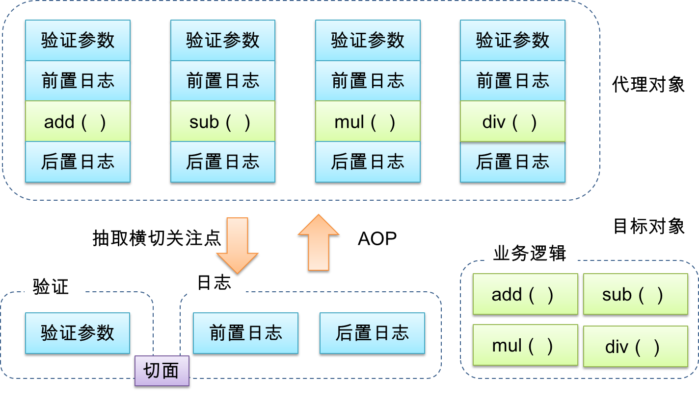

#AOP

## 简介

AOP：Aspect-Oriented Programming，**面向切面编程**

在开发中,为了给业务方法中增加日志记录,权限检查,事务控制等功能,此时我们需要去修改业务方法代码,考虑到代码的重用性,我们可以考虑使用OOP的继承或组合关系来消除重复, 但是无论怎么样, 我们都会在业务方法中纵向地增加这些功能方法的调用代码。



主要作用：

- 日志记录
- 事务处理
- 异常处理
- 性能统计
- 安全控制
- ...

## 相关术语

**Jointpoint(连接点)**

- 所谓连接点就是指那些被拦截的点。在spring中，这些点指的是方法，因为spring只支持方法类型的连接点。

**Pointcut(切入点)**

- 所谓切入点是指我们要对哪些Jointpoint进行拦截的定义。

**Advice(增强，通知)**：

- 所谓通知是指拦截到 Joinpoint 之后所要做的事情就是通知。
- 通知的类型：前置通知,后置通知,异常通知,最终通知,环绕通知。

**切面(Aspect)**

- 是切入点和通知的结合

**目标(Target)**

- 被通知的对象

**代理(Proxy)**

- 向目标对象应用通知之后创建的代理对象

## AspectJ

AspectJ：Java社区里最完整最流行的AOP框架。

在Spring2.0以上版本中，可以使用基于AspectJ注解或基于XML配置的AOP。

## 切入点表达式

通过**表达式的方式**定位**一个或多个**具体的连接点。

```
切入点表达式的写法：
        关键字：execution(表达式)
        表达式：
            访问修饰符  返回值类型 全类名.方法名(参数列表)
        标准的表达式写法：
            public void cn.akangaroo.service.Impl.AccountServiceImpl.saveAccount()
        访问修饰符可以省略：
            void cn.akangaroo.service.Impl.AccountServiceImpl.saveAccount()
        返回值可以使用通配符，表示任意返回值：
            * cn.akangaroo.service.Impl.AccountServiceImpl.saveAccount()
        包名可以使用通配符表示任意包。但是有几级包，就需要写几个*
            * *.*.*.*.AccountServiceImpl.saveAccount()
        包名可以使用..表示当前包及其子包
            * *..AccountServiceImpl.saveAccount()
        类名和方法名都可以使用*来实现通配
            * *..*.*()
        参数列表：
            可以直接写数据类型：
                基本类型直接写名称：  int
                引用类型直接写包名.类名的方法 java.lang.String
            可以使用通配符表示任意类型，但是表示必须有参数
            可以使用..表示有无参数均可。
        全通配写法：
            * *..*.*(..)

        实际开发中切入点表达式的通常写法：
            切到业务层实现类下的所有方法
                * cn.akangaroo.Service.Impl.*.*(..)
```

## JoinPoint

切入点表达式通常都会是从宏观上定位一组方法，和具体某个通知的注解结合起来就能够确定对应的连接点。那么就一个具体的连接点而言，我们可能会关心这个连接点的一些具体信息，例如：当前连接点所在方法的方法名、当前传入的参数值等等。这些信息都封装在JoinPoint接口的实例对象中。

`getArgs()`：获取方法运行时的参数

`getSignature()`：封装签名对象的信息，可以进一步获取方法名等。

```java
String classMethod = joinPoint.getSignature().getDeclaringTypeName() + "." + joinPoint.getSignature().getName();
Object[] args = joinPoint.getArgs();
```


## 通知类型

前置通知：@Before

后置通知：@AfterReturning

异常通知：@AfterThrowing

最终通知：@After

环绕通知：@Around

## 注解配置

```java
@Component
@Aspect // 表示当前类是一个切面类
public class LogAspect {

    @Pointcut("execution(* cn.akangaroo.service.Impl.*.*(..))")
    private void pointCut() {

    }

    /**
     * 前置通知
     */
    @Before("pointCut()")
    public void beforePrintLog(JoinPoint joinPoint) {
        Object[] args = joinPoint.getArgs();
        System.out.println("前置通知，记录日志，参数是："+ Arrays.toString(args));
    }

    /**
     * 后置通知
     */
    @AfterReturning("pointCut()")
    public void afterReturningPrintLog() {
        System.out.println("后置通知，记录日志");
    }

    /**
     * 异常通知
     */
    @AfterThrowing("pointCut()")
    public void afterThrowingPrintLog() {
        System.out.println("异常通知，记录日志");
    }

    /**
     * 最终通知
     */
    @After("pointCut()")
    public void afterPrintLog() {
        System.out.println("最终通知，记录日志");
    }

    /**
     * 环绕通知
     * 问题：当我们配置了环绕通知之后，切入点方法没有执行，而通知方法执行了。
     * 分析：代码中没有切入点的代码调用
     * 解决：spring框架为我们提供了一个接口，proceedingJointPoint。该方法有一个接口proceed，此方法就相当于明确调用切入点方法。
     */
    //@Around("pt1()")
    public Object aroundPrintLog(ProceedingJoinPoint pjp) {
        Object rtValue = null;
        try {
            Object[] args = pjp.getArgs();//得到执行所需的参数

            System.out.println("前置通知执行了");
            rtValue = pjp.proceed(args);//明确调用业务层切入点方法
            System.out.println("后置通知执行了");

            return rtValue;
        } catch (Throwable throwable) {
            System.out.println("异常通知执行了");
            throw new RuntimeException(throwable);

        } finally {
            System.out.println("最终通知执行了");
        }

    }
}
```

在同一个连接点上应用不止一个切面时，除非明确指定，否则它们的优先级是不确定的。

切面的优先级可以通过实现Ordered接口或利用@Order注解指定。

实现Ordered接口，getOrder()方法的返回值越小，优先级越高。

若使用@Order注解，序号出现在注解中


多个切面，执行顺序和Filter一样。

## XML配置

```java
public class LogAspect {

    /**
     * 前置通知
     */
    public void beforePrintLog(){
        System.out.println("前置通知，记录日志");
    }
    /**
     * 后置通知
     */
    public void afterReturningPrintLog(){
        System.out.println("后置通知，记录日志");
    }
    /**
     * 异常通知
     */
    public void afterThrowingPrintLog(){
        System.out.println("异常通知，记录日志");
    }
    /**
     * 最终通知
     */
    public void afterPrintLog(){
        System.out.println("最终通知，记录日志");
    }

    /**
     * 环绕通知
     *      问题：当我们配置了环绕通知之后，切入点方法没有执行，而通知方法执行了。
     *      分析：代码中没有切入点的代码调用
     *      解决：spring框架为我们提供了一个接口，proceedingJointPoint。该方法有一个接口proceed，此方法就相当于明确调用切入点方法。
     */
    public Object aroundPrintLog(ProceedingJoinPoint pjp){
        Object rtValue = null;
        try {
            Object[] args = pjp.getArgs();//得到放啊执行所需的参数

            System.out.println("前置通知执行了");
            rtValue = pjp.proceed(args);//明确调用业务层切入点方法
            System.out.println("后置通知执行了");

            return rtValue;
        } catch (Throwable throwable) {
            System.out.println("异常通知执行了");
            throw new RuntimeException(throwable);

        } finally {
            System.out.println("最终通知执行了");
        }

    }
}

```


- 切入点使用&lt;aop:pointcut&gt;元素声明。

- 切入点必须定义在&lt;aop:aspect&gt;元素下，或者直接定义在&lt;aop:config&gt;元素下。

  定义在&lt;aop:aspect&gt;元素下：只对当前切面有效

  定义在&lt;aop:config&gt;元素下：对所有切面都有效

- 基于XML的AOP配置不允许在切入点表达式中用名称引用其他切入点

```xml
	<!--将LogAspect注入到容器中-->
    <bean id="logAspect" class="cn.aknagroo.common.LogAspect"></bean>

    <!--配置aop-->
    <aop:config>
        <!--配置切面-->
        <aop:aspect id="logAdvice" ref="logAspect">
            <!--配置切入点表达式-->
            <aop:pointcut id="pt1" expression="execution(* cn.akangaroo.service.Impl.*.*(..))"/>
            <!--配置前置通知-->
            <aop:before method="beforePrintLog" pointcut-ref="pt1"></aop:before>
            <!--配置后置通知-->
            <aop:after-returning method="afterReturningPrintLog" pointcut-ref="pt1"></aop:after-returning>
            <!--配置异常通知-->
            <aop:after-throwing method="afterThrowingPrintLog" pointcut-ref="pt1"></aop:after-throwing>
            <!--配置最终通知-->
            <aop:after method="afterPrintLog" pointcut-ref="pt1"></aop:after>

            <!--配置环绕通知-->
            <!--<aop:around method="aroundPrintLog" pointcut-ref="pt1"></aop:around>-->
        </aop:aspect>
    </aop:config>
```


