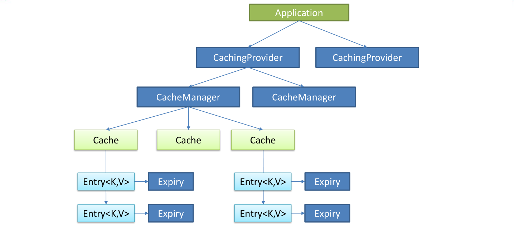

# 缓存简介

## JSR107
`Java Caching`定义了5个核心接口，分别是`CachingProvider`, `CacheManager`, `Cache`, `Entry`和`Expiry`

- `CachingProvider`定义了创建、配置、获取、 管理和控制多个`CacheManager`。一个应用可以在运行期访问多个`CachingProvider`.

- `CacheManager`定义 了创建、配置、获取、管理和控制多个唯一 命名的`Cache`,这些`Cache`存在于`CacheManager`的上下文中。一个`CacheManager`仅被一个`CachingProvider`所拥有。

- `Cache`是一 个类似Map的数据结构并临时存储以Key为索引的值。一个`Cache`仅被一个`CacheManager`所拥有。
- `Entry`是一个存储在`Cache`中的`key-value`对。
- `Expiry`每一个存储在`Cache`中的条目有一个定义的有效期。-一旦超过这个时间，条目为过期的状态。一旦过期，条目将不可访问、更新和删除。缓存有效期可以通过`ExpiryPolicy`设置。



## Spring缓存抽象

`Spring`从3.1开始定义了`org.springframework.cache.Cache`和`org.springframework.cache.CacheManager`接口来统一不同的缓存技术; 并支持使用JCache (JSR-107) 注解简化我们开发;

- `Cache`接口为缓存的组件规范定义，包含缓存的各种操作集合;
- `Cache`接口 下`Spring`提供了各种`xxxCache`的实现; 如`RedisCache`，`EhCacheCache` ,`ConcurrentMapCache`等;
- 每次调用需要缓存功能的方法时 . Spring会检查检查指定参数的指定的目标方法是否已经被调用过;如果有就直接从缓存中获取方法调用后的结果，如果没有就调用方法并缓存结果后返回给用户。下次调用直接从缓存中获取。
- 使用Spring缓存抽象时我们需要关注以下两点;
  1. 确定方法需要被缓存以及他们的缓存策略
  2. 从缓存中读取之前缓存存储的数据

# 1. 基本环境搭建

1. 库和表的创建

   ```mysql
   SET FOREIGN_KEY_CHECKS=0;
   
   -- ----------------------------
   -- Table structure for department
   -- ----------------------------
   DROP TABLE IF EXISTS `department`;
   CREATE TABLE `department` (
     `id` int(11) NOT NULL AUTO_INCREMENT,
     `departmentName` varchar(255) DEFAULT NULL,
     PRIMARY KEY (`id`)
   ) ENGINE=InnoDB DEFAULT CHARSET=utf8;
   
   -- ----------------------------
   -- Table structure for employee
   -- ----------------------------
   DROP TABLE IF EXISTS `employee`;
   CREATE TABLE `employee` (
     `id` int(11) NOT NULL AUTO_INCREMENT,
     `lastName` varchar(255) DEFAULT NULL,
     `email` varchar(255) DEFAULT NULL,
     `gender` int(2) DEFAULT NULL,
     `d_id` int(11) DEFAULT NULL,
     PRIMARY KEY (`id`)
   ) ENGINE=InnoDB DEFAULT CHARSET=utf8;
   ```

   

2. 创建相应的实体类

   ```java
   public class Department {
   	
   	private Integer id;
   	private String departmentName;
   	
   	
   	public Department() {
   		super();
   		// TODO Auto-generated constructor stub
   	}
   	public Department(Integer id, String departmentName) {
   		super();
   		this.id = id;
   		this.departmentName = departmentName;
   	}
   	public Integer getId() {
   		return id;
   	}
   	public void setId(Integer id) {
   		this.id = id;
   	}
   	public String getDepartmentName() {
   		return departmentName;
   	}
   	public void setDepartmentName(String departmentName) {
   		this.departmentName = departmentName;
   	}
   	@Override
   	public String toString() {
   		return "Department [id=" + id + ", departmentName=" + departmentName + "]";
   	}
   	
   }
   
   ```
   
   ```java
public class Employee {
   	
   	private Integer id;
   	private String lastName;
   	private String email;
   	private Integer gender; //性别 1男  0女
   	private Integer dId;
   	
   	
   	public Employee() {
   		super();
   	}
   
   	
   	public Employee(Integer id, String lastName, String email, Integer gender, Integer dId) {
   		super();
   		this.id = id;
   		this.lastName = lastName;
   		this.email = email;
   		this.gender = gender;
   		this.dId = dId;
   	}
   	
   	public Integer getId() {
   		return id;
   	}
   	public void setId(Integer id) {
   		this.id = id;
   	}
   	public String getLastName() {
   		return lastName;
   	}
   	public void setLastName(String lastName) {
   		this.lastName = lastName;
   	}
   	public String getEmail() {
   		return email;
   	}
   	public void setEmail(String email) {
   		this.email = email;
   	}
   	public Integer getGender() {
   		return gender;
   	}
   	public void setGender(Integer gender) {
   		this.gender = gender;
   	}
   	public Integer getdId() {
   		return dId;
   	}
   	public void setdId(Integer dId) {
   		this.dId = dId;
   	}
   	@Override
   	public String toString() {
   		return "Employee [id=" + id + ", lastName=" + lastName + ", email=" + email + ", gender=" + gender + ", dId="
   				+ dId + "]";
   	}
   	
   
   }
   
   ```
   
   
   
3. 配置数据源信息

   ```yaml
   spring:
     datasource:
       url: jdbc:mysql://localhost:3306/spring-cache?useUnicode=true&characterEncoding=UTF-8&serverTimezone=Asia/Shanghai
       username: root
       password: love22
       driver-class-name: com.mysql.cj.jdbc.Driver
   
   mybatis:
     configuration:
       map-underscore-to-camel-case: true
   ```

   

4. 使用注解版的Mybatis编写sql语句

   ```java
   @Mapper
   public interface EmployeeMapper {
   
       @Select("SELECT * FROM employee WHERE id = #{id}")
       Employee getEmpById(Integer id);
   
       @Update("UPDATE employee  SET lastName = #{lastName},email=#{email},gender=#{gender},d_id=#{dId} WHERE id = #{id}")
       void updateEmp(Employee employee);
   
       @Delete("DELETE FROM employee WHERE id = #{id}")
       void deleteEmpById(Integer id);
   
       @Insert("INSERT INTO employee (lastName,email,gender,d_id) VALUES (#{lastName},#{email},#{gender},#{dId})")
       void insertEmp(Employee employee);
   }
   ```

5. 编写service和controller

   - 很久没写，忘了很多。`@Service`注解是放在类上的，不是放在接口上的，因为`@Service`注解是把spring容器中的bean进行实例化，也就是等同于new操作，只有实现类是可以进行new实例化的，而接口则不能。

   ```java
   public interface EmployeeService {
       Employee getEmp(Integer id);
   }
   
   
   @Service
   public class EmployeeServiceImpl implements EmployeeService {
   
       @Autowired
       EmployeeMapper employeeMapper;
       
       @Override
       public Employee getEmp(Integer id) {
           System.out.println("查询"+id+"号员工");
           Employee emp = employeeMapper.getEmpById(id);
           return emp;
       }
   
   }
   
   ```

   - controller

      ```java
   @RestController
   public class EmployeeController {
   
       @Autowired
       EmployeeService employeeService;
   
       @GetMapping("/emp/{id}")
       public Employee getEmp(@PathVariable("id") Integer id) {
           Employee emp = employeeService.getEmp(id);
           return emp;
       }
   }
      ```

6. 在数据库Employee表中添加数据，然后在浏览器的地址栏中输入`localhost:8080/emp/1`，查到结果，成功！

# 2. 缓存的使用

- 开启基于缓存的注解`@EnableCaching`

  ```java
  @SpringBootApplication
  @MapperScan("cn.edu.cache.mapper")
  @EnableCaching
  public class SpringBootCacheApplication {
  
      public static void main(String[] args) {
          SpringApplication.run(SpringBootCacheApplication.class, args);
      }
  
  }
  ```

- 常用的三个注解简介

  - `@Cacheable`：主要针对方法配置，能够根据方法的请求参数对其结果进行缓存。

  - `@CacheEvict`：清空缓存。

  - `@CachePut`：方法被调用，结果又会被缓存。

## 2.1 @Cacheable

- `@Cacheable`参数介绍

  ​	CacheManager管理多个cache组件的，对缓存的真正的CRUD操作在cache组件中，每一个缓存组件有自己唯一一个名字

   1. `cacheNames/value`：指定缓存组件的名字，将方法的返回结果放在哪个缓存中，是数组的方式，可以指定多个缓存。

      ```java
      @Cacheable(cacheNames = {"emp", "temp"})
      public Employee getEmp(Integer id) {
        System.out.println("查询"+id+"号员工");
          Employee emp = employeeMapper.getEmpById(id);
        return emp;
      }
      ```
    ```
  
    ```
2. `key`：缓存数据使用的key，（因为缓存都是根据key-value的形式）可以用它来指定，默认是使用方法参数的值。
  
   ​	例如下面的方法，传入了一个1，那么就是`key = 1, value = 方法的返回值`
  
   ​	还可以编写spEL表达式，`#id`的值，等同于`#a0`,`#p0`,`#root.args[0]`
  
   ```java
     @Cacheable(cacheNames = "emp", key = "#id")
   public Employee getEmp(Integer id) {
         System.out.println("查询"+id+"号员工");
         Employee emp = employeeMapper.getEmpById(id);
         return emp;
     }
   ```
  
  3. `keyGenerator`：key的生成器，可以自己指定key的生成器的组件id
  
     ​	key/keyGenerator：二选一
  
     ```java
         @Configuration
         public class MyCacheConfig {
     
             @Bean("myKeyGenerator")
             public KeyGenerator keyGenerator() {
                 return new KeyGenerator(){
                     @Override
                     public Object generate(Object o, Method method, Object... objects) {
                         return method.getName() + "["+ Arrays.asList(objects).toString() +"]";
                     }
                 };
           }
         }
      
     ------------------------------------------------------------------------
      
         @Cacheable(cacheNames = {"emp"}, keyGenerator = "myKeyGenerator")
       public Employee getEmp(Integer id) {
             System.out.println("查询"+id+"号员工");
           Employee emp = employeeMapper.getEmpById(id);
             return emp;
       }
     ```

     

   4. `cacheManger`：缓存管理器

   5. `condition`：指定符合条件的情况才缓存

      ```java
          @Cacheable(cacheNames = {"emp"}, key = "#id", condition = "#id > 0")
          public Employee getEmp(Integer id) {
              System.out.println("查询"+id+"号员工");
              Employee emp = employeeMapper.getEmpById(id);
              return emp;
          }
      ```
  
  6. `unless`：当unless指定的条件为true时，就不会缓存，可以获取到结果进行判断
  
     ```java
         @Override
         @Cacheable(cacheNames = {"emp"}, key = "#id", unless = "#result == 2")
         public Employee getEmp(Integer id) {
             System.out.println("查询"+id+"号员工");
             Employee emp = employeeMapper.getEmpById(id);
             return emp;
         }
     ```
  
  7. ​	`sync`：是否使用异步模式
  
     

## 2.2 @CachePut注解

- `@CachePut`：**既调用方法**，又更新缓存数据

  - 运行时机：先调用目标方法，再将目标方法的结果缓存起来。（一定会调用目标方法）

  - 测试步骤：

    1. 查询一号员工，查到的结果会放在缓存中。
    2. 更新一号员工，地址栏输入`emp?lastName=lisi&gender=0`
       - 更新的数据是以key=value保存的，默认是参数名，所以这次的key是一个employee对象，而步骤1中是员工id
    3. 查询一号员工，发现没有更新。

    ```java
    	@Override
        @CachePut(value = "emp")
        public Employee updateEmp(Employee employee) {
            System.out.println("更新了员工信息");
            employeeMapper.updateEmp(employee);
            return employee;
        }
    ```

  - 改为

    ```java
        @CachePut(value = "emp", key = "#employee.id")
    	// 因为返回值也是employee，所以也可以改为
    	@CachePut(value = "emp", key = "#result.id")
    ```

    >  注意：@Cacheable注解的key是不能够使用#result， 因为@Cacheable是在方法运行前执行的。


## 2.3 @CacheEvict注解

- `@CacheEvict`：缓存清除

```java
    @Override
    @CacheEvict(value = "emp", key = "#id")
    public void deleteEmp(Integer id) {
        System.out.println("deleteEmp: " + id);
        // employeeMapper.deleteEmpById(id);
    }
```

- controller

```java
    @GetMapping("/delemp")
    public String deleteEmp(Integer id) {
        employeeService.deleteEmp(id);
        return "success";
    }
```

- 测试步骤：
  1. 先在地址栏中输入`localhots:8080/emp/1`查询一号员工
  2. 接着输入`localhost:8080/delemp?id=1`删除一号员工
  3. 再输入`localhots:8080/emp/1`，发现这次查询是从数据库中查的

- 参数：
  - `allentries = true`：删除所有
  - `beforeInvocation`：是否在方法之前执行，默认是false


## 2.4 @Caching注解

```java
    @Override
    @Caching(
        cacheable = {
            @Cacheable(value = "emp", key = "#lastName")
        },
        put = {
            @CachePut(value = "emp", key = "#result.id"),
            @CachePut(value = "emp", key = "#result.email")
        }
    )
    public Employee getEmpByLastName(String lastName) {
        return employeeMapper.getEmpByLastName(lastName);
    }

```

- controller

```java
    @GetMapping("/emp/lastname/{lastName}")
    public Employee getEmpByLastName(@PathVariable("lastName") String lastName) {
        System.out.println("lastname");
        return employeeService.getEmpByLastName(lastName);
    }
```

- 测试步骤：

  1. 先在地址栏中输入`localhost:8080/emp/lastname/zhangsan`，lastName，id，email都被作为key缓存。

  2. 输入`localhost:8080/emp/1`来查看是否成功，发现结果确实是这样

  3. 但是再输入一遍`localhost:8080/emp/lastname/zhangsan`时，发现，还是调用了`getEmpByLastName()`方法，原因在于使用了`@CachePut`注解，该注解无论如何都会调用一遍方法。


## 2.5 @CacheConfig注解

标注在类上，

作用：抽取缓存的公共配置


# 3. 整合Redis

## 3.1 基本操作

1. 导入Redis的依赖

   ```xml
           <dependency>
               <groupId>org.springframework.boot</groupId>
               <artifactId>spring-boot-starter-data-redis</artifactId>
           </dependency>
   ```

   

2. 进行redis的相关配置

   ```yaml
   spring:
     redis:
       host: 118.178.141.179
   ```

3. 使用`StringRedisTemplate` `RedisTemplate`操作

   `StringRedisTemplate`继承`RedisTemplate`，所以它们的方法是一样的。

   - 区别：

     RedisTemplate使用的是JdkSerializationRedisSerializer  存入数据会将数据先序列化成字节数组然后在存入Redis数据库。

     StringRedisTemplate使用的是StringRedisSerializer

   > 当你的redis数据库里面本来存的是字符串数据或者你要存取的数据就是字符串类型数据的时候，那么你就使用StringRedisTemplate即可， 但是如果你的数据是复杂的对象类型，而取出的时候又不想做任何的数据转换，直接从Redis里面取出一个对象，那么使用RedisTemplate是 更好的选择。

    * String stringRedisTemplate.opsForValue();
    * List stringRedisTemplate.opsForList();
    * Set stringRedisTemplate.opsForSet();
    * Hash stringRedisTemplate.opsForHash();
    * ZSet stringRedisTemplate.opsForZSet();

   其中，opsXXX()后面的方法和redis中的方法大抵上一致

   ```java
       @Test
   	public void testForKey() {
           Set<String> keys = stringRedisTemplate.keys("*");
           keys.forEach(System.out::println);
   
           Boolean flag = stringRedisTemplate.hasKey("k1");
           System.out.println(flag);
   
           DataType dataType = stringRedisTemplate.type("k1");
           System.out.println(dataType);
       }
   ```

   ```java
       @Test
       public void test01() {
           // 给redis中追加数据
           // stringRedisTemplate.opsForValue().append("msg", "hello");
           // String msg = stringRedisTemplate.opsForValue().get("msg");
           // System.out.println(msg);
   
           stringRedisTemplate.opsForList().leftPush("mylist", "1");
           stringRedisTemplate.opsForList().leftPush("mylist", "2");
           String mylist = stringRedisTemplate.opsForList().leftPop("mylist");
           System.out.println(mylist);
       }
   ```

- 测试保存对象

  ```java
      // 测试保存对象
      @Test
      public void test02() {
          Employee empById = employeeMapper.getEmpById(1);
          // 默认如果保存对象，使用JDK序列化机制
          redisTemplate.opsForValue().set("emp01", empById);
      }
  ```

  如果想要切换成JSON的方式，自定义`RedisTemplate`

  ```java
  @Configuration
  public class MyRedisConfig {
  
      @Bean
      public RedisTemplate<Object, Employee> empRedisTemplate(RedisConnectionFactory redisConnectionFactory)
              throws UnknownHostException {
          RedisTemplate<Object, Employee> template = new RedisTemplate<>();
          template.setConnectionFactory(redisConnectionFactory);
          Jackson2JsonRedisSerializer<Employee> serializer = new Jackson2JsonRedisSerializer<Employee>(Employee.class);
          template.setDefaultSerializer(serializer);
          return template;
      }
      
  }
  ```

  ```java
      @Test
      public void test02() {
          Employee empById = employeeMapper.getEmpById(1);
  
          // 将数据以json的方式保存R
          // 1. 自己将对象转为JSON
          // 2. RedisTemplate默认的序列化机制
          empRedisTemplate.opsForValue().set("emp-01", empById);
      }
  ```

  

## 3.2 自定义RedisCacheManger

SpringBoot2.0版本中配置RediscCacheManger如下

[参考文章](https://blog.csdn.net/qinying233/article/details/104689709)

```java
    @Bean
    RedisCacheManager cacheManager(RedisConnectionFactory redisConnectionFactory) {
        RedisCacheConfiguration redisCacheConfiguration = RedisCacheConfiguration.defaultCacheConfig()
            .entryTtl(Duration.ofMinutes(15))   // 设置缓存过期时间
            .disableCachingNullValues() // 禁用缓存空值，不缓存null校验
            .serializeValuesWith(RedisSerializationContext.SerializationPair.fromSerializer(
                new GenericJackson2JsonRedisSerializer())); // 设置cacheManger的序列化方式为json方式


        RedisCacheManager redisCacheManager = RedisCacheManager.builder(redisConnectionFactory)
            .cacheDefaults(redisCacheConfiguration).build();

        return redisCacheManager;

    }
```


# 原理

 1. 自动配置类`CacheConfigurationImportSelector`

    ```java
    0 = "org.springframework.boot.autoconfigure.cache.GenericCacheConfiguration"
    1 = "org.springframework.boot.autoconfigure.cache.JCacheCacheConfiguration"
    2 = "org.springframework.boot.autoconfigure.cache.EhCacheCacheConfiguration"
    3 = "org.springframework.boot.autoconfigure.cache.HazelcastCacheConfiguration"
    4 = "org.springframework.boot.autoconfigure.cache.InfinispanCacheConfiguration"
    5 = "org.springframework.boot.autoconfigure.cache.CouchbaseCacheConfiguration"
    6 = "org.springframework.boot.autoconfigure.cache.RedisCacheConfiguration"
    7 = "org.springframework.boot.autoconfigure.cache.CaffeineCacheConfiguration"
    8 = "org.springframework.boot.autoconfigure.cache.SimpleCacheConfiguration"
    9 = "org.springframework.boot.autoconfigure.cache.NoOpCacheConfiguration"
    ```

2. 在yml文件中配置debug = true，然后运行，检查哪个是否生效了。

   `SimpleCacheConfiguration`生效了，SpringBoot版本2.3.6