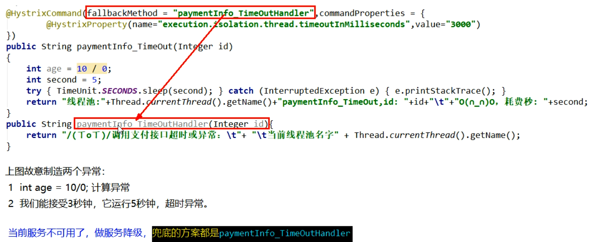
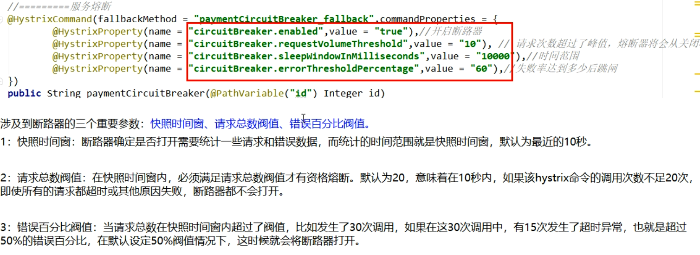

# Hystrix

## 1. 简介


作用：

- 服务降级
- 服务熔断
- 接近实时的监控


## 2. Hystrix重要概念


## 3. 案例

### 3.1 构建

1. 新建cloud-provider-hystrix-payment8001模块

2. pom文件

   ```xml
           <!-- hystrix-->
           <dependency>
               <groupId>org.springframework.cloud</groupId>
               <artifactId>spring-cloud-starter-netflix-hystrix</artifactId>
           </dependency>
   ```

3. yml文件

   ```yaml
   server:
     port: 8001
   
   spring:
     application:
       name: cloud-provider-hystrix-payment
   
   eureka:
     client:
       register-with-eureka: true
       fetch-registry: true
       service-url:
         defaultZone: http://localhost:7001/eureka
   ```

4. 主启动类

   ```java
   @SpringBootApplication
   @EnableEurekaClient
   public class PaymentHystrixMain8001 {
       public static void main(String[] args) {
           SpringApplication.run(PaymentHystrixMain8001.class, args);
       }
   }
   ```

5. 业务类

   service

   ```java
   @Service
   public class PaymentService {
       //正常访问方法
       public String paymentInfo_OK(Integer id){
           return "线程池：" + Thread.currentThread().getName() + "\tpaymentInfo_OK，id：" + id;
       }
       //超时访问方法
       public String paymentInfo_TimeOut(Integer id){
           int timeNumber = 5;
           try {
               TimeUnit.SECONDS.sleep(timeNumber);
           } catch (InterruptedException e) {
               e.printStackTrace();
           }
           return "线程池：" + Thread.currentThread().getName() +
                   "\tpaymentInfo_TimeOut，id：" + id + "，耗时：" + timeNumber + "秒";
       }
   }
   ```

   controller

   ```java
   @RestController
   @Slf4j
   public class PaymentController {
   
       @Autowired
       private PaymentService paymentService;
   
       @GetMapping("/payment/hystrix/ok/{id}")
       public String paymentInfo_OK(@PathVariable("id") Integer id){
           String result = paymentService.paymentInfo_OK(id);
           log.info("****result：" + result);
           return result;
       }
   
       @GetMapping("/payment/hystrix/timeout/{id}")
       public String paymentInfo_TimeOut(@PathVariable("id") Integer id){
           String result = paymentService.paymentInfo_TimeOut(id);
           log.info("****result：" + result);
           return result;
       }
   }
   ```

   

### 3.2 测试

#### 3.2.1 正常测试

`http://localhost:8001/payment/hystrix/ok/31`

`http://localhost:8001/payment/hystrix/timeout/31`

都能访问

#### 3.2.2 高并发测试

jmeter高并发测试

发现请求的时候转圈圈（响应慢）

原因：tomcat的默认的工作线程数被打满了，没有多余的线程来分解压力和处理。


### 3.3 消费者模块构建

1. 新建cloud-consumer-feign-hystrix-order80模块

2. pom文件

   ```xml
           <!-- openfeign -->
           <dependency>
               <groupId>org.springframework.cloud</groupId>
               <artifactId>spring-cloud-starter-openfeign</artifactId>
           </dependency>
           <!--   hystrix     -->
           <dependency>
               <groupId>org.springframework.cloud</groupId>
               <artifactId>spring-cloud-starter-netflix-hystrix</artifactId>
           </dependency>
           <!--eureka client-->
           <dependency>
               <groupId>org.springframework.cloud</groupId>
               <artifactId>spring-cloud-starter-netflix-eureka-client</artifactId>
           </dependency>
   ```

3. yml文件

   ```yaml
   server:
     port: 80
   
   
   eureka:
     client:
       register-with-eureka: false
       service-url:
         defaultZone: http://localhost:7001/eureka
   
   #需要加上，否则会报错
   ribbon:
     ReadTimeout: 4000
     ConnectTimeout: 4000
   ```

4. 主启动类

   ```java
   @EnableEurekaClient
   @EnableFeignClients
   @SpringBootApplication
   public class OrderHystrixMain80 {
       public static void main(String[] args) {
           SpringApplication.run(OrderHystrixMain80.class, args);
       }
   }
   ```

5. 业务类

   service

   ```java
   @Component
   @FeignClient(value = "CLOUD-PROVIDER-HYSTRIX-PAYMENT", fallback = PaymentFallbackService.class)
   public interface PaymentHystrixService {
   
       @GetMapping("/payment/hystrix/ok/{id}")
       String paymentInfo_OK(@PathVariable("id") Integer id);
   
       @GetMapping("/payment/hystrix/timeout/{id}")
       String paymentInfo_TimeOut(@PathVariable("id") Integer id);
   }
   ```

   controller

   ```java
   @Slf4j
   @RestController
   public class OrderHystrixController {
   
       @Resource
       private PaymentHystrixService paymentHystrixService;
   
       @GetMapping("/consumer/payment/hystrix/ok/{id}")
       public String paymentInfo_OK(@PathVariable("id") Integer id){
           String result = paymentHystrixService.paymentInfo_OK(id);
           return result;
       }
       
       @GetMapping("/consumer/payment/hystrix/timeout/{id}")
       public String paymentInfo_TimeOut(@PathVariable("id") Integer id){
           String result = paymentHystrixService.paymentInfo_TimeOut(id);
           return result;
       }
   }
   ```

6. 正常测试
7. 高并发测试，发现情况如上述所示。

### 3.4 原因

8001同一层次的其他接口服务被困死，因为tomcat线程里面的工作线程已经被挤占完毕

80此时调用8001，客户端访问响应缓慢，转圈圈。

正因为有上述故障或不佳表现，才有我们的降级/容错/限流等技术诞生

### 3.5 解决


## 4. 服务降级

降级配置：`@HystrixCommand`

### 4.1 服务方

8001先从自身找问题：设置自身调用超时时间的峰值，峰值内可以正常运行，超过了需要有兜底的方法处理，作**服务降级fallback**


业务类修改

```java
@Service
public class PaymentService {
    //正常访问方法
    public String paymentInfo_OK(Integer id){
        return "线程池：" + Thread.currentThread().getName() + "\tpaymentInfo_OK，id：" + id;
    }

    //超时访问方法
    @HystrixCommand(fallbackMethod = "paymentInfo_TimeOutHandler", commandProperties = {
            //设置自身超时调用时间的峰值为3秒，峰值内可以正常运行，超过了需要有兜底的方法处理，服务降级fallback
            @HystrixProperty(name = "execution.isolation.thread.timeoutInMilliseconds", value = "3000")
    })
    public String paymentInfo_TimeOut(Integer id){
        int timeNumber = 5;
        // int i = 10/0;
        try {
            TimeUnit.SECONDS.sleep(timeNumber);
        } catch (InterruptedException e) {
            e.printStackTrace();
        }
        return "线程池：" + Thread.currentThread().getName() +
                "\tpaymentInfo_TimeOut，id：" + id + "，耗时：" + timeNumber + "秒";
    }
	
    // 兜底方法
    public String paymentInfo_TimeOutHandler(Integer id){
        return "8001提供者，线程池：" + Thread.currentThread().getName() +
                "\tpaymentInfo_TimeOutHandler系统繁忙，请稍后再试，id：" + id;
    }
}
```




主启动类添加注解`@EnableCircuitBreaker`


### 4.2 消费方

1. yml

   ```yaml
   feign:
     hystrix:
       enabled: true
   ```

2. 主启动类添加`@EnableHystrix`

3. controller

   ```java
       @HystrixCommand(fallbackMethod = "paymentTimeOutFallbackMethod", commandProperties = {
               @HystrixProperty(name = "execution.isolation.thread.timeoutInMilliseconds", value = "1500")
       })
       @GetMapping("/consumer/payment/hystrix/timeout/{id}")
       public String paymentInfo_TimeOut(@PathVariable("id") Integer id){
           String result = paymentHystrixService.paymentInfo_TimeOut(id);
           return result;
       }
   
       public String paymentTimeOutFallbackMethod(@PathVariable("id") Integer id){
           return "消费者80，支付系统繁忙";
       }
   ```

   

### 4.3 存在的问题

#### 4.3.1 代码膨胀

每个方法配置一个？？？膨胀

1. controller类上添加`@DefaultProperties()`

2. 编写统一的降级方法

3. 在需要降级的方法上添加`@HystrixCommand`注解

   ```java
   @Slf4j
   @RestController
   @DefaultProperties(defaultFallback = "payment_Global_FallbackMethod")
   public class OrderHystrixController {
       
       @HystrixCommand
       @GetMapping("/consumer/payment/hystrix/timeout/{id}")
       public String paymentInfo_TimeOut(@PathVariable("id") Integer id){
           String result = paymentHystrixService.paymentInfo_TimeOut(id);
           return result;
       }
       
       //全局fallback方法，不能有传参
       public String payment_Global_FallbackMethod(){
           return "Global异常处理信息，请稍后再试！";
       }
   }
   ```

   

#### 4.3.2 代码混乱

1. 服务降级，客户端去调用服务端，碰上服务端宕机或关闭

2. 本次案例服务降级处理是在客户端80实现完成的，与服务端8001没有关系，只需要为Feign客户端定义的接口添加一个服务降级处理的实现类即可实现解耦

3. 未来我们要面对的异常

   - 运行时异常
   - 超时
   - 宕机

4. 再看我们的业务类PaymentController

   

5. 修改cloud-consumer-feign-hystrix-order80

6. 根据cloud-consumer-feign-hystrix-order80已经有的PaymentHystrixService接口，新建一个类（PaymentFallbackService）实现该接口，统一为接口里面的方法进行异常处理.

7. PaymentFallbackService类实现PaymentFeignClientService接口

   ```java
   @Component
   public class PaymentFallbackService implements PaymentHystrixService {
       @Override
       public String paymentInfo_OK(Integer id) {
           return "----PaymentFallbackService\t fallback-paymentInfo_OK----";
       }
   
       @Override
       public String paymentInfo_TimeOut(Integer id) {
           return "----PaymentFallbackService\t fallback-paymentInfo_TimeOut----";
       }
   }
   ```

8. yml

   ```yaml
   feign:
     hystrix:
       enabled: true
   ```

9. PaymentFeignClientService接口

   ```java
   @Component
   @FeignClient(value = "CLOUD-PROVIDER-HYSTRIX-PAYMENT", fallback = PaymentFallbackService.class)
   public interface PaymentHystrixService {
   
       @GetMapping("/payment/hystrix/ok/{id}")
       String paymentInfo_OK(@PathVariable("id") Integer id);
   
       @GetMapping("/payment/hystrix/timeout/{id}")
       String paymentInfo_TimeOut(@PathVariable("id") Integer id);
   }
   ```

10. 正常测试
11. 宕机测试

## 5. 服务熔断

断路器：一句话就是家里保险丝

### 5.1 操作

1. 修改cloud-provider-hystrix-payment8001

2. PaymentService

   ```java
       @HystrixCommand(fallbackMethod = "paymentCircuitBreaker_fallback",commandProperties = {
               @HystrixProperty(name = "circuitBreaker.enabled", value = "true"),                      //开启断路器
               @HystrixProperty(name = "circuitBreaker.requestVolumeThreshold", value = "10"),         //请求总数阈值（默认20）
               @HystrixProperty(name = "circuitBreaker.sleepWindowInMilliseconds", value = "10000"),   //休眠时间窗口期（休眠多久进入半开模式（单位毫秒，默认5秒））
               @HystrixProperty(name = "circuitBreaker.errorThresholdPercentage", value = "60"),       //请求次数的错误率达到多少跳闸（百分率%，默认50%）
       })
       public String paymentCircuitBreaker(Integer id) {
           if(id < 0){
               throw  new RuntimeException("****id 不能为负数");
           }
           String serialNumber = IdUtil.simpleUUID();
   
           return  Thread.currentThread().getName() + "\t" + "调用成功，流水号：" + serialNumber;
       }
   ```

3. PaymentController

   ```java
       @GetMapping("/payment/circuit/{id}")
       public String paymentCircuitBreaker(@PathVariable("id") Integer id){
           String result = paymentService.paymentCircuitBreaker(id);
           log.info("******result：" + result);
           return result;
       }
   ```

4. 测试

   自测cloud-provider-hystrix-payment8001

   正确：http://localhost:8001/payment/circuit/31

   错误：http://localhost:8001/payment/circuit/-31

   一次正确一次错误

   多次错误,然后慢慢正确，发现刚开始不满足条件，就算是正确的访问地址也不能进行访问，需要慢慢的恢复链路

### 5.2 总结


当请求的失败次数超过阈值时，熔断器进入开启状态。经过一段时间（@HystrixProperty(name = "circuitBreaker.sleepWindowInMilliseconds", value = "10000")中设置的值）后，进入半开状态，此时，如果再来一个请求，如果请求时正确的，则熔断器断开，否则，继续开启。


断路器在什么情况下起作用？




断路器打开之后


## 6. 服务监控hystrixDashboard


1. 新建cloud-consumer-hystrix-dashboard9001

2. pom

   ```xml
           <dependency>
               <groupId>org.springframework.cloud</groupId>
               <artifactId>spring-cloud-starter-netflix-hystrix-dashboard</artifactId>
           </dependency>
   ```

3. yml

   ```yaml
   server:
     port: 9001
   
   hystrix:
     dashboard:
       proxy-stream-allow-list: "localhost"
   ```

4. HystrixDashboardMain9001+新注解@EnableHystrixDashboard

5. 所有Provider微服务提供类（8001/8002）都需要监控依赖配置

   ```xml
           <dependency>
               <groupId>org.springframework.boot</groupId>
               <artifactId>spring-boot-starter-actuator</artifactId>
           </dependency>
   ```

6. 启动cloud-consumer-hystrix-dashboard9001该微服务后续将监控微服务8001

   `http://localhost:9001/hystrix`

7. 注意：新版本Hystrix需要在主启动类MainAppHystrix8001中指定监控路径

   ```java
   @SpringBootApplication
   @EnableCircuitBreaker
   @EnableEurekaClient
   public class PaymentHystrixMain8001 {
       public static void main(String[] args) {
           SpringApplication.run(PaymentHystrixMain8001.class, args);
       }
   
       /**
        * 此配置是为了服务监控而配置，与服务容错本身无关，springcloud升级后的坑
        * ServletRegistrationBean因为SpringBoot的默认路径不是 “/hystrix.stream"
        * 只要在自己的项目里配置上下的servlet就可以了
        */
       @Bean
       public ServletRegistrationBean getServlet() {
           HystrixMetricsStreamServlet streamServlet = new HystrixMetricsStreamServlet() ;
           ServletRegistrationBean registrationBean = new ServletRegistrationBean(streamServlet);
           registrationBean.setLoadOnStartup(1);
           registrationBean.addUrlMappings("/actuator/hystrix.stream");
           registrationBean.setName("HystrixMetricsStreamServlet");
           return  registrationBean;
       }
   
   }
   
   ```

8. 填写监控地址：`http://localhost:8001/actuator/hystrix.stream`

9. 输入地址进行测试

   `http://localhost:8001/payment/circuit/31`

   `http://localhost:8001/payment/circuit/-31`