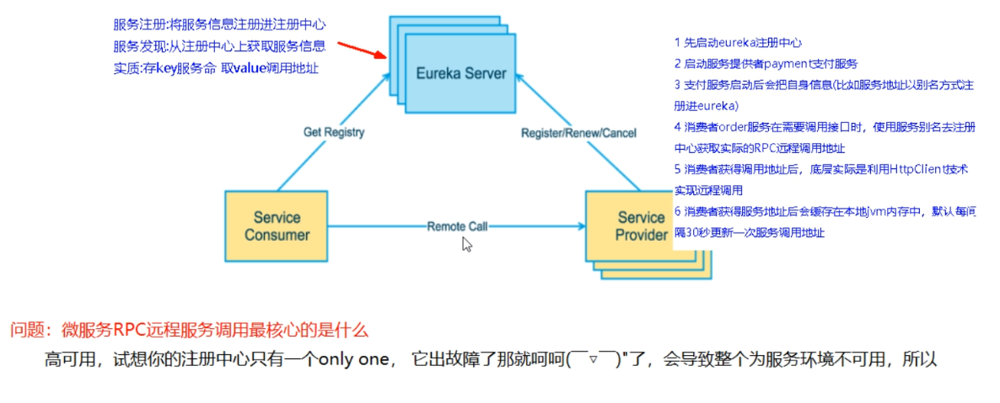
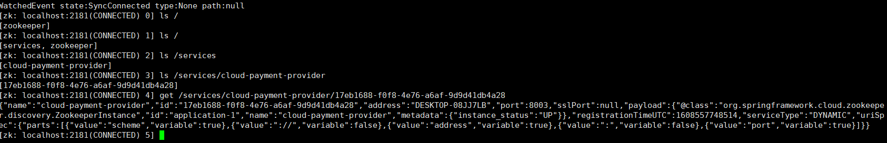
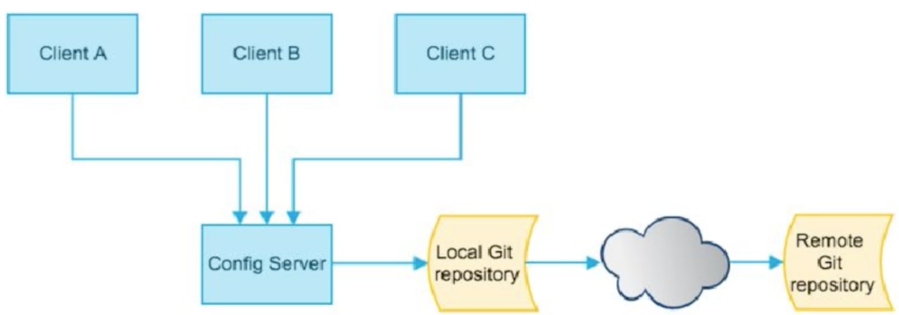
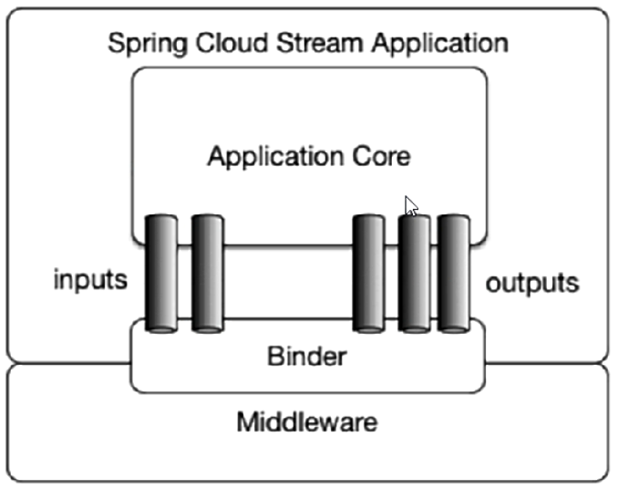

[详细配置教程](https://blog.csdn.net/qq_36903261/category_10087946.html)

# SpringCloud入门

**版本介绍**

[SpringBoot和SpringCloud版本介绍](https://www.cnblogs.com/chsoul/p/12545137.html)

[SpringBoot 和 SpringCloud 和 SpringCloud Alibaba](https://github.com/alibaba/spring-cloud-alibaba/wiki/%E7%89%88%E6%9C%AC%E8%AF%B4%E6%98%8E)


**本工程使用的版本**

SpringBoot：2.3.2

SpringCloud：Hoxton.SR8


SpringCloud Alibaba：2.2.3.RELEASE

java：8

maven：3.6.3

mysql：5.7


**Cloud的各种组件**


参考资料：

SpringCloud：https://cloud.spring.io/spring-cloud-static/Hoxton.SR1/reference/htmlsingle/

中文官网：https://www.bookstack.cn/read/spring-cloud-docs/docs-index.md

SpringBoot：https://docs.spring.io/spring-boot/docs/2.3.2.RELEASE/reference/htmlsingle/


**工程搭建**

[参考博客](https://blog.csdn.net/qq_36903261/article/details/106507150)

**搭建时需要注意的知识点**

> dependencyManagement
>
> Maven使用dependencyManagement元素来提供了一种管理依赖版本号的方式。
> ==通常会在一个组织或者项目的最顶层的父POM中看到dependencyManagement元素。==
>
> 使用pom.xml中的dependencyManagement元素能让所有在子项目中引用一个依赖而不用显式的列出版本号。 Maven会沿着父子层次向上走，直到找到一个拥有dependencyManagement元素的项目，然后它就会使用这个dependencyManagement元素中指定的版本号。


> 这样做的好处就是：如果有多个子项目都引用同一样依赖，则可以避免在每个子项目里都声明一个版本号，这样当想升级或切换到另一个版本时，只需要在顶层父容器里更新，而不需要一个一个子项目的修改，如果某个子项目需要另外的一个版本,只需要声version即可。
>
> - **dependencyManagement只是声明依赖，并不实现引入，因此子项目需要显示的声明需要用的依赖。**
>
> - 如果不在子项目中声明赖，是不会从父项目中继承下来的，只有在子项目中写了该依赖项，并且没有指定具体版本，才会从父项目中继承该依赖项，并且其version和scope都读取自父pom;
>
> - 如果子项目中指定了版本号, 那么会使用子项目中指定的jar版本。


父工程创建完成执行`mvn:install`将父工程发布到仓库方便子工程继承


# Eureka服务注册和发现

[项目搭建](https://blog.csdn.net/qq_36903261/article/details/106551120)

**服务治理**

在传统的rpc远程调用框架中，管理每个服务与服务之间依赖关系比较复杂，所以需要使用服务治理，管理服务与服务之间依赖关系，可以实现服务调用、负载均衡、容错等，实现服务发现与注册。

**服务注册和发现**

在服务注册与发现中，有一个注册中心。当服务器启动的时候，会把当前自己服务器的信息比如服务地址通讯地址等以别名方式注册到注册中心上。另一方（消费者|服务提供者），以该别名的方式去注册中心上获取到实际的服务通讯地址，然后再实现本地RPC调用。

RPC远程调用框架核心设计思想：在于注册中心，因为使用注册中心管理每个服务与服务之间的一个依赖关系（服务治理概念）。 在任何rpc远程框架中，都会有一个注册中心（存放服务地址相关信息（接口地址））





**Eureka自我保护**

为什么会产生Eureka自我保护机制？
为了防止EurekaClient可以正常运行，但是与EurekaServer网络不通情况下，**EurekaServer不会立刻将EurekaClient服务剔除**。

什么是自我保护模式？
默认情况下，如果EurekaServer在一定时间内没有接收到某个微服务实例的心跳,，EurekaServer将会注销该实例（默认90秒）。但是当网络分区故障发生（延时、卡顿、拥挤）时，微服务与EurekaServer之间无法正常通信，以上行为可能变得非常危险了，因为微服务本身其实是健康的，此时本不应该注销这个微服务。Eureka通过“自我保护模式”来解决这个问题，当EurekaServer节点在短时间内丢失过多客户端时(可能发生了网络分区故障)，那么这个节点就会进入自我保护模式。


**总结**

1. Eureka包括服务端(`@EnableEurekaServer`)和客户端(`@EnableEurekaClient`)

3. 服务发现需要在主启动类上标注`@EnableDiscoveryClient`

3. yml中常用的配置项

   ```properties
   # 服务端
   # eureka服务端的实例名称
   eureka.instance.name = eureka-server 
   # 表示向注册中心注册自己
   eureka.client.register-with-eureka = true 
   # 从EurekaServer抓取已有的注册信息
   eureka.client.fetch-registry = true 
   # 设置与eurekaServer交互的地址，查询服务和注册服务都需要依赖这个地址，集群只需要加,分割
   eureka.client.service-url.defaultZone = http://${eureka.instance.hostname}:${server.port}/eureka 
   
   # 客户端
   # 服务端中显示的关于客户端的Status名称
   eureka.instance.instance-id = payment8001 
   # 访问路径可以显示ip地址
   eureka.instance.prefer-ip-address = true 
   ```

4. 关于discoveryClient

   ```java
   // 获取服务信息的列表
   List<String> services = discoveryClient.getServices();
   // 获取某个服务的所有具体实例
   List<ServiceInstance> instances = discoveryClient.getInstances(services.get(0));
   // 通过具体实例，可以获取到uri，端口，主机名称等信息
   instance.getServiceId(), instance.getHost(), instance.getPort(), instance.getUri())
   ```

5. Eureka存在自我保护功能，自我保护的意思就是

   > Eureka Server 在运行期间会去统计心跳失败比例在 15 分钟之内是否低于 85%，如果低于 85%，Eureka Server 会将这些实例保护起来，让这些实例不会过期，但是在保护期内如果服务刚好这个服务提供者非正常下线了，此时服务消费者就会拿到一个无效的服务实例，此时会调用失败，对于这个问题需要服务消费者端要有一些容错机制，如重试，断路器等。


# Zookeeper服务注册和发现

Zookeeper是一个分布式协调工具，可以实现注册中心功能，相当于Eureka的服务端。

**zookeeper也是有心跳机制，在一定时间能如果一直没心跳返回，Zookeeper就会把服务节点剔除掉。所以在Zookeeper上的服务节点是临时节点。**这点与Eureka不同，Eureka存在保护机制，并不会将节点剔除。


```shell
# 拉取镜像
docker pull zookeeper
# 运行镜像
docker run --name zk01 -p 2181:2181 --restart always -d zookeeper
# 进入容器内
docker exec -it zk01 /bin/bash
# 进入bin目录下
cd bin
# 运行Zookeeper
zkCli.sh
# 查看当前的微服务
ls / 
# 查看入驻的微服务
ls /services
# 获取流水号
ls /services/cloud-provider-payment   
# 获得微服务信息
get /services/cloud-provider-payment/流水号
```




与Eureka的不同点

| 组件名    | 语言 | CAP  | 服务健康检查 | 对外暴露接口 |
| --------- | ---- | ---- | ------------ | ------------ |
| Eureka    | Java | AP   | 可配支持     | HTTP         |
| Zookeeper | Go   | CP   | 支持         | 客户端       |

CAP（这三个要素最多只能同时实现两点，不可能三者兼顾）

- C（Consistency）：一致性

- A（Availability）：可用性

- P（Partition tolerance）：分区容错性（微服务必须有）


# Ribbon负载均衡服务调用

[项目搭建](https://blog.csdn.net/qq_36903261/article/details/106590923)


Spring Cloud Ribbon是基于Netflix Ribbon实现的一套**客户端负载均衡**的工具。


**LB（负载均衡）**

- 集中式LB
  即**在服务的消费方和提供方之间**使用独立的LB设施(可以是硬件，如F5, 也可以是软件，如nginx), 由该设施负责把访问请求通过某种策略转发至服务的提供方。

- 进程内LB
  将**LB逻辑集成到消费方**，消费方从服务注册中心获知有哪些地址可用,然后自己再从这些地址中选择出一个合适的服务器。Ribbon就属于进程内LB，它只是一个类库，集成于消费方进程,消费方通过它来获取到服务提供方的地址。

**Ribbon和Nginx的区别：**

- Nginx是**服务端负载均衡**，客户端所有的请求都会交给nginx，由nginx实现转发请求。即负载均衡是由服务端实现的。
- Ribbon**本地负载均衡**，在调用微服务接口时候，会在注册中心上获取注册信息服务列表之后缓存到JVM本地，从而在本地实现RPC远程服务调用技术。


1. 如何使用Ribbon
   在RestTemplate上添加@LoadBalanced注解实现负载均衡。

   ```java
   @Configuration
   public class ApplicationContextConfig {
   
       @Bean
       @LoadBalanced
       public RestTemplate getRestTemplate() {
           return new RestTemplate();
       }
   }
   ```

2. 负载均衡策略：有轮询，随机等。它们的接口为IRule，可以通过查看IRule的实现类查看具体有哪些策略。

3. 如何修改负载均衡策略

   ```yaml
   # CLOUD-PAYMENT-SERVICE是微服务名
   CLOUD-PAYMENT-SERVICE:
     ribbon:
      NFLoadBalancerRuleClassName: com.netflix.loadbalancer.RandomRule
   ```

   [参考博客](https://blog.csdn.net/liuchuanhong1/article/details/54693124?utm_medium=distribute.pc_relevant_t0.none-task-blog-BlogCommendFromMachineLearnPai2-1.control&depth_1-utm_source=distribute.pc_relevant_t0.none-task-blog-BlogCommendFromMachineLearnPai2-1.control)

4. 轮询算法的原理

   


# OpenFeign服务接口调用

[项目搭建](https://blog.csdn.net/qq_36903261/article/details/106590923)

Feign能干什么
前面在使用Ribbon+ RestTemplate时，利用RestTemplate对http请求的封装处理，形成了一套模版化的调用方法。但是在实际开发中，由于对服务依赖的调用可能不止一处，往往一个接口会被多处调用， 所以通常都会针对每个微服务自行封装一些客户端类来包装这些依赖服务的调用。所以，Feign在此基础上做了进一步封装， 由他来帮助我们定义和实现依赖服务接口的定义。在Feign的实现下，我们只需要创建一个接口并使用注解的方式来配置它（以前是Dao接口上面标注Mapper注解，现在是一个微服务接口上面标注一个Feign注解)，即可完成对服务提供方的接口绑定，简化了使用Spring cloud Ribbon时，自动封装服务调用客户端的开发量。

OpenFeign是Spring Cloud在Feign的基础上支持了SpringMVC的注解如@RequesMapping等等。OpenFeign的@FeignClient可以解析SpringMVC的@RequestMapping注解下的接口，并通过动态代理的方式产生实现类，实现类中做负载均衡并调用其他服务。


使用方法：
定义一个服务接口然后在上面添加`@FeignClient(value = "微服务名")`和`@Component`注解，主启动类标注`@EnableFeignClients`。

OpenFeign集成了Ribbon


OpenFeign还提供了超时控制和日志打印的功能。

超时控制：默认**Feign客户端**只**等待一秒钟**，如果服务端处理时长超过一秒钟，直接返回报错。为了避免这种情况，需要设置Feign客户端的超时控制。

```yaml
ribbon:
  #指的是建立连接后从服务器读取到可用资源所用的时间
  ReadTimeout: 5000
  #指的是建立连接使用的时间，适用于网络状况正常的情况下，两端连接所用的时间
  ConnectTimeout: 5000
```


日志打印：

OpenFeign的日志级别有：

- NONE： 默认的，不显示任何日志

- BASIC： 仅记录请求方法、URL、响应状态码以及执行时间

- HEADERS：除了BASIC 中自定义的信息外，还有请求和响应的信息头

- FULL： 除了HEADERS中定义的信息外， 还有请求和响应的正文以及元数据。

构建日志配置类

```java
import feign.Logger; // 导入的包是这个
@Configuration
public class OpenFeignLogConfig {
 
    @Bean
    Logger.Level feignLoggerLeave(){
        return Logger.Level.FULL;
    }
}
```

构建yml，feign日志以什么级别监控哪个接口。

```yaml
logging:
  level:
    cn.akangaroo.springcloud.service.PaymentFeignService: debug
```


# GateWay网关

[项目搭建](https://blog.csdn.net/qq_36903261/article/details/106635918)

SpringCloud Gateway是Spring Cloud的一个全新项目，基于Spring 5.0 + Spring Boot 2.0和Project Reactor等技术开发的网关，它旨在为微服务架构提供一种简单有效的统一的API路由管理方式。

为了提升网关的性能，SpringCloud Gateway是基于WebFlux框架实现的，而WebFlux框架底层则使用了高性能的Reactor模式通信框架Netty.

Spring Cloud Gateway的目标提供统一的路由方式且**基于Filter链的方式**提供了网关基本的功能，例如：安全，监控/指标，限流。

作用：

- 反向代理
- 鉴权
- 流量控制
- 熔断
- 日志监控


三大核心概念：

- 路由(route)：路由是构建网关的基本模块，它由ID，目标URI, 一系列的**断言**和**过滤器**组成，如果Predicate(断言)为true则匹配该路由

- 断言(predicate)：参考的是Java8的java.util.function.Predicate，开发人员可以匹配HTTP请求中的所有内容(例如请求头或请求参数)，如果请求与断言相匹配则进行路由

- 过滤(filter)：指的是Spring框架中GatewayFilter的实例，使用过滤器，可以在请求被路由前或者之后对请求进行修改


工作流程：路由转发 + 执行过滤器链


如何做路由映射？

```yaml
spring
  cloud:
    gateway:
      routes:
        - id: payment_route # 路由的id,没有规定规则但要求唯一,建议配合服务名
          # 匹配后提供服务的路由地址
          uri: http://localhost:8001
          predicates:
            - Path=/payment/get/** # 断言，路径相匹配的进行路由

        - id: payment_route2 # 路由的id,没有规定规则但要求唯一,建议配合服务名
            # 匹配后提供服务的路由地址
          uri: http://localhost:8001
          predicates:
            - Path=/payment/lb/** #断言,路径相匹配的进行路由
```

其中，predicates和filter的配置可以看这篇文章[gateway配置](https://blog.csdn.net/weiwoyonzhe/article/details/88686480)


# Config配置中心

[项目搭建](https://blog.csdn.net/qq_36903261/article/details/106814648)

SpringCloud Config为微服务架构中的微服务提供集中化的外部配置支持，配置服务器为各个不同微服务应用的所有环境提供了一个中心化的外部配置。

SpringCloud Config**分为服务端和客户端两部分**。

- 服务端也称为分布式配置中心，它是一个独立的微服务应用，用来**连接配置服务器**并为客户端提供获取配置信息，加密/解密信息等访问接口
- 客户端则是**通过指定的配置中心来管理应用资源**，以及与业务相关的配置内容，并在启动的时候从配置中心获取和加载配置信息，配置服务器默认采用git来存储配置信息，这样就有助于对环境配置进行版本管理，并且可以通过git客户端工具来方便的管理和访问配置内容



关于读取Config上配置的规则：

- /{label}/{application}-{profile}.yml：`http://config-3344.com:3344/master/config-dev.yml`
- /{application}-{profile}.yml：默认master`http://config-3344.com:3344/config-dev.yml`
- /{application}/{profile}[/{lable}]：`http://config-3344.com:3344/dev/master`


服务端需要加`@EnableConfigServer`注解

客户端的配置文件要以`bootstrap.yml`命名[原因](https://blog.csdn.net/wenyicodedog/article/details/93500604?utm_medium=distribute.pc_relevant.none-task-blog-baidujs_title-2&spm=1001.2101.3001.4242)

- bootstrap优先级比application更高，如果想要在**加载属性之前**去spring cloud config server上取配置文件，那spring cloud config相关配置就是需要最先加载的


动态刷新问题：ConfigServer配置中心做了修改，但是ConfigClient没有立即响应。

解决办法1：

1. pom文件中加上`spring-boot-starter-actuator`
2. yml中暴露端点
3. Controller中添加`@RefreshScope`
4. 服务端修改完成后，在终端输入`curl -X POST "http://ip:port/actuator/refresh"`即可

解决办法2：与Bus整合

# Bus消息总线

[项目搭建](https://blog.csdn.net/qq_36903261/article/details/106814648)

使用Bus可以实现分布式自动刷新配置功能，Bus支持两种消息代理，RabbitMQ和Kafka。


在ConfigServer和ConfigClient添加对消息总线的支持和配置，利用消息总线触发一个服务端ConfigServer的/bus/refresh端点，而刷新所有客户端的配置。

除此之外，还可以实现动态刷新定点通知，即对某个指定的微服务刷新配置。


# Stream消息驱动

[项目搭建](https://blog.csdn.net/qq_36903261/article/details/106834598)

什么是消息驱动？屏蔽底层消息中间件的差异,降低切换成本，统一消息的编程模型。


Stream为什么可以统一底层差异？通过定义绑定器Binder作为中间层，实现了应用程序与消息中间件细节之间的隔离。

Binder：INPUT对应消费者，OUTPUT对应生产者


另外，通过分组可以解决持久化和同一个消息被不同的消费者消费的问题；因为在stream中，处于同一个group的多个消费者是竞争关系，这样就能噶保证消息只会被一个应用消费一次。





# Sleuth请求链路追踪

[项目搭建](https://blog.csdn.net/qq_36903261/article/details/106834598)


在微服务框架中，一个由客户端发起的请求在后端系统中会经过多个不同的的服务节点调用来协同产生最后的请求结果，每一个前段请求都会形成一条复杂的分布式服务调用链路，链路中的任何一环出现高延时或错误都会引起整个请求最后的失败。

Spring Cloud Sleuth提供追踪解决方案并兼容支持zipkin

[zipkin下载地址](http://dl.bintray.com/openzipkin/maven/io/zipkin/java/zipkin-server/)


# Nacos

等待整理

```shell
docker pull nacos/nacos-server

docker run -e JVM_XMS=256m -e JVM_XMX=256m --env MODE=standalone --name nacos -d -p 8848:8848 nacos/nacos-server

docker exec -it nacos /bin/bash
cd conf/
cp application.properties application.properties.bak # 修改之前备份
vim application.properties
```

properties文件

```properties
spring.datasource.platform=mysql
db.num=1
db.url.0=jdbc:mysql://118.178.141.179:3306/nacos_devtest?characterEncoding=utf8&connectTimeout=1000&socketTimeout=3000&autoReconnect=true
db.user=root
db.password=123456
```

docker安装nacos

```shell
docker run --env MODE=standalone --name mynacos -d -p 8848:8848 -e MYSQL_SERVICE_HOST=118.178.141.179  -e MYSQL_SERVICE_PORT=3306  -e MYSQL_SERVICE_DB_NAME=nacos_config  -e MYSQL_SERVICE_USER=root  -e MYSQL_SERVICE_PASSWORD=LvHa#2kyw33 -e SPRING_DATASOURCE_PLATFORM=mysql  -e MYSQL_DATABASE_NUM=1 -e JVM_XMS=256m -e JVM_XMX=256m nacos/nacos-server
```


# Sentinel

待学


# Seata

待学

随着微服务的流行，服务和服务之间的稳定性变得越来越重要。Sentinel 以流量为切入点，从流量控制、熔断降级、系统负载保护等多个维度保护服务的稳定性。

Sentinel的主要功能：


Sentinel 分为两个部分:

- 核心库（Java 客户端）不依赖任何框架/库，能够运行于所有 Java 运行时环境，同时对 Dubbo / Spring Cloud 等框架也有较好的支持。
- 控制台（Dashboard）基于 Spring Boot 开发，打包后可以直接运行，不需要额外的 Tomcat 等应用容器。


Sentinel的安装

```shell
#拉取sentinel镜像
docker pull bladex/sentinel-dashboard

#运行sentinel（docker里的sentinel是8858端口）
docker run --name sentinel -d -p 8858:8858 bladex/sentinel-dashboard
```

