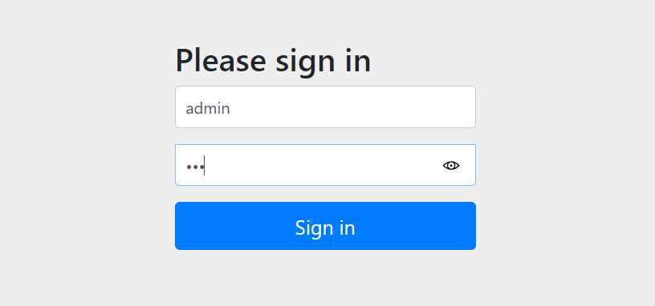
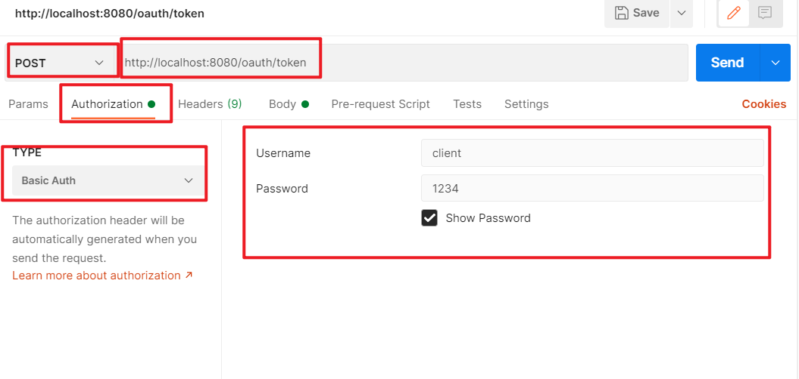
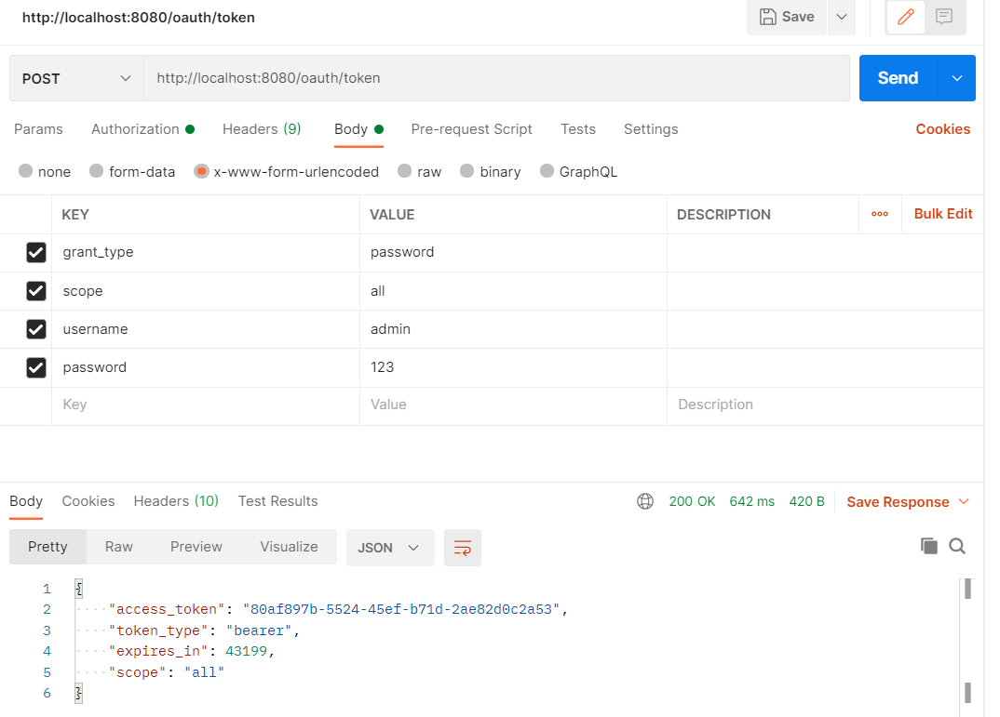

# Oauth2认证

### 简介

第三方认证技术方案最主要是解决认证协议的通用标准问题，因为要实现跨系统认证，各系统之间要遵循一定的接口协议。

OAUTH协议为用户资源的授权提供了一个安全的、开放而又简易的标准。同时，任何第三方都可以使用OAUTH认证服务，任何服务提供商都可以实现自身的OAUTH认证服务，因而OAUTH是开放的。业界提供了OAUTH的多种实现如PHP、JavaScript，Java，Ruby等各种语言开发包，大大节约了程序员的时间，因而OAUTH是简易的。互联网很多服务如Open API，很多大公司如Google，Yahoo，Microsoft等都提供了OAUTH认证服务，这些都足以说明OAUTH标准逐渐成为开放资源授权的标准。

Oauth协议目前发展到2.0版本，1.0版本过于复杂，2.0版本已得到广泛应用。


Oauth2.0认证流程如下：


### 角色

- **客户端**
  本身不存储资源，需要通过资源拥有者的授权去请求资源服务器的资源，比如：Android客户端、Web客户端（浏览器端）、微信客户端等。
- **资源拥有者**
  通常为用户，也可以是应用程序，即该资源的拥有者。
- **授权服务器**
  用来对资源拥有的身份进行认证、对访问资源进行授权。客户端要想访问资源需要通过认证服务器由资
  源拥有者授权后方可访问。
- **资源服务器**
  存储资源的服务器，比如，网站用户管理服务器存储了网站用户信息，网站相册服务器存储了用户的相
  册信息，微信的资源服务存储了微信的用户信息等。客户端最终访问资源服务器获取资源信息。

### 常用术语

- **客户凭证(client Credentials)** 
  客户端的clientId和密码用于认证客户
- **令牌(tokens) **
  授权服务器在接收到客户请求后，颁发的访问令牌
- **作用域(scopes)** 
  客户请求访问令牌时，由资源拥有者额外指定的细分权限(permission)

### 令牌类型

- **授权码** 
  仅用于授权码授权类型，用于交换获取访问令牌和刷新令牌
- **访问令牌** 
  用于代表一个用户或服务直接去访问受保护的资源
- **刷新令牌**
  用于去授权服务器获取一个刷新访问令牌
- **BearerToken**
  不管谁拿到Token都可以访问资源，类似现金
- **Proof of Possession(PoP) Token** 
  可以校验client是否对Token有明确的拥有权


### 授权模式

`https://tools.ietf.org/html/rfc6749`

#### 授权码模式


#### 密码模式


#### 刷新令牌


# SpringSecurity整合Oauth2

## 创建项目

导入依赖，导入的是spring-cloud的oauth2和security。

```xml
    <properties>
        <java.version>1.8</java.version>
        <spring-cloud.version>Hoxton.SR8</spring-cloud.version>
    </properties>
    <dependencies>
        <dependency>
            <groupId>org.springframework.cloud</groupId>
            <artifactId>spring-cloud-starter-oauth2</artifactId>
        </dependency>
        <dependency>
            <groupId>org.springframework.cloud</groupId>
            <artifactId>spring-cloud-starter-security</artifactId>
        </dependency>
        <dependency>
            <groupId>org.springframework.boot</groupId>
            <artifactId>spring-boot-starter-web</artifactId>
        </dependency>

        <dependency>
            <groupId>org.springframework.boot</groupId>
            <artifactId>spring-boot-starter-test</artifactId>
            <scope>test</scope>
        </dependency>
    </dependencies>

    <dependencyManagement>
        <dependencies>
            <dependency>
                <groupId>org.springframework.cloud</groupId>
                <artifactId>spring-cloud-dependencies</artifactId>
                <version>${spring-cloud.version}</version>
                <type>pom</type>
                <scope>import</scope>
            </dependency>
        </dependencies>
    </dependencyManagement>
```

编写service

```java
@Service
public class UserService implements UserDetailsService {

    @Autowired
    PasswordEncoder passwordEncoder;

    @Override
    public UserDetails loadUserByUsername(String username) throws UsernameNotFoundException {

        String password = passwordEncoder.encode("123");
        return new User(username, password, AuthorityUtils.commaSeparatedStringToAuthorityList("admin, normal"));
    }
}
```


编写controller

```java
@RestController
@RequestMapping("/user")
public class UserController {

    @GetMapping("/getCurrentUser")
    public Object getParentUser(Authentication authentication) {
        return authentication.getPrincipal();
    }
}
```


编写配置类

```java
@Configuration
@EnableWebSecurity
public class SecurityConfig extends WebSecurityConfigurerAdapter {

    @Override
    protected void configure(HttpSecurity http) throws Exception {
        http.authorizeRequests()
                .antMatchers("/oauth/**", "/login/**", "/logout/**")
                .permitAll()
                .anyRequest()
                .authenticated()
                .and()
                .formLogin()
                .permitAll()
                .and()
                .csrf()
                .disable();
    }

    @Bean
    public PasswordEncoder passwordEncoder() {
        return new BCryptPasswordEncoder();
    }
}

```


认证服务器配置

```java
@Configuration
@EnableAuthorizationServer
public class AuthorizationServerConfig extends AuthorizationServerConfigurerAdapter {

    @Autowired
    private PasswordEncoder passwordEncoder;

    @Override
    public void configure(ClientDetailsServiceConfigurer clients) throws Exception {
        clients.inMemory()
                // 配置client_id
                .withClient("client")
                // 配置client-secret
                .secret(passwordEncoder.encode("1234"))
                // 配置redirect_uri，用于授权成功后跳转
                .redirectUris("http://www.baidu.com")
                // 配置申请的权限范围
                .scopes("all")
                // 配置grant_type，表示授权类型
                // authorization_code: 授权码模式
                .authorizedGrantTypes("authorization_code");
    }
}
```


资源服务器配置

```java
@Configuration
@EnableResourceServer
public class ResourceServerConfig extends ResourceServerConfigurerAdapter {

    @Override
    public void configure(HttpSecurity http) throws Exception {
        http.authorizeRequests()
                .anyRequest()
                .authenticated()
                .and()
                .requestMatchers()
                // 配置需要保护的资源路径
                .antMatchers("/user/**");
    }
}
```


## 授权码模式测试

授权码模式测试

输入如下网址。

`http://localhost:8080/oauth/authorize?response_type=code&client_id=client&redirect_uri=http://www.baidu.com&scope=all`

之后会进入如下页面，输入账号密码



选择Approve，点击授权


接着，跳转到百度页面，后面跟着的参数是授权码，每次都不一样。


根据授权码从服务器中获取令牌（POST请求），下面的Username和Password是在授权服务器中配置的client_id和client_secret


- grant_type ：授权类型，填写authorization_code，表示授权码模式
- code ：授权码，就是刚刚获取的授权码，注意：授权码只使用一次就无效了，需要重新申请
- client_id :客户端标识
- redirect_uri ：申请授权码时的跳转url，一定和申请授权码时用的redirect_uri一致
- scope :授权范围


配置完后点击Send，即可获得令牌和令牌类型


接着，根据令牌去服务器获取资源。


如果token有误就会报错


## 密码模式测试

密码模式相较于授权码模式较为简单。

SecurityConfig配置类中修改

```java
    @Bean
    @Override
    public AuthenticationManager authenticationManager() throws Exception {
        return super.authenticationManager();
    }
```


资源服务器AuthorizationServerConfig配置

```java
@Configuration
@EnableAuthorizationServer
public class AuthorizationServerConfig extends AuthorizationServerConfigurerAdapter {

    @Autowired
    private PasswordEncoder passwordEncoder;

    @Autowired
    private AuthenticationManager authenticationManager;

    @Autowired
    private UserService userService;

    /**
     * 使用密码模式需要配置
     * @param endpoints
     * @throws Exception
     */
    @Override
    public void configure(AuthorizationServerEndpointsConfigurer endpoints) throws Exception {
        endpoints.authenticationManager(authenticationManager)
                .userDetailsService(userService);
    }

    @Override
    public void configure(ClientDetailsServiceConfigurer clients) throws Exception {
        clients.inMemory()
                // 配置client_id
                .withClient("client")
                // 配置client-secret
                .secret(passwordEncoder.encode("1234"))
                // 配置redirect_uri，用于授权成功后跳转
                .redirectUris("http://www.baidu.com")
                // 配置申请的权限范围
                .scopes("all")
                // 配置grant_type，表示授权类型
                .authorizedGrantTypes("authorization_code", "password");
    }
}
```




配置完后点击Send即可获得令牌，相较于授权码模式比较简单。

其中，下面的username是我们的登陆用户名和密码，在UserService类中配置的，UserService中配置的什么就写什么，没有的话随便写。




## Redis存储Token

之前的代码我们将token直接存在内存中，这在生产环境中是不合理的，下面我们将其改造成存储在Redis中

添加依赖

```xml
        <!--redis 依赖-->
        <dependency>
            <groupId>org.springframework.boot</groupId>
            <artifactId>spring-boot-starter-data-redis</artifactId>
        </dependency>
         <!--commons-pool2 对象池依赖 -->
        <dependency>
            <groupId>org.apache.commons</groupId>
            <artifactId>commons-pool2</artifactId>
        </dependency>
```

yml文件中配置redis地址

```yaml
spring:
  redis:
    host: 127.0.0.1
    port: 6379
```

编写RedisConfig配置类

```java
@Configuration
public class RedisConfig {

    @Autowired
    private RedisConnectionFactory redisConnectionFactory;

    @Bean
    public TokenStore redisTokenStore() {
        return new RedisTokenStore(redisConnectionFactory);
    }
}
```


在认证服务器配置中指定令牌的存储策略为Redis

```java
    @Autowired
    @Qualifier("redisTokenStore")
    private TokenStore tokenStore;

    /**
     * 使用密码模式需要配置
     * @param endpoints
     * @throws Exception
     */
    @Override
    public void configure(AuthorizationServerEndpointsConfigurer endpoints) throws Exception {
        endpoints.authenticationManager(authenticationManager)
                .userDetailsService(userService)
                .tokenStore(tokenStore);
    }
```


使用密码模式测试


