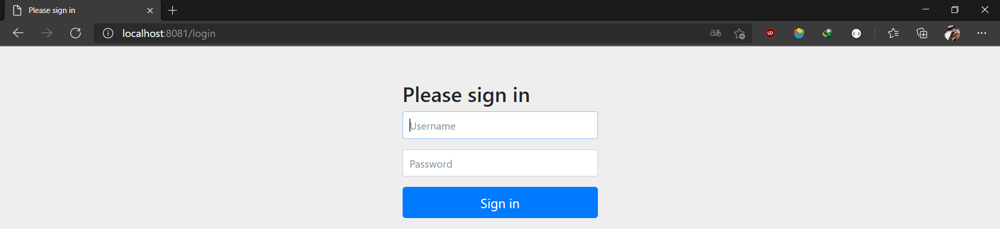
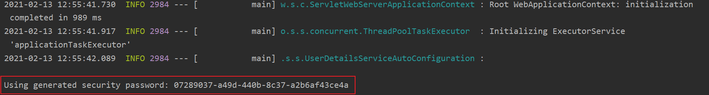
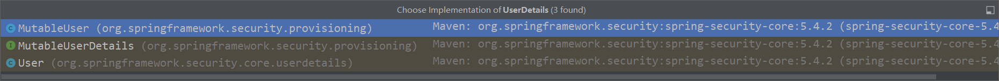
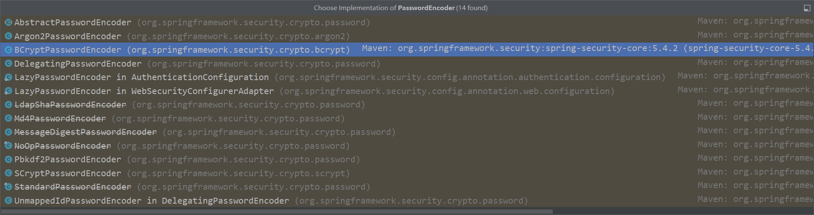
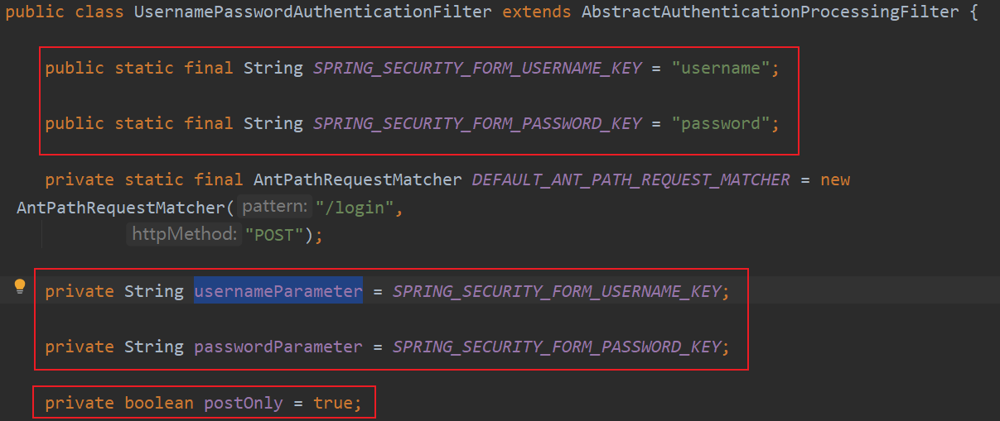
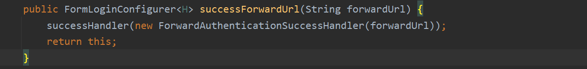
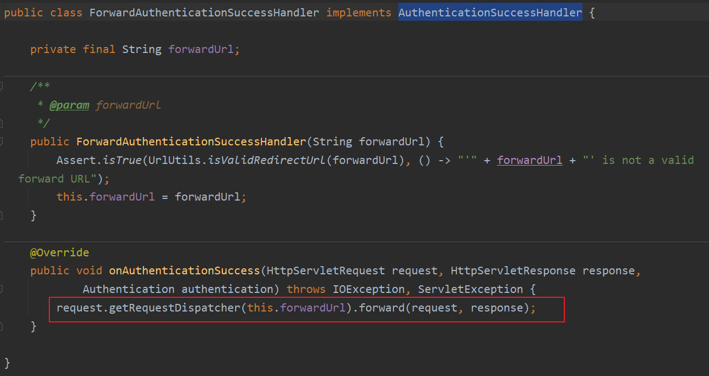
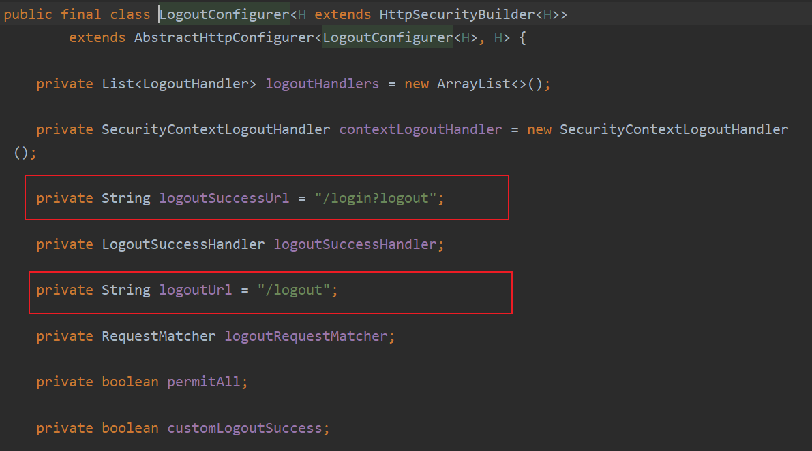

# SpringSecurity

SpringSecurity是一个安全框架，对于安全框架，有两个概念

- 认证：判断一个用户的身份是否合法的过程，身份合法方可继续访问，不合法则拒绝访问。
  常见的认证方式：用户名密码登录，二维码登录，手机短信登录，指纹登录等。
- 授权：授权是用户认证通过根据用户的权限来控制用户访问资源的过程

## 项目搭建

1. 导入web和springsecurity的依赖

   ```xml
       <dependencies>
           <dependency>
               <groupId>org.springframework.boot</groupId>
               <artifactId>spring-boot-starter-security</artifactId>
           </dependency>
           <dependency>
               <groupId>org.springframework.boot</groupId>
               <artifactId>spring-boot-starter-web</artifactId>
           </dependency>
           <dependency>
               <groupId>org.springframework.boot</groupId>
               <artifactId>spring-boot-starter-test</artifactId>
               <scope>test</scope>
           </dependency>
           <dependency>
               <groupId>org.springframework.security</groupId>
               <artifactId>spring-security-test</artifactId>
               <scope>test</scope>
           </dependency>
       </dependencies>
   ```

2. 在static目录下新建login.html和main.html(登录成功页面)

   ```html
   <!DOCTYPE html>
   <html lang="en">
   <head>
       <meta charset="UTF-8">
       <title>Title</title>
   </head>
   <body>
   <form action="/login" method="post">
       用户名：<input type="text" name="username"><br>
       密码：<input type="password" name="password"><br>
       <input type="submit" value="登录">
   </form>
   </body>
   </html>
   ```

   ```html
   <!DOCTYPE html>
   <html lang="en">
   <head>
       <meta charset="UTF-8">
       <title>Title</title>
   </head>
   <body>
   登录成功！！
   </body>
   </html>
   ```

3. 编写对应的controller实现跳转（用户名user）

   ```java
   @Controller
   public class LoginController {
   
       @PostMapping("/toMain")
       public String toMain() {
           return "redirect:/main.html";
       }
   }
   ```

   浏览器页面中输入localhost:8080/login.html，但是导入spring-boot-starter-security 启动器后，Spring Security 已经生效，默认拦截全部请求，如果用户没有登录，跳转到内置登录页面。

   

   登录用户名为user，密码在控制台中。

   


## 自定义登录逻辑

### UserDetailsService

当什么也没有配置的时候，账号和密码是由 Spring Security 定义生成的。而在实际项目中账号和密码都是从数据库中查询出来的。所以我们要通过自定义逻辑控制认证逻辑。如果需要自定义逻辑时，只需要实现 UserDetailsService 接口即可。

```java
public interface UserDetailsService {

	UserDetails loadUserByUsername(String username) throws UsernameNotFoundException;

}
```

方法loadUserByUsername返回值 UserDetails 是一个接口，定义如下

```java
public interface UserDetails extends Serializable {

	/**
	 * 获取所有权限
	 */
	Collection<? extends GrantedAuthority> getAuthorities();

	/**
	 * 获取密码
	 */
	String getPassword();

	/**
	 * 获取用户名
	 */
	String getUsername();

	/**
	 * 账户是否过期
	 */
	boolean isAccountNonExpired();

	/**
	 * 账户是否被锁定
	 */
	boolean isAccountNonLocked();

	/**
	 * 凭证（密码）是否过期
	 */
	boolean isCredentialsNonExpired();

	/**
	 * 是否可用
	 */
	boolean isEnabled();

}

```

实际项目中不可能new接口，UserDetails有三个实现类，选择User这个实现类。可以发现里面的属性与刚刚UserDetails中的方法都有关系。



```java
public class User implements UserDetails, CredentialsContainer {

	private static final long serialVersionUID = SpringSecurityCoreVersion.SERIAL_VERSION_UID;

	private static final Log logger = LogFactory.getLog(User.class);

	private String password;

	private final String username;

	private final Set<GrantedAuthority> authorities;

	private final boolean accountNonExpired;

	private final boolean accountNonLocked;

	private final boolean credentialsNonExpired;

	private final boolean enabled;
    
    ...
}
```

接下来看一下User的构造方法，有三个入参的构造方法和七个入参的构造方法，三个入参的构造方法调用了七个入参的构造方法。

- username:用户名
- password:密码
- authorities:权限

```java
	public User(String username, String password, Collection<? extends GrantedAuthority> authorities) {
		this(username, password, true, true, true, true, authorities);
	}
```

```java
	public User(String username, String password, boolean enabled, boolean accountNonExpired,
			boolean credentialsNonExpired, boolean accountNonLocked,
			Collection<? extends GrantedAuthority> authorities) {
		Assert.isTrue(username != null && !"".equals(username) && password != null,
				"Cannot pass null or empty values to constructor");
		this.username = username;
		this.password = password;
		this.enabled = enabled;
		this.accountNonExpired = accountNonExpired;
		this.credentialsNonExpired = credentialsNonExpired;
		this.accountNonLocked = accountNonLocked;
		this.authorities = Collections.unmodifiableSet(sortAuthorities(authorities));
	}
```


那么具体的登录逻辑是什么？

首先，会去找UserDetailsService中的loadUserByUsername这个方法，根据用户名去数据库找，找到了之后，返回UserDetail对象，通过UserDetail实现类User中构造方法，来实现登录。


### PasswordEncoder

Spring Security 要求容器中必须有 PasswordEncoder 实例。所以当自定义登录逻辑时要求必须给容器注入 PaswordEncoder 的 bean 对象。

encode用于加密，matches用于比较，upgradeEncoding用于二次加密。

```java
public interface PasswordEncoder {

	/**
	 * 加密
	 */
	String encode(CharSequence rawPassword);

	/**
	 * 密码比较
	 */
	boolean matches(CharSequence rawPassword, String encodedPassword);

	/**
	 * 二次比较
	 */
	default boolean upgradeEncoding(String encodedPassword) {
		return false;
	}

}
```

PasswordEncoder有很多实现类，BCryptPasswordEncoder官方推荐的加密方式。




```java
     @Test
     public void test(){
       // 1. 创建解析器
       PasswordEncoder pw = new BCryptPasswordEncoder();
       // 2. 密码加密
       String encode = pw.encode("123");
       System.out.println(encode);
       // 3. 判断原字符和加密后内容是否匹配
       boolean result = pw.matches("1234", encode);
       System.out.println(result);
     }
```


### 自定义登录逻辑的实现

在config包下编写SecurityConfig配置类

```java
@Configuration
public class SecurityConfig {
    
    @Bean
    public PasswordEncoder passwordEncoder() {
        return new BCryptPasswordEncoder();
    }   
    
}
```

在service包下编写UserDetailsServiceImpl。为了方便，就不从数据库中查询数据，直接编写。

```java
@Service
public class UserDetailsServiceImpl implements UserDetailsService {

    @Autowired
    private PasswordEncoder passwordEncoder;

    @Override
    public UserDetails loadUserByUsername(String username) throws UsernameNotFoundException {
        System.out.println("执行自定义登录逻辑");
        // 1. 查询数据库判断用户名是否存在，如果不存在抛出UsernameNotFoundException异常
        if (!"admin".equals(username)) {
            throw new UsernameNotFoundException("用户名不存在");
        }
        // 2. 比较密码（一般在数据库中是加密的），如果匹配成功就返回UserDetails。
        String password = passwordEncoder.encode("123");
		
        // 权限使用英文逗号分割，表示拥有多个权限
        return new User(username, password, AuthorityUtils
                .commaSeparatedStringToAuthorityList("admin, normal"));
    }
}
```

重启项目，在浏览器中输入`localhost:8080/login.html`，输入账号：admin，密码：123，之后可以正确进入到 login.html 页面。


## 自定义登录页面

修改配置类中主要是设置哪个页面是登录页面。配置类需要继承`WebSecurityConfigurerAdapter`，并重写`configure(HttpSecurity http)`方法。

```java
@Configuration
public class SecurityConfig extends WebSecurityConfigurerAdapter {
    
	@Override
    protected void configure(HttpSecurity http) throws Exception {
        // 表单提交
        http.formLogin()
                // 自定义登录页面
                .loginPage("/login.html")
                // 当发现/login时认为是登录，必须和表单提交的地址一样。去执行UserServiceImpl
                .loginProcessingUrl("/login")
                // 登录成功后跳转页面，POST请求
                .successForwardUrl("/toMain");

        // 授权
        http.authorizeRequests()
                // 放行/login.html
                .antMatchers("/login.html").permitAll()
                // 所有的请求都必须经过认证才能访问，必须登录
                .anyRequest().authenticated();

        // 关闭csrf
        http.csrf().disable();
    }
    
    @Bean
    public PasswordEncoder passwordEncoder() {
        return new BCryptPasswordEncoder();
    }
}
```


```java
@Controller
public class LoginController {

    @PostMapping("/toMain")
    public String toMain() {
        return "redirect:/main.html";
    }
}
```


## 其它常用配置

### 失败跳转

登录失败页面

```html
<!DOCTYPE html>
<html lang="en">
<head>
    <meta charset="UTF-8">
    <title>Title</title>
</head>
<body>
失败失败失败......
</body>
</html>
```

添加登录失败的配置，此处需要注意，还需要放行error.html，因为如果登录不成功的话，认证失败，所以页面需要放行。

`.failureForwardUrl("/toError")`

`.antMatchers("/error.html").permitAll()`

```java
    @Override
    protected void configure(HttpSecurity http) throws Exception {
        // 表单提交
        http.formLogin()
                // 自定义登录页面
                .loginPage("/login.html")
                // 当发现/login时认为是登录，必须和表单提交的地址一样。去执行UserServiceImpl
                .loginProcessingUrl("/login")
                // 登录成功后跳转页面，POST请求
                .successForwardUrl("/toMain")
            	// 登录失败后跳转页面，POST请求
                .failureForwardUrl("/toError");

        // 授权
        http.authorizeRequests()
                // 放行/login.html
                .antMatchers("/login.html").permitAll()
                .antMatchers("/error.html").permitAll()
                // 所有的请求都必须经过认证才能访问，必须登录
                .anyRequest().authenticated();

        // 关闭csrf
        http.csrf().disable();
    }
```

```java
    @PostMapping("/toError")
    public String toError() {
        return "redirect:error.html";
    }
```


### 设置请求账户和密码的参数

当进行登录时会执行 UsernamePasswordAuthenticationFilter 过滤器。

- usernameParameter：账户参数名
- passwordParameter：密码参数名
- postOnly：默认情况下只允许POST请求



```java
        http.formLogin()
                .usernameParameter("uname")
                .passwordParameter("pw");
```

```html
<form action="/login" method="post">
    用户名：<input type="text" name="uname"><br>
    密码：<input type="password" name="pw"><br>
    <input type="submit" value="登录">
</form>
```


### 自定义登录成功处理器

使用`successForwardUrl()`时表示成功后转发请求到地址。内部是通过 `successHandler()` 方法进行控制成功后交给哪个类进行处理。



`ForwardAuthenticationSuccessHandler`内部就是最简单的请求转发。由于是请求转发，**当遇到需要跳转到站外或在前后端分离的项目中就无法使用了**。



在handler包下新建MyAuthenticationSuccessHandler类

```java
public class MyAuthenticationSuccessHandler implements AuthenticationSuccessHandler {

    private String url;

    public MyAuthenticationSuccessHandler(String url) {
        this.url = url;
    }

    @Override
    public void onAuthenticationSuccess(HttpServletRequest request, HttpServletResponse response, Authentication authentication) throws IOException, ServletException {
        // Principal 主体，存放了登录用户的信息
        User user = (User) authentication.getPrincipal();
        System.out.println(user.getUsername());
        // 输出 null
        System.out.println(user.getPassword());
        System.out.println(user.getAuthorities());
        response.sendRedirect(url);
    }
}
```

修改配置类

```java
        http.formLogin()
                // 自定义登录页面
                .loginPage("/login.html")
                // 必须和表单提交的接口一样，会去执行自定义登录逻辑
                .loginProcessingUrl("/login")
                // 自定义的登录成功处理器
                .successHandler(new MyAuthenticationSuccessHandler("http://www.baidu.com"));   
```


### 自定义登录失败处理器

在handler包下新建MyAuthenticationFailureHandler类

```java
public class MyAuthenticationFailureHandler implements AuthenticationFailureHandler {

    private String url;

    public MyAuthenticationFailureHandler(String url) {
        this.url = url;
    }

    @Override
    public void onAuthenticationFailure(HttpServletRequest request, HttpServletResponse response, AuthenticationException exception) throws IOException, ServletException {
        response.sendRedirect(url);
    }
}
```

修改配置类

```java
        http.formLogin()
                // 自定义登录页面
                .loginPage("/login.html")
                // 必须和表单提交的接口一样，会去执行自定义登录逻辑
                .loginProcessingUrl("/login")
                // 自定义的登录成功处理器
                .successHandler(new MyAuthenticationSuccessHandler("http://www.baidu.com"))
                // 自定义登录失败处理器
                .failureHandler(new MyAuthenticationFailureHandler("/error.html"));
```


## 访问控制url匹配

### anyRequest

所有的请求都必须经过认证才能访问，必须登录，必须放在最后面。

```java
        http.authorizeRequests()
                // 所有的请求都必须经过认证才能访问，必须登录
                .anyRequest().authenticated();
```

### antMatchers

- `?`：匹配 1 个字符
- `*`：匹配 0 个或多个字符
- `**` ：匹配 0 个或多个目录

```java
        http.authorizeRequests()
                // 放行login.html登录页面
                .antMatchers("/login.html").permitAll()
                // 放行错误页面，因为登录没有成功，所以需要放行，如果登录成功，那么就不需要放行了。
                .antMatchers("/error.html").permitAll()
                // 放行所有静态资源
                .antMatchers("/css/**", "/js/**", "/imgs/**").permitAll()
                // 放行所有的jpg
                .antMatchers("/**/*.jpg").permitAll();
```

### regexMatchers

使用正则表达式进行匹配。和 antMatchers() 主要的区别就是参数， antMatchers() 参数是 ant表达式， regexMatchers() 参数是正则表达式。

```java
        http.authorizeRequests()
            	// 所有以.js文件结尾的都被放行
				.regexMatchers( ".+[.]js").permitAll()
```

无论是 antMatchers() 还是 regexMatchers() 都具有两个参数的方法，其中第一个参数都是HttpMethod ，表示请求方式，当设置了 HttpMethod 后表示只有设定的特定的请求方式才执行对应的权限设置。

```java
        http.authorizeRequests()
                .regexMatchers(HttpMethod.POST, "/demo").permitAll();
```

### mvcMatchers

mvcMatchers()适用于配置了 servletPath 的情况。

```properties
spring.mvc.servlet.path=/xxx
```

```java
        http.authorizeRequests()
                .mvcMatchers("/demo.html").servletPath("/xxx").permitAll();
```


## 内置访问控制方法

Spring Security 匹配了 URL 后调用了 permitAll() 表示不需要认证，随意访问。在 Spring Security 中提供了多种内置控制。

- permitAll()表示所匹配的 URL 任何人都允许访问。

- authenticated()表示所匹配的 URL 都需要被认证才能访问。

- anonymous()表示可以匿名访问匹配的URL。

- denyAll()表示所匹配的 URL 都不允许被访问。

- rememberMe()表示被“remember me”的用户允许访问

- fullyAuthenticated()表示用户不是被 remember me 的，才可以访问。


## 基于权限访问

```java
        http.authorizeRequests()
                // 权限控制，严格区分大小写
                .antMatchers("/main1.html").hasAuthority("admiN")
            	// 只要有一个即可
                .antMatchers("/main1.html").hasAnyAuthority("admin", "admiN");
```


## 基于角色访问

如果是角色的话，需要在`loadUserByUsername`方法中加入`ROLE_abc`表示用户拥有abc的权限。

```java
        return new User(username, password, AuthorityUtils
                .commaSeparatedStringToAuthorityList("admin, normal, ROLE_abc"));
```

```java
	        http.authorizeRequests()
				.antMatchers("/main1.html").hasRole("abC")
                .antMatchers("/main1.html").hasAnyRole("abc, abC");
```


## 自定义403处理方案

在`handler`包下新建`MyAccessDeniedHandler`

```java
@Component
public class MyAccessDeniedHandler implements AccessDeniedHandler {
    @Override
    public void handle(HttpServletRequest request, HttpServletResponse response, AccessDeniedException accessDeniedException) throws IOException, ServletException {
        // 响应状态
        response.setStatus(HttpServletResponse.SC_FORBIDDEN);
        // 返回json格式
        response.setHeader("Content-Type", "application/json;charset=utf-8");
        PrintWriter pw = response.getWriter();
        pw.write("{\"status\": \"error\" , \"msg\": \"权限不足，请联系管理员\"}");
        pw.flush();
        pw.close();
    }
}
```

修改配置类，myAccessDeniedHandler 是在配置类中进行自动注入的。

```java
    @Autowired
    private MyAccessDeniedHandler myAccessDeniedHandler;


    @Override
    protected void configure(HttpSecurity http) throws Exception {
		// 异常处理
        http.exceptionHandling()
                .accessDeniedHandler(myAccessDeniedHandler);
        
    }
```


## 基于表达式的访问控制

之前学习的登录用户权限判断实际上底层实现都是调用access(表达式)

```java
        http.authorizeRequests()
            	// 两个是相等的
                // .antMatchers("/main1.html").hasRole("abC")
                .antMatchers("/main1.html").access("hasRole('abc')")
```


## 基于注解的访问控制

在 Spring Security 中提供了一些访问控制的注解。这些注解都是默认是都不可用的，需要通过`@EnableGlobalMethodSecurity`进行开启后使用。

这些注解可以写到 Service 接口或方法上，也可以写到 Controller或 Controller 的方法上。通常情况下都是写在控制器方法上的，控制接口URL是否允许被访问。

### @Secured

`@Secured`是专门用于判断是否具有角色的。能写在方法或类上。参数要以 ROLE_开头。

```java
@SpringBootApplication
@EnableGlobalMethodSecurity(securedEnabled = true)
public class SpringsecurityDemoApplication {

    public static void main(String[] args) {
        SpringApplication.run(SpringsecurityDemoApplication.class, args);
    }

}
```


```java
    @Secured("ROLE_abC")
    @PostMapping("/toMain")
    public String toMain() {
        return "redirect:/main.html";
    }
```


### @PreAuthorize/@PostAuthorize

- @PreAuthorize 表示访问方法或类在执行之前先判断权限，大多情况下都是使用这个注解，注解的参数和access()方法参数取值相同，都是权限表达式。
- @PostAuthorize 表示方法或类执行结束后判断权限，此注解很少被使用到。

```java
@SpringBootApplication
@EnableGlobalMethodSecurity(prePostEnabled = true)
public class SpringsecurityDemoApplication {

    public static void main(String[] args) {
        SpringApplication.run(SpringsecurityDemoApplication.class, args);
    }

}
```


```java
    @PreAuthorize("hasRole('abC')")
    @PostMapping("/toMain")
    public String toMain() {
        return "redirect:/main.html";
    }
```


## RememberMe功能

Spring Security 中 Remember Me 为“记住我”功能，用户只需要在登录时添加 remember-me复选框，取值为true。Spring Security 会自动把用户信息存储到数据源中，以后就可以不登录进行访问。

Spring Security 实 现 Remember Me 功 能 时 底 层 实 现 依 赖Spring-JDBC，所以需要导入 Spring-JDBC。以后多使用 MyBatis 框架很很少直接导入 spring-jdbc，所以此处导入 mybatis 启动器同时还需要添加 MySQL 驱动。

```xml
        <!-- mybatis-->
        <dependency>
            <groupId>org.mybatis.spring.boot</groupId>
            <artifactId>mybatis-spring-boot-starter</artifactId>
            <version>2.1.3</version>
        </dependency>
        <!--mysql驱动-->
        <dependency>
            <groupId>mysql</groupId>
            <artifactId>mysql-connector-java</artifactId>
            <scope>runtime</scope>
        </dependency>
```

配置数据源

```yaml
spring:
  datasource:
    driver-class-name: com.mysql.cj.jdbc.Driver
    url: jdbc:mysql://localhost:3306/test?useUnicode=true&characterEncoding=UTF-8&serverTimezone=Asia/Shanghai
    username: root
    password: love22
```

修改配置类

```java
    @Autowired
    private DataSource dataSource;

	@Autowired
    private PersistentTokenRepository persistentTokenRepository;

	@Autowired
    private UserDetailsServiceImpl userDetailsService;

	@Override
    protected void configure(HttpSecurity http) throws Exception {

        // 记住我
        http.rememberMe()
                // 设置数据源
                .tokenRepository(persistentTokenRepository)
                // 设置超时时间
                .tokenValiditySeconds(60)
                // 设置自定义登录逻辑
                .userDetailsService(userDetailsService);

    }

	@Bean
    public PersistentTokenRepository persistentTokenRepository() {
        JdbcTokenRepositoryImpl jdbcTokenRepository = new JdbcTokenRepositoryImpl();
        // 设置数据源
        jdbcTokenRepository.setDataSource(dataSource);
        // 自动建表，第二次启动注释掉
        // jdbcTokenRepository.setCreateTableOnStartup(true);
        return jdbcTokenRepository;
    }
```


## 退出登录

在页面中添加 /logout 的超链接即可。

```html
<a href="/logout">退出登录</a>
```

```java
        http.logout()
                .logoutSuccessUrl("/login.html");
```

为了实现更好的效果，通常添加退出的配置。默认的退出 url 为 `/logout` ，退出成功后跳转到 `/login?logout`

