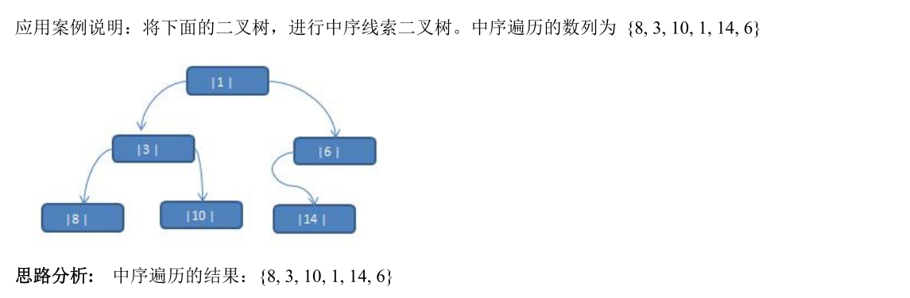

# 树结构的基本部分

## 树的相关概念


树的常用术语：

1. 节点
2. 根节点
3. 父节点
4. 子节点
5. 叶子节点(没有子节点的节点)
6. 节点的权(节点值)
7. 路径(从root节点找到该节点的路线)
8. 层
9. 子树
10. 树的高度(最大层数)
11. 森林：多颗子树构成森林

## 二叉树

### 概念

1. 树有很多种，每个节点最多只能有两个子节点的一种形式称为二叉树。

2. 二叉树的子节点分为左节点和右节点

   

3. 如果该二叉树的所有叶子节点都在最后一层，并且结点总数=2^n^-1，n为层数，则我们称为满二叉树。

   

4. 如果该二叉树的所有叶子节点都在最后一层或者倒数第二层，而且最后一层的叶子节点在左边连续，倒数第二层的叶子节点在右边连续，我们称为完全二叉树。

   


### 遍历与查找

- 前序遍历：先输出当前节点，再遍历左子树和右子树
- 中序遍历：先遍历左子树，再输出当前节点，再遍历右子树
- 后序遍历：先遍历左子树，再遍历右子树，再输出当前节点

[整理文章时发现一篇博客，比下面的代码更为简洁](https://blog.csdn.net/kmansicha/article/details/87919043)

```java
package cn.akangaroo.datastructure.tree;

public class BinaryTreeDemo {
    public static void main(String[] args) {
        //先创建一个二叉树
        BinaryTree binaryTree = new BinaryTree();
        //创建需要的结点
        HeroNode a = new HeroNode(1, "1");
        HeroNode b = new HeroNode(2, "2");
        HeroNode c = new HeroNode(3, "3");
        HeroNode d = new HeroNode(4, "4");
        HeroNode e = new HeroNode(5, "5");
        HeroNode f = new HeroNode(6, "6");
        HeroNode g = new HeroNode(7, "7");
        HeroNode h = new HeroNode(8, "8");
        HeroNode i = new HeroNode(9, "9");

        a.setLeftNode(b);
        a.setRightNode(c);
        b.setLeftNode(d);
        b.setRightNode(e);
        c.setLeftNode(f);
        c.setRightNode(g);
        d.setLeftNode(h);
        d.setRightNode(i);

        binaryTree.setRoot(a);

        //测试
        System.out.println("前序遍历");
        binaryTree.prefixOrder();
        binaryTree.deleteNode(4);
        System.out.println("删除结点后~~");
        binaryTree.prefixOrder();
//        System.out.println("中序遍历");
//        binaryTree.infixOrder();
//        System.out.println("后序遍历");
//        binaryTree.suffixOrder();
        System.out.println("~~~~~~~~~~~~~~~~~~~~~~~~~~~~~~~~~~~~~~~~~~~~~~~");
//        System.out.println("前序遍历查找");
//        System.out.println(binaryTree.prefixSearch(6));
//        System.out.println("中序遍历查找");
//        System.out.println(binaryTree.infixSearch(9));
//        System.out.println("后序遍历查找");
//        System.out.println(binaryTree.suffixSearch(1));
    }
}

class BinaryTree {
    private HeroNode root;

    public void setRoot(HeroNode root) {
        this.root = root;
    }

    //前序遍历
    public void prefixOrder() {
        if (this.root != null) {
            this.root.prefixOrder();
        } else {
            System.out.println("二叉树为空，无法遍历");
        }
    }

    public void infixOrder() {
        if (this.root != null) {
            this.root.infixOrder();
        } else {
            System.out.println("二叉树为空，无法遍历");
        }
    }

    public void suffixOrder() {
        if (this.root != null) {
            this.root.suffixOrder();
        } else {
            System.out.println("二叉树为空，无法遍历");
        }
    }

    public HeroNode prefixSearch(int id) {
        if (root != null) {
            return root.prefixSearch(id);
        } else {
            return null;
        }
    }

    public HeroNode infixSearch(int id) {
        if (root != null) {
            return root.infixSearch(id);
        } else {
            return null;
        }
    }

    public HeroNode suffixSearch(int id) {
        if (root != null) {
            return root.suffixSearch(id);
        } else {
            return null;
        }
    }

}

class HeroNode {
    private int id;
    private String name;
    private HeroNode leftNode;
    private HeroNode rightNode;

    public HeroNode(int id, String name) {
        this.id = id;
        this.name = name;
    }

    public int getId() {
        return id;
    }

    public void setId(int id) {
        this.id = id;
    }

    public String getName() {
        return name;
    }

    public void setName(String name) {
        this.name = name;
    }

    public HeroNode getLeftNode() {
        return leftNode;
    }

    public void setLeftNode(HeroNode leftNode) {
        this.leftNode = leftNode;
    }

    public HeroNode getRightNode() {
        return rightNode;
    }

    public void setRightNode(HeroNode rightNode) {
        this.rightNode = rightNode;
    }

    @Override
    public String toString() {
        return "HeroNode{" +
                "id=" + id +
                ", name='" + name + '\'' +
                '}';
    }

    /**
     * 编写前序遍历
     */
    public void prefixOrder() {

        //输出父结点
        System.out.println(this);
        //递归向左子树遍历
        if (this.leftNode != null) {
            this.leftNode.prefixOrder();
        }
        //递归向右子树遍历
        if (this.rightNode != null) {
            this.rightNode.prefixOrder();
        }
    }

    /**
     * 编写中序遍历
     */
    public void infixOrder() {
        //递归向左子树遍历
        if (this.leftNode != null) {
            this.leftNode.infixOrder();
        }
        //输出父结点
        System.out.println(this);
        //递归向右子树遍历
        if (this.rightNode != null) {
            this.rightNode.infixOrder();
        }
    }

    /**
     * 编写后序遍历
     */
    public void suffixOrder() {
        //递归向左子树遍历
        if (this.leftNode != null) {
            this.leftNode.suffixOrder();
        }
        //递归向右子树遍历
        if (this.rightNode != null) {
            this.rightNode.suffixOrder();
        }
        //输出父结点
        System.out.println(this);
    }

    /**
     * 前序遍历查找
     *
     * @return
     */
    public HeroNode prefixSearch(int id) {
        System.out.println("进入前序查找");
        //比较当前结点
        if (this.id == id) {
            return this;
        }
        HeroNode rtNode = null;
        if (this.leftNode != null) {
            rtNode = this.leftNode.prefixSearch(id);
        }
        if (rtNode != null) {
            return rtNode;
        }
        if (this.rightNode != null) {
            rtNode = this.rightNode.prefixSearch(id);
        }

        return rtNode;
    }

    /**
     * 中序遍历查找
     *
     * @return
     */
    public HeroNode infixSearch(int id) {
        HeroNode rtNode = null;
        if (this.leftNode != null) {
            rtNode = this.leftNode.infixSearch(id);
        }
        if (rtNode != null) {
            return rtNode;
        }
        System.out.println("进入中序查找");
        if (this.id == id) {
            return this;
        }

        if (this.rightNode != null) {
            rtNode = this.rightNode.infixSearch(id);
        }
        return rtNode;
    }

    /**
     * 后序遍历查找
     *
     * @return
     */
    public HeroNode suffixSearch(int id) {
        HeroNode rtNode = null;
        if (this.leftNode != null) {
            rtNode = this.leftNode.suffixSearch(id);
        }
        if (rtNode != null) {
            return rtNode;
        }

        if (this.rightNode != null) {
            rtNode = this.rightNode.suffixSearch(id);
        }
        if (rtNode != null) {
            return rtNode;
        }
        System.out.println("进入后序查找");
        if (this.id == id) {
            return this;
        }

        return rtNode;
    }
}
```
### 二叉树删除结点

要求：

如果删除的是叶子结点，则删除该结点

如果删除的是非叶子结点，则删除该子树


代码：

在HeroNode中添加方法

```java
    public void deleteNode(int id) {
        // 如果当前结点的左子结点不为空且等于要删除的值，就将左子结点置空
        if (this.leftNode != null && this.leftNode.id == id) {
            this.leftNode = null;
            return;
        }
        // 如果当前结点的右子结点不为空且等于要删除的值，就将右子结点置空
        if (this.rightNode != null && this.rightNode.id == id) {
            this.rightNode = null;
            return;
        }
        // 需要向左子树进行递归删除
        if (this.leftNode != null) {
            this.leftNode.deleteNode(id);
        }
        // 需要向右子树进行递归删除
        if (this.rightNode != null) {
            this.rightNode.deleteNode(id);
        }
    }
```

在BinaryTree中添加方法

```java
    public void deleteNode(int id) {
        if (root != null) {
            if (root.getId() == id) {
                root = null;
            } else {
                root.deleteNode(id);
            }
        } else {
            System.out.println("空树，无法删除！");
        }
    }
```


## 顺序存储二叉树

### 概念

从数据存储来看，数组存储方式和树的存储方式可以相互转换，即数组可以转换成树，树也可以转换成数组。


顺序存储二叉树的特点：

- 通常只考虑完全二叉树
- 第n个元素的左子节点为 2 * n + 1
- 第n个元素的右子节点为 2 * n + 2
- 第n个元素的父节点为 （n - 1）/ 2
- n：表示二叉树中的第几个元素(按0开始编号如图所示)

### 遍历

需求：给你一个数组{1,2,3,4,5,6,7}， 要求以二叉树前序遍历的方式进行遍历。前序遍历 的结果应当为1,2,4,5,3,6,7

```java
package cn.akangaroo.datastructure.tree;

public class ArrayBinaryTreeDemo {
    public static void main(String[] args) {
        int[] arr = {1, 2, 3, 4, 5, 6, 7};

        ArrayBinaryTree arrayBinaryTree = new ArrayBinaryTree(arr);
        arrayBinaryTree.prefixOrder();
        System.out.println();
        arrayBinaryTree.infixOrder();
        System.out.println();
        arrayBinaryTree.suffixOrder();
    }
}

class ArrayBinaryTree {
    private int[] arr;  //存储数据结点的数组

    public ArrayBinaryTree(int[] arr) {
        this.arr = arr;
    }

    //编写一个方法，完成顺序存储二叉树的前序遍历
    public void prefixOrder() {
        this.prefixOrder(0);
    }

    /**
     * @param index 数组的下标
     */
    public void prefixOrder(int index) {
        //如果数组为空，或者arr.length == 0
        if (arr == null || arr.length == 0) {
            System.out.println("数组为空，不能按照二叉树的前序遍历");
        }
        //输出当前这个元素
        System.out.print(arr[index] + "\t");
        //向左递归遍历
        if (index * 2 + 1 < arr.length) {
            prefixOrder(index * 2 + 1);
        }
        if (index * 2 + 2 < arr.length) {
            prefixOrder(index * 2 + 2);
        }
    }

    public void infixOrder() {
        this.infixOrder(0);
    }

    /**
     * @param index 数组的下标
     */
    public void infixOrder(int index) {
        //如果数组为空，或者arr.length == 0
        if (arr == null || arr.length == 0) {
            System.out.println("数组为空，不能按照二叉树的前序遍历");
        }
        //向左递归遍历
        if (index * 2 + 1 < arr.length) {
            infixOrder(index * 2 + 1);
        }
        //输出当前这个元素
        System.out.print(arr[index] + "\t");
        if (index * 2 + 2 < arr.length) {
            infixOrder(index * 2 + 2);
        }
    }

    public void suffixOrder() {
        this.suffixOrder(0);
    }

    /**
     * @param index 数组的下标
     */
    public void suffixOrder(int index) {
        //如果数组为空，或者arr.length == 0
        if (arr == null || arr.length == 0) {
            System.out.println("数组为空，不能按照二叉树的前序遍历");
        }
        //向左递归遍历
        if (index * 2 + 1 < arr.length) {
            suffixOrder(index * 2 + 1);
        }
        if (index * 2 + 2 < arr.length) {
            suffixOrder(index * 2 + 2);
        }
        //输出当前这个元素
        System.out.print(arr[index] + "\t");
    }
}
```
### 应用

八大排序算法中的堆排序，就会使用到顺序存储二叉树


## 线索化二叉树

### 问题


### 概念

- 对于一个有n个节点的二叉链表，每个节点有指向左右节点的2个指针域，整个二叉链表存在2n个指针域。而n个节点的二叉链表有n-1条分支线，那么空指针域的个数=2n-(n-1) = n+1个空指针域，从存储空间的角度来看，这n+1个空指针域浪费了内存资源。 
- 利用二叉链表中的空指针域，存放指向该结点在某种遍历次序下的前驱和后继结点的指针(这种附加的指针称为"线索")
- 这种加上了线索的二叉链表称为线索链表，相应的二叉树称为线索二叉树(Threaded BinaryTree)。根据线索性质的不同，线索二叉树可分为前序线索二叉树、中序线索二叉树和后序线索二叉树三种
- 一个结点的前一个结点，称为前驱结点
- 一个结点的后一个结点，称为后继结点

- 注意：**线索链表解决了无法直接找到该结点在某种遍历序列中的前驱和后继结点的问题，解决了二叉链表找左、右孩子困难的问题**


### 代码实现




```java
package cn.akangaroo.datastructure.tree.threadedbinarytree;

public class ThreadedBinaryTreeDemo {
    public static void main(String[] args) {
        //测试
        HeroNode root = new HeroNode(1, "tom");
        HeroNode node1 = new HeroNode(3, "jack");
        HeroNode node2 = new HeroNode(6, "smith");
        HeroNode node3 = new HeroNode(8, "mary");
        HeroNode node4 = new HeroNode(10, "nancy");
        HeroNode node5 = new HeroNode(14, "randy");

        root.setLeftNode(node1);
        root.setRightNode(node2);
        node1.setLeftNode(node3);
        node1.setRightNode(node4);
        node2.setLeftNode(node5);

        //测试中序线索化
        ThreadedBinaryTree threadedBinaryTree = new ThreadedBinaryTree();
        threadedBinaryTree.setRoot(root);
        threadedBinaryTree.threadedNode();

        //以10号结点测试
        HeroNode leftNode = node4.getLeftNode();
        HeroNode rightNode = node4.getRightNode();
        System.out.println("10号结点的前驱结点：" + leftNode);
        System.out.println("10号结点的后继结点：" + rightNode);

        System.out.println("~~~~~~~~~~~~~~~~~~~~~~~~~~~~~~");
        System.out.println("使用线索化的方式遍历线索化二叉树");
        threadedBinaryTree.threadedList();


    }
}

class ThreadedBinaryTree {
    private HeroNode root;

    public void setRoot(HeroNode root) {
        this.root = root;
    }

    //为了实现线索化，需要创建要给指向当前结点的前驱结点的指针
    private HeroNode preNode = null;

    //编写对二叉树中序线索化的方法
    public void threadedNode() {
        this.threadedNode(root);
    }

    /**
     * @param node 当前需要线索化的结点
     */
    public void threadedNode(HeroNode node) {
        //如果node==null，无法线索化
        if (node == null) {
            return;
        }

        //1. 先线索化左子树
        threadedNode(node.getLeftNode());
        //2. 线索化当前结点
        //2.1 先处理当前结点的前驱结点
        if (node.getLeftNode() == null) {
            //让当前结点的左指针指向前驱结点
            node.setLeftNode(preNode);
            //修改当前左指针的类型,指向的是前驱结点
            node.setLeftType(1);
        }
        //2.2 处理后继结点
        if (preNode != null && preNode.getRightNode() == null) {
            //让前驱结点的右指针指向当前结点
            preNode.setRightNode(node);
            //修改前驱结点的右指针类型
            preNode.setRightType(1);
        }
        //每处理一个结点后，让当前结点是下一个结点的前驱结点
        preNode = node;
        //3. 再线索化右子树
        threadedNode(node.getRightNode());

    }

    //遍历线索化中序二叉树
    public void threadedList() {
        //定义一个变量，存储当前遍历的结点，从root开始
        HeroNode node = root;
        while (node != null) {
            //循环找到的leftType等于1的结点，第一个找到的就是8结点
            //后面随着遍历变化，因为当leftType==1时，说明该结点是按照线索化处理后的有效节点
            while (node.getLeftType() == 0) {
                node = node.getLeftNode();
            }
            //打印当前结点
            System.out.println(node);
            //如果当前结点的右指针指向的是后继结点,就一直输出
            while (node.getRightType() == 1) {
                //获取到当前结点的后继结点
                node = node.getRightNode();
                System.out.println(node);
            }
            //替换这个遍历的结点
            node = node.getRightNode();
        }
    }

}

//创建HeroNode
class HeroNode {
    private int id;
    private String name;
    private HeroNode leftNode;
    private HeroNode rightNode;
    //说明：
    //1. leftType为0，表示指向的是左子树，如果1表示指向的是前驱结点
    //2. rightType为0，表示指向的是右子树，如果1表示指向的是后继结点
    private int leftType;
    private int rightType;

    public int getLeftType() {
        return leftType;
    }

    public void setLeftType(int leftType) {
        this.leftType = leftType;
    }

    public int getRightType() {
        return rightType;
    }

    public void setRightType(int rightType) {
        this.rightType = rightType;
    }

    public HeroNode(int id, String name) {
        this.id = id;
        this.name = name;
    }

    public int getId() {
        return id;
    }

    public void setId(int id) {
        this.id = id;
    }

    public String getName() {
        return name;
    }

    public void setName(String name) {
        this.name = name;
    }

    public HeroNode getLeftNode() {
        return leftNode;
    }

    public void setLeftNode(HeroNode leftNode) {
        this.leftNode = leftNode;
    }

    public HeroNode getRightNode() {
        return rightNode;
    }

    public void setRightNode(HeroNode rightNode) {
        this.rightNode = rightNode;
    }

    @Override
    public String toString() {
        return "HeroNode{" +
                "id=" + id +
                ", name='" + name + '\'' +
                '}';
    }
}
```


# 树结构的应用

## 堆排序

参照堆排序

## 赫夫曼树

### 概念

- 给定n个权值作为n个叶子结点，构造一棵二叉树，若该树的带权路径长度(wpl)达到最小，称这样的二叉树为最优二叉树，也称为哈夫曼树(Huffman Tree)，还有的书翻译为霍夫曼树。
- 赫夫曼树是带权路径长度最短的树，权值较大的结点离根较近


- **路径和路径长度**：在二叉树中，从一个结点往下可以达到的孩子或孙子结点之间的通路，称为路径。通路中分支的数目称为路径度。若规定根结点的层数为1，则从根结点到第L层结点的路径长度为L-1。
- **结点的权**：若将树中结点赋给一个有着某种含义的数值，则这个数值称为该结点的权。
- **结点的带权路径长度为**：从根结点到该结点之间的路径长度与该结点的权的乘积。
- **树的带权路径长度**：树的带权路径长度规定为所有叶子结点的带权路径长度之和，记为WPL(weighted path length)，权值越大的结点离根结点越近的二叉树才是最优二叉树。
- WPL最小的就是赫夫曼树


### 创建思路

1. 从小到大进行排序，将每-一个数据，每个数据都是一一个节点 ，每个节点可以看成是一颗最简单的二叉树
2. 取出根节点权值最小的两颗二叉树
3. 组成一颗新的二叉树,该新的二叉树的根节点的权值是前面两颗二叉树根节点权值的和
4. 再将这颗新的二叉树，以根节点的权值大小再次排序，不断重复 1-2-3-4 的步骤，直到数列中，所有的数据都被处理，就得到一颗赫夫曼树


### 代码实现

```java
package cn.akangaroo.datastructure.tree;

import java.util.ArrayList;
import java.util.Collections;

public class HuffmanTreeDemo {
    public static void main(String[] args) {
        int[] arr = {13, 7, 8, 3, 29, 6, 1};
        Node root = createHuffmanTree(arr);
        //测试
        prefixOrder(root);
    }

    //编写一个前序遍历的方法
    public static void prefixOrder(Node root) {
        if (root != null) {
            root.prefixOrder();
        } else {
            System.out.println("空树，无法遍历！");
        }
    }

    //创建赫夫曼树的方法
    public static Node createHuffmanTree(int[] arr) {
        //1. 遍历arr数组
        //2. 将arr的每个元素构成一个个Node
        //3. 将Node放入ArrayList中
        ArrayList<Node> nodeList = new ArrayList<>();
        for (int value : arr) {
            nodeList.add(new Node(value));
        }

        while (nodeList.size() > 1) {
            //排序，从小到大
            Collections.sort(nodeList);

            //1. 取出根结点权值最小的二叉树
            Node leftNode = nodeList.get(0);
            //2. 取出根节点权值次小的二叉树
            Node rightNode = nodeList.get(1);
            //3. 构建一颗新的二叉树
            Node parent = new Node(leftNode.value + rightNode.value);
            parent.left = leftNode;
            parent.right = rightNode;
            //4. 从ArrayList中删除处理过的二叉树
            nodeList.remove(leftNode);
            nodeList.remove(rightNode);
            //5. 将parent加入
            nodeList.add(parent);
        }

        //返回Huffman树的最后一个结点
        return nodeList.get(0);
    }


}

//创建结点类
//为了使Node对象排序，让Node实现Comparable接口
class Node implements Comparable<Node> {
    int value;
    Node left;  //指向左子结点
    Node right; //指向右子节点

    //前序遍历
    public void prefixOrder() {
        System.out.println(this);
        if (this.left != null) {
            this.left.prefixOrder();
        }
        if (this.right != null) {
            this.right.prefixOrder();
        }
    }

    public Node(int value) {
        this.value = value;
    }

    @Override
    public String toString() {
        return "Node{" +
                "value=" + value +
                '}';
    }

    @Override
    public int compareTo(Node o) {
        //表示从小到大进行排序
        return this.value - o.value;
    }
}
```


## 二叉排序树(BST)

### 概念

如果想要对一个数列完成搞笑的数据查询和添加，可以使用二叉排序树

**二叉排序树**：BST：(Binary Sort(Search) Tree)，对于二叉排序树的任何一个非叶子节点，要求左子节点的值比当前节点的值小，右子节点的值比当前节点的值大。
**特别说明**：如果有相同的值，可以将该节点放在左子节点或右子节点。


### 创建和遍历

Node

```java
    //添加结点的代码
    //递归的形式添加结点，需要满足二叉排序树的要求
    public void add(Node node) {
        if (node == null) {
            return;
        }

        //传入结点的值，和当前子树根结点的关系
        if (node.value < this.value) {
            //如果当前结点左子结点为空
            if (this.left == null) {
                this.left = node;
            } else {
                //递归的向左子结点添加
                this.left.add(node);
            }
        } else {
            if (this.right == null) {
                this.right = node;
            } else {
                this.right.add(node);
            }
        }
    }
```

 BinarySortTree

```java
    public void add(Node node) {
        if (root == null) {
            root = node;
        } else {
            root.add(node);
        }
    }
```


### 删除

二叉排序树的删除情况比较复杂，有下面三种情况需要考虑

1. 删除叶子节点(比如: 2，5，9，12)

   > 1. 先去找到要删除的结点targetNode
   > 2. 找到 targetNode 的父结点parent
   > 3. 确定 targetNode 是 parent 的左子结点还是右子结点
   > 4. 根据前面的情况来对应删除
   >    - 左子结点parent.left = null
   >    - 右子结点parent.right = null

2. 删除只有一颗子树的节点(比如: 1)

   > 1. 先去找到要删除的结点targetNode
   > 2. 找到targetNode的父结点parent
   > 3. 确定targetNode 的子结点是左子结点还是右子结点
   > 4. targetNode是parent 的左子结点还是右子结点
   > 5. 如果targetNode有左子结点
   >    1. 如果targetNode 是parent的左子结点
   >       parent.left = targetNode.left;
   >    2. 如果targetNode 是parent的右子结点
   >       parent.right = targetNode.left;
   > 6. 如果targetNode有右子结点
   >    1. 如果targetNode 是parent 的左子结点
   >       parent.left = targetNode.right;
   >    2. 如果targetNode 是parent 的右子结点
   >       parent.right = targetNode.right;

3. 删除有两颗子树的节点(比如：7，3，10)

   > 1. 先去找到要删除的结点targetNode
   > 2. 找到targetNode 的父结点parent
   > 3. 从targetNode的右子树找到最小的结点
   > 4. 用一个临时变量，将最小结点的值保存temp= 11
   > 5. 删除 该最小结点
   > 6. targetNode.value = temp

```java
package cn.akangaroo.datastructure.tree.binarySortTree;

public class BinarySortTreeDemo {
    public static void main(String[] args) {
        int[] arr = {7, 3, 10, 12, 5, 1, 9, 0};
        BinarySortTree binarySortTree = new BinarySortTree();
        //循环地添加结点到二叉排序树
        for (int i = 0; i < arr.length; i++) {
            binarySortTree.add(new Node(arr[i]));
        }

        //中序遍历二叉排序树
        System.out.println("中序遍历二叉排序树");
        binarySortTree.infixOrder();//1	2	3	5	7	9	10	12
        System.out.println();

        //测试删除叶子结点
        binarySortTree.delNode(10);
        System.out.println("删除结点后：");
        binarySortTree.infixOrder();


    }
}

//创建二叉排序树
class BinarySortTree {
    private Node root;

    //查找要删除的结点
    public Node search(int value) {
        if (root == null) {
            return null;
        } else {
            return root.search(value);
        }
    }

    /**
     * @param node 传入的结点（当作二叉排序树的根结点）
     * @return 返回的是以node为根结点的二叉排序树的最小结点的值
     */
    public int delRightTreeMin(Node node) {
        Node target = node;
        //循环地查找左结点，就会找到最小值
        while (target.left != null) {
            target = target.left;
        }
        delNode(target.value);
        return target.value;
    }

    //要删除结点的父结点
    public Node searchParent(int value) {
        if (root == null) {
            return null;
        } else {
            return root.searchParent(value);
        }
    }

    //删除结点
    public void delNode(int value) {
        if (root == null) {
            return;
        } else {
            //1. 查找要删除的结点
            Node targetNode = search(value);
            //没有找到要删除的结点
            if (targetNode == null) {
                return;
            }
            //如果发现当前这棵二叉排序树只有一个结点
            if (root.left == null && root.right == null) {
                root = null;
            }

            //2. 去找targetNode的父结点
            Node parent = searchParent(value);

            //3. 如果要删除的结点是叶子结点
            if (targetNode.left == null && targetNode.right == null) {
                //判断targetNode是父结点的左子结点还是右子结点
                if (parent.left != null && parent.left.value == value) {
                    parent.left = null;
                } else if (parent.right != null && parent.right.value == value) {
                    parent.right = null;
                }
            } else if (targetNode.left != null && targetNode.right != null) {
                int minVal = delRightTreeMin(targetNode.right);
                targetNode.value = minVal;
            } else {    //删除只有一颗子树的结点
                if (targetNode.left != null) {
                    if (parent != null) {
                        //如果要删除的targetNode有左子结点
                        if (parent.left.value == value) {
                            parent.left = targetNode.left;
                        } else { //targetNode是parent的右子结点
                            parent.right = targetNode.left;
                        }
                    } else {
                        root = targetNode.left;
                    }
                } else {//要删除的结点有右子结点
                    if (parent != null) {
                        if (parent.left.value == value) {
                            parent.left = targetNode.right;
                        } else {
                            parent.right = targetNode.right;
                        }
                    } else {
                        root = targetNode.right;
                    }

                }
            }
        }
    }

    public void add(Node node) {
        if (root == null) {
            root = node;
        } else {
            root.add(node);
        }
    }

    //中序遍历
    public void infixOrder() {
        if (root != null) {
            root.infixOrder();
        } else {
            System.out.println("二叉排序树为空，无法遍历");
        }
    }
}

//创建Node结点
class Node {
    int value;
    Node left;
    Node right;

    public Node(int value) {
        this.value = value;
    }

    /**
     * 查找要删除的结点
     */
    public Node search(int value) {
        if (value == this.value) {
            return this;
        } else if (value < this.value) {//应当向左子树递归查找
            //如果左子结点为空
            if (this.left == null) {
                return null;
            }
            return this.left.search(value);
        } else {//应当向右子树递归查找
            if (this.right == null) {
                return null;
            }
            return this.right.search(value);
        }
    }

    /**
     * 查找要删除结点的父结点
     *
     * @param value
     * @return 要删除结点的父结点
     */
    public Node searchParent(int value) {
        if ((this.left != null && this.left.value == value) || (this.right != null && this.right.value == value)) {
            return this;
        } else {
            //如果查找的值小于当前结点的值
            //且当前结点的左子结点不为空
            if (value < this.value && this.left != null) {
                return this.left.searchParent(value);
            } else if (value >= this.value && this.right != null) {
                return this.right.searchParent(value);
            } else {
                return null;//没有找到父结点
            }
        }
    }

    @Override
    public String toString() {
        return "Node{" +
                "value=" + value +
                '}';
    }

    //添加结点的代码
    //递归的形式添加结点，需要满足二叉排序树的要求
    public void add(Node node) {
        if (node == null) {
            return;
        }

        //传入结点的值，和当前子树根结点的关系
        if (node.value < this.value) {
            //如果当前结点左子结点为空
            if (this.left == null) {
                this.left = node;
            } else {
                //递归的向左子结点添加
                this.left.add(node);
            }
        } else {
            if (this.right == null) {
                this.right = node;
            } else {
                this.right.add(node);
            }
        }
    }

    //中序遍历
    public void infixOrder() {
        if (this.left != null) {
            this.left.infixOrder();
        }
        System.out.print(this.value + "\t");
        if (this.right != null) {
            this.right.infixOrder();
        }
    }
}
```


## 平衡二叉树(AVL)

```java
package cn.akangaroo.datastructure.tree.avl;

public class AVLTreeDemo {
    public static void main(String[] args) {
        //int[] arr = {4, 3, 6, 5, 7, 8};
        //int[] arr = {10,12,8,9,7,6};
        int[] arr = {10, 11, 7, 6, 8, 9};
        //创建一个AVLTree对象
        AVLTree avlTree = new AVLTree();
        for (int i = 0; i < arr.length; i++) {
            avlTree.add(new Node(arr[i]));
        }
        System.out.println("中序遍历：");
        avlTree.infixOrder();

        System.out.println("在没有做旋转之前~~");
        System.out.println("树的高度=" + avlTree.getRoot().height());
        System.out.println("左子树的高度=" + avlTree.getRoot().leftHeight());
        System.out.println("右子树的高度=" + avlTree.getRoot().rightHeight());
    }
}

//创建AVLTree
class AVLTree {
    private Node root;

    public Node getRoot() {
        return root;
    }

    public void add(Node node) {
        if (root == null) {
            root = node;
        } else {
            root.add(node);
        }
    }

    //中序遍历
    public void infixOrder() {
        if (root != null) {
            root.infixOrder();
        } else {
            System.out.println("二叉排序树为空，无法遍历");
        }
    }
}

//创建Node结点
class Node {
    int value;
    Node left;
    Node right;

    public Node(int value) {
        this.value = value;
    }

    //返回左子树的高度
    public int leftHeight() {
        if (left == null) {
            return 0;
        }
        return left.height();
    }

    //返回右子树的高度
    public int rightHeight() {
        if (right == null) {
            return 0;
        }
        return right.height();
    }

    //返回以该结点为根结点的树的高度
    public int height() {
        return Math.max(left == null ? 0 : left.height(), right == null ? 0 : right.height()) + 1;
    }

    //左旋转的方法
    public void leftRotate() {
        //创建新的结点，以当前根结点的值创建
        Node newNode = new Node(value);
        //把新的结点的左子树设置为当前结点的左子树
        newNode.left = this.left;
        //把新的结点的右子树设置为当前结点的右子树的左子树
        newNode.right = this.right.left;
        //把当前结点的值替换成右子结点的值
        this.value = this.right.value;
        //把当前结点的右子树设置为当前结点的右子树的右子树
        this.right = this.right.right;
        //把当前结点的左子结点设置为新的结点
        this.left = newNode;

    }

    public void rightRotate() {
        Node newNode = new Node(value);
        newNode.right = right;
        newNode.left = left.right;
        value = left.value;
        left = left.left;
        right = newNode;
    }

    @Override
    public String toString() {
        return "Node{" +
                "value=" + value +
                '}';
    }

    //添加结点的代码
    //递归的形式添加结点，需要满足二叉排序树的要求
    public void add(Node node) {
        if (node == null) {
            return;
        }

        //传入结点的值，和当前子树根结点的关系
        if (node.value < this.value) {
            //如果当前结点左子结点为空
            if (this.left == null) {
                this.left = node;
            } else {
                //递归的向左子结点添加
                this.left.add(node);
            }
        } else {
            if (this.right == null) {
                this.right = node;
            } else {
                this.right.add(node);
            }
        }

        //当添加完结点后，如果右子树的高度-左子树的高度>1
        if (rightHeight() - leftHeight() > 1) {
            if (right != null && right.leftHeight() > right.rightHeight()) {
                right.rightRotate();
            }
            leftRotate();//左旋转
            return;
        }

        if (leftHeight() - rightHeight() > 1) {
            //右旋转
            if (left != null && left.rightHeight() > left.leftHeight()) {
                //先对当前结点的左子树进行左旋转
                left.leftRotate();
            }
            rightRotate();//右旋转
        }
    }

    //中序遍历
    public void infixOrder() {
        if (this.left != null) {
            this.left.infixOrder();
        }
        System.out.print(this.value + "\t");
        if (this.right != null) {
            this.right.infixOrder();
        }
    }
}
```

