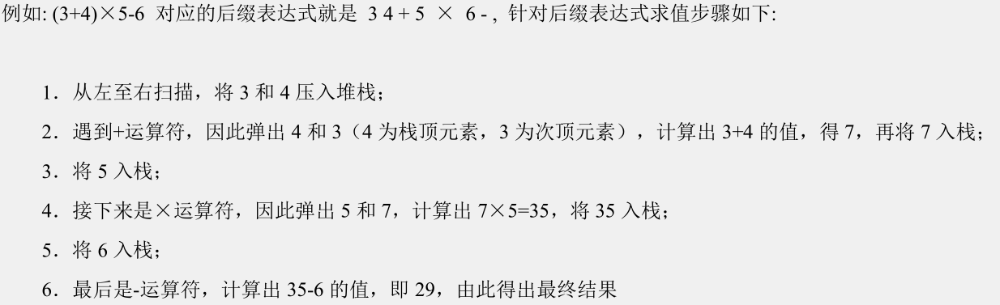
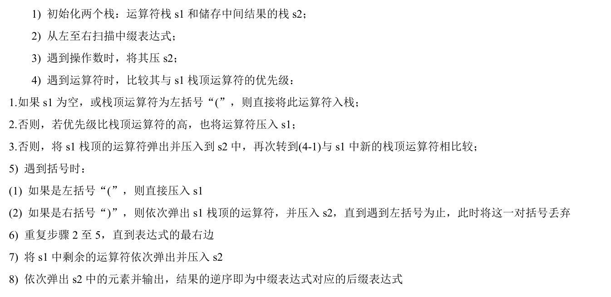

# 栈

1. 栈的英文为(stack)
2. 栈是一个先入后 出(FILO-First In Last Out)的有序列表。
3. 栈(stack)是 限制线性表中元素的插入和删除只能在线性表的同一端进行 的一种特殊线性表。 允许插入和删除的一端， 为变化的一端，称为栈顶(Top), 另-端为固定的一端，称为栈底(Bottom)。
4. 根据栈的定义可知，最先放入栈中元素在栈底，最后放入的元素在栈顶，而删除元素刚好相反，最后放入的元素最先删除，最先放入的元素最后删除

## 栈的应用场景

- 子程序的调用：在跳往子程序前，会先将下个指令的地址存到堆栈中，直到子程序执行完后再将地址取出，以回到原来的程序中。
- 处理递归调用：和子程序的调用类似，只是除了储存下一一个指令的地址外，也将参数、区域变量等数据存入堆、栈中。
- 表达式的转换[中缀表达式转后缀表达式]与求值(实际解决)。
- 二叉树的遍历。
- 图形的深度优先(depth--first)搜索法。


## 栈的快速入门

```java
package cn.akangaroo.datastructure.stack;

public class ArrayStackDemo {
    public static void main(String[] args) {
        ArrayStack arrayStack = new ArrayStack(4);
        arrayStack.push(1);
        arrayStack.push(2);
        arrayStack.push(3);
        arrayStack.push(4);
        arrayStack.list();
        int pop = 0;
        try {
            pop = arrayStack.pop();
        } catch (Exception e) {
            System.out.println(e.getMessage());
        }
        System.out.println(pop);
        arrayStack.list();
    }
}

class ArrayStack {
    private int maxSize;    //栈的大小
    private int[] stack;    //数组
    private int top = -1;   //top表示栈顶，初始化为-1

    public ArrayStack(int maxSize) {
        this.maxSize = maxSize;
        stack = new int[maxSize];
    }

    public boolean isFull() {
        return top == maxSize - 1;
    }

    public boolean isEmpty() {
        return top == -1;
    }

    //入栈
    public void push(int value) {
        if (isFull()) {
            System.out.println("栈满");
            return;
        }
        top++;
        stack[top] = value;
    }

    //出栈
    public int pop() {
        if (isEmpty()) {
            throw new RuntimeException("栈空");
        }
        int value = stack[top];
        top--;
        return value;
    }

    //遍历
    public void list() {
        if (isEmpty()) {
            System.out.println("栈空");
            return;
        }
        for (int i = top; i >= 0; i--) {
            System.out.println("stack[" + i + "] =" + stack[i]);
        }
    }
}

```


## 逆波兰计算器(栈实现)

### 要求

输入一个逆波兰表达式(后缀表达式)，使用栈(Stack)，计算其结果

支持小括号和多位数整数，因为这里我们主要讲的是数据结构，因此计算器进行简化，只支持对整数的计算。





### 中缀表达式转为后缀表达式




### 实现

```java
package cn.akangaroo.datastructure.stack;

import java.util.ArrayList;
import java.util.List;
import java.util.Stack;

public class PolandNotation {
    public static void main(String[] args) {
        String expression = "1+((2*3)+4)-5";
        //先将中缀表达式转换成List形式
        List<String> infixStringList = getInfixStringList(expression);
        System.out.println("中缀表达式对应的List = " + infixStringList);
        //再将中缀表达式转换为后缀表达式
        List<String> suffixExpr = parseSuffixExpr(infixStringList);
        System.out.println("后缀表达式对应的List = " + suffixExpr);

        System.out.println(expression + " = " + calculate(suffixExpr));

    }

    /**
     * 将中缀表达式转化成后缀表达式。
     *
     * @param list
     * @return
     */
    public static List<String> parseSuffixExpr(List<String> list) {
        //定义两个栈，其中一个用ArrayList代替即可
        //存放符号
        Stack<String> s1 = new Stack<>();
        //存放结果
        List<String> s2 = new ArrayList<>();

        for (String item : list) {
            if (item.matches("\\d+")) {//如果是数字，就加入
                s2.add(item);
            } else if (item.equals("(")) {
                s1.push(item);
            } else if (item.equals(")")) {
                //如果是右括号)，则依次弹出栈顶的运算符，直到遇到(为止。
                while (!s1.peek().equals("(")) {
                    s2.add(s1.pop());
                }
                s1.pop();//将(弹出栈
            } else {
                //比较符号的优先级
                while (s1.size() != 0 && Operation.getPriority(s1.peek()) >= Operation.getPriority(item)) {
                    s2.add(s1.pop());
                }
                s1.push(item);
            }
        }

        while (s1.size() != 0) {
            s2.add(s1.pop());
        }

        return s2;
    }

    /**
     * 将中缀表达式转换成List形式
     *
     * @param infixExpr
     * @return
     */
    public static List<String> getInfixStringList(String infixExpr) {
        List<String> list = new ArrayList<>();
        int i = 0;//用于遍历中缀表达式
        String str;//用于字符串的拼接
        char c;//每遍历到一个字符，就放入到c
        do {
            //如果是一个非数字，就加入到list中
            if ((c = infixExpr.charAt(i)) < 48 || (c = infixExpr.charAt(i)) > 57) {
                list.add("" + c);
                i++;//i向后移
            } else {//要考虑多位数的情况
                str = "";
                while (i < infixExpr.length() && (c = infixExpr.charAt(i)) >= 48 && (c = infixExpr.charAt(i)) <= 57) {
                    str += c;//拼接
                    i++;
                }
                list.add(str);
            }
        } while (i < infixExpr.length());

        return list;
    }

    /**
     * 将后缀表达式转换成List形式
     *
     * @param suffixExpr
     * @return
     */
    public static List<String> getSuffixStringList(String suffixExpr) {
        String[] split = suffixExpr.split(" ");
        ArrayList<String> list = new ArrayList<>();
        for (String ele : split) {
            list.add(ele);
        }
        return list;
    }

    /**
     * 完成对后缀表达式的计算
     *
     * @param list
     * @return
     */
    public static int calculate(List<String> list) {

        Stack<String> stack = new Stack<>();

        //遍历list
        for (String item : list) {
            if (item.matches("\\d+")) {//匹配的是多位数
                //入栈
                stack.push(item);
            } else {
                //pop出两个数，进行运算
                int num1 = Integer.parseInt(stack.pop());
                int num2 = Integer.parseInt(stack.pop());
                int res = 0;

                if (item.equals("+")) {
                    res = num1 + num2;
                } else if (item.equals("-")) {
                    res = num2 - num1;
                } else if (item.equals("*")) {
                    res = num1 * num2;
                } else if (item.equals("/")) {
                    res = num2 / num1;
                } else {
                    throw new RuntimeException("运算符有错误！");
                }
                stack.push(res + "");
            }
        }
        //最后保存在栈中的元素是运算结果
        return Integer.parseInt(stack.pop());
    }
}

class Operation {
    private static int ADD = 1;
    private static int SUB = 1;
    private static int MUL = 2;
    private static int DIV = 2;

    public static int getPriority(String operation) {
        int result = 0;

        switch (operation) {
            case "+":
                result = ADD;
                break;
            case "-":
                result = SUB;
                break;
            case "*":
                result = MUL;
                break;
            case "/":
                result = DIV;
                break;
            default:
                break;
        }
        return result;
    }

}
```