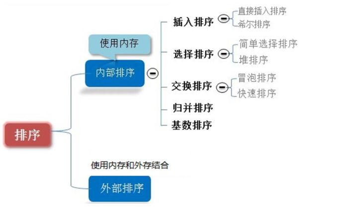
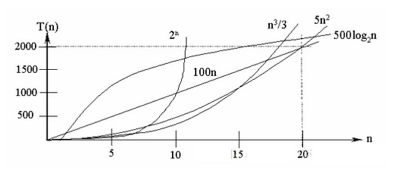
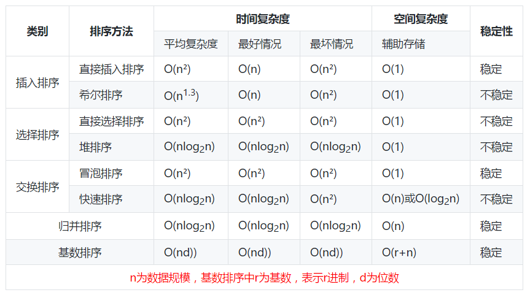
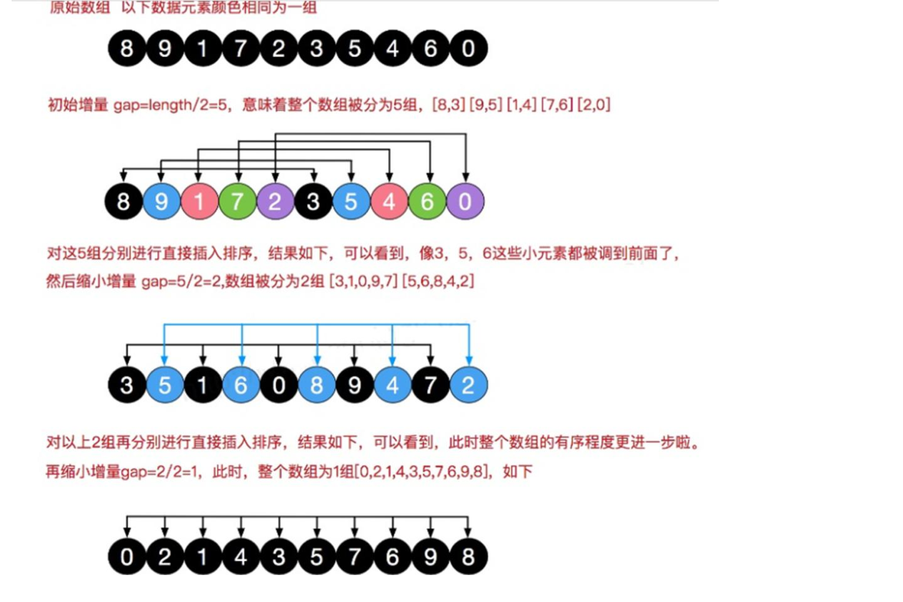
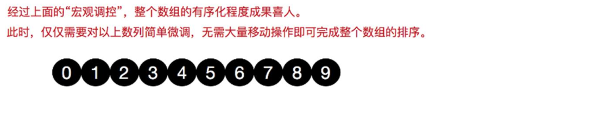
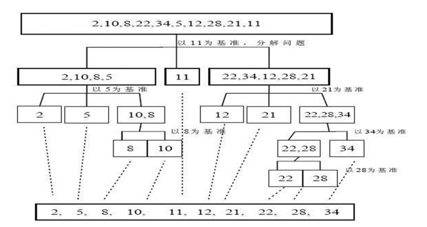
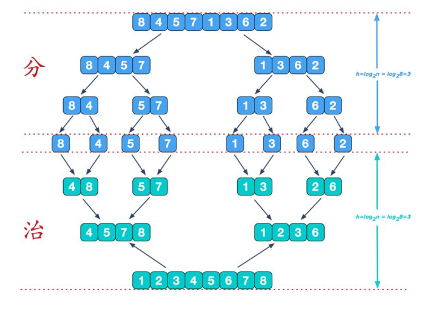
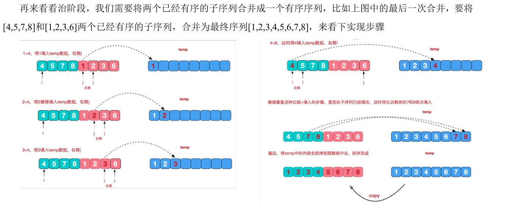
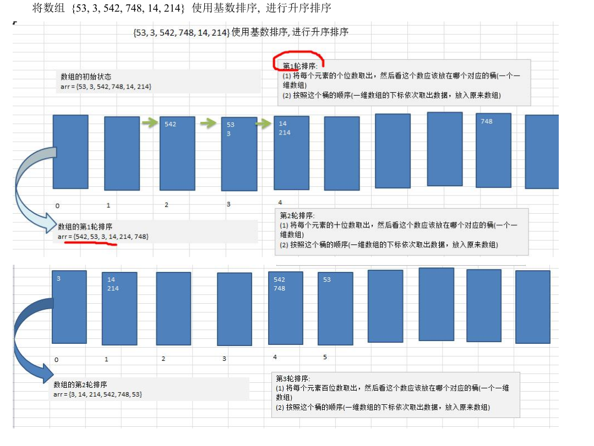
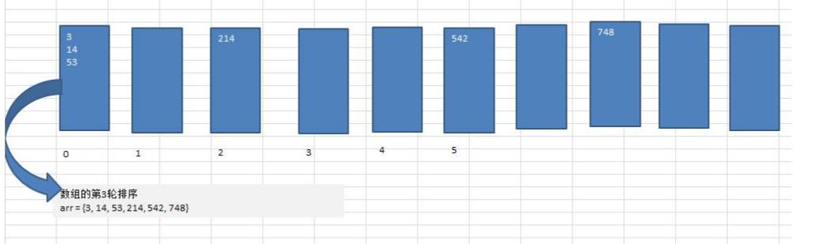

#  排序算法

排序的分类：

- 内部排序：指将需要处理的所有数据都加载到内部存储器(内存)中进行排序。
- 外部排序：数据量过大，无法全部加载到内存中，需要借助外部存储(文件等)进行排序。

常见的排序：



## 时间复杂度

### 简介

- 一般情况下，**算法中的基本操作语句的重复执行次数是问题规模n的某个函数**，用T(n)表示，若有某个辅助函数f(n)，使得当n趋近于无穷大时，T(n)/f(n)的极限值为不等于零的常数，则称f(n)是T(n)的同数量级函数。
  记作**T(n)=O(f(n))**，称O(f(n))为算法的渐进时间复杂度，简称时间复杂度。
- T(n)不同，但时间复杂度可能相同。如：T(n)=n^2^+7n+6与T（n）=3n^2^+2n+2它们的T(n)不同，但时间复杂度相同，都为O(n^2^)
- 计算时间复杂度的方法：
  1. 用常数1代替运行时间中的所有加法常数T(n)=3n^2^+7n+6 → T(n)=3n^2^+7n+1
  2. 修改后的运行次数函数中，只保留最高阶项T(n)=3n^2^+7n+1 → T(n)=3n^2^
  3. 去除最高阶项的系数T(n)=3n^2^ → T(n)=n^2^ → O(n^2^）

常见的时间复杂度(由小到大)：

1. 常数阶O(1)
2. 对数阶O(log~2~n)
3. 线性阶O(n)
4. 线性对数阶 O(nlog~2~n)
5. 平方阶O(n^2^)
6. 立方阶O(n^3^)
7. k次方阶O(n^k^)
8. 指数阶O(2^n^)



### 常用时间复杂度举例

1. 常数阶O(1)

   无论代码执行了多少行，只要是没有循环等复杂结构，那这个代码的时间复杂度就是O(1)

   ```java
   int i = 1;
   int j = 1;
   ++i;
   j++;
   int m = i + j;
   ```

2. 对数阶O(log~2~n)

   ```java
   int i = 1;
   while (i < n) {
       i = i * 2;
   }
   ```

3. 线性阶O(n)

   ```java
   for (int i = 0; i < n; i++) {
       int j = i;
       j++;
   }
   ```

4. 线性对数阶O(nlog~2~n)

   线性对数阶O(nlog~2~n)其实非常容易理解，将时间复杂度为O(log~2~n)的代码循环n遍的活，那么它的时间复杂度就是n * O(log~2~n)，也就是了O(nlog~2~n)

   ```java
   for (int k = 0; k < n; k++) {
       int i = 1;
       while (i < n) {
           m = m * 2;
       }
   }
   ```

5. 平方阶O(2^n^)

   ```java
   for (int i = 0; i < n; i++) {
       for (int j = 0; j < n; j++) {
           j++;
       }
   }
   ```

   


### 常用排序算法复杂度




## 冒泡排序

冒泡排序（ Bubble sorting）的基本思想是：通过对待排序序列从前向后（从下标较小的元素开始），依次比较相邻元素的值，若发现逆序则交换，使值较大的元素逐渐从前移向后部，就像水底下的气泡一样逐渐向上冒。

优化：因为排序的过程中，各元素不断接近自己的位置，如果一趟比较下来没有进行过交换，就说明序列有序，因此要在排序过程中设置一个标志flag判断元素是否进行过交换。从而减少不必要的比较。

```java
package cn.akangaroo.datastructure.sort;

import java.util.Arrays;

public class BubbleSort {
    public static void main(String[] args) {
        int[] arr = {1, 2, 3, 4, 5, 6};
        bubbleSort(arr);

    }

    public static void bubbleSort(int[] arr) {

        for (int i = 0; i < arr.length - 1; i++) {
            boolean flag = false;//用来判断是否产生了交换

            for (int j = 0; j < arr.length - 1 - i; j++) {
                if (arr[j] > arr[j + 1]) {
                    flag = true;
                    int temp = arr[j];
                    arr[j] = arr[j + 1];
                    arr[j + 1] = temp;
                }
            }
            System.out.println("第" + (i + 1) + "次交换后的结果为：");
            System.out.println(Arrays.toString(arr));

            if (!flag) {//如果flag为false就退出。
                break;
            }
        }

    }
}

```
## 选择排序

思想：第一次从arr[0]-arr[n-1]中遍历，选出最小值，与arr[0]交换，接着从arr[1]-arr[n-1]中遍历，选出最小值，与arr[1]交换...

```java
package cn.akangaroo.datastructure.sort;

public class SelectionSort {
    public static void main(String[] args) {
        int[] arr = new int[80000];
        for (int i = 0; i < 80000; i++) {
            arr[i] = (int) (Math.random() * 800000);
        }
        long start = System.currentTimeMillis();
        selectionSort(arr);
        long end = System.currentTimeMillis();
        System.out.println(end - start);
    }

    /**
     * 尚未优化的选择排序
     *
     * @param arr
     */
    public static void selectionSort(int[] arr) {
        for (int i = 0; i < arr.length - 1; i++) {
            //假设arr[i]为最小的元素
            int minIndex = i;
            //找到最小元素的下标
            for (int j = i + 1; j < arr.length; j++) {
                if (arr[minIndex] > arr[j]) {
                    minIndex = j;
                }

            }
            //交换元素
            if (minIndex != i) {
                int temp = arr[i];
                arr[i] = arr[minIndex];
                arr[minIndex] = temp;
            }

        }
    }
}

```

## 插入排序

插入排序( Insertion Sorting)的基本思想是：把n个待排序的元素看成为一个有序表和一个无序表，开始时有序表中只包含一个元素，无序表中包含有n-1个元素，排序过程中每次从无序表中取出第一个元素，把它的排序码依次与有序表元素的排序码进行比较，将它插入到有序表中的适当位置，使之成为新的有序表。


```java
package cn.akangaroo.datastructure.sort;

import java.util.Arrays;

public class InsertSort {
    public static void main(String[] args) {
       /* int[] arr = new int[80000];
        for (int i = 0; i < 80000; i++) {
            arr[i] = (int)(Math.random()*800000);
        }
        System.out.println("尚未优化的版本~~");
        long start = System.currentTimeMillis();
        insertSort(arr);
        long end = System.currentTimeMillis();
        System.out.println(end-start);

        System.out.println("优化的版本~~");
        long start1 = System.currentTimeMillis();
        insertSort2(arr);
        long end1 = System.currentTimeMillis();
        System.out.println(end1-start1);*/

        int[] arr = {12, 31, 45, 1, 43, 22};
        insertSort2(arr);
    }

    //插入排序
    public static void insertSort(int[] arr) {

        for (int i = 1; i < arr.length; i++) {
            //待排元素小于有序序列的最后一个元素时，向前插入
            for (int j = i; j > 0; j--) {
                if (arr[j] < arr[j - 1]) {
                    int temp = arr[j];
                    arr[j] = arr[j - 1];
                    arr[j - 1] = temp;
                }
            }
//            System.out.println("经过"+i+"次交换后的数据为：");
//            System.out.println(Arrays.toString(arr));
        }
    }

    //插入排序优化

    /**
     * 首先上面的这个每次替换都要定义一个temp赋值需要插入的数，这样会造成不必要的浪费：
     * 所以我们可以吧所有的大于需要插入的数先保存，然后进行比较，然后将最后的正确位置空出来。
     * 把之前保存的需要插入的数放到正确位置上；
     */
    public static void insertSort2(int[] arr) {

        for (int i = 1; i < arr.length; i++) {
            int temp = arr[i];//定义待插入的数
            int j;
            for (j = i - 1; j >= 0 && (arr[j] > temp); j--) {
                arr[j + 1] = arr[j];//把大于需要插入的数往后移动。最后不大于temp的数就空出来
            }
            arr[j + 1] = temp;
        }
        System.out.println(Arrays.toString(arr));
    }
}

```
## 希尔排序

思想：希尔排序(Shell's Sort)是插入排序的一种又称“缩小增量排序”（Diminishing Increment Sort），是直接插入排序算法的一种更高效的改进版本。希尔排序是非稳定排序算法。





```java
package cn.akangaroo.datastructure.sort;

import java.util.Arrays;

public class ShellSort {
    public static void main(String[] args) {
        int[] arr = {8, 9, 1, 7, 2, 3, 5, 4, 6, 0};
        System.out.println("原先的数组~~");
        System.out.println(Arrays.toString(arr));
        shellSort2(arr);
    }

    public static void shellSort(int[] arr) {

        int temp;
        int count = 0;
        for (int gap = arr.length / 2; gap > 0; gap /= 2) {

            for (int i = gap; i < arr.length; i++) {
                //以下其实就是一个插入排序
                for (int j = i - gap; j >= 0; j -= gap) {
                    if (arr[j] > arr[j + gap]) {
                        temp = arr[j];
                        arr[j] = arr[j + gap];
                        arr[j + gap] = temp;
                    }
                }
            }
            System.out.println("第" + (++count) + "次希尔排序的结果~~");
            System.out.println(Arrays.toString(arr));
        }
    }

    public static void shellSort2(int[] arr) {

        int temp;
        int count = 0;
        for (int gap = arr.length / 2; gap > 0; gap /= 2) {

            for (int i = gap; i < arr.length; i++) {
                //以下其实就是一个插入排序
                temp = arr[i];//定义待插入的数
                int j;

                for (j = i - gap; j >= 0 && (arr[j] > temp); j -= gap) {
                    arr[j + gap] = arr[j];//把大于需要插入的数往后移动。最后不大于temp的数就空出来
                }
                arr[j + gap] = temp;
            }
            System.out.println("第" + (++count) + "次希尔排序的结果~~");
            System.out.println(Arrays.toString(arr));
        }
    }
}

```
## 快速排序

思想：

1. 先从数列中取出一个数作为基准数。
2. 分区过程，将比这个数大的数全放到它的右边，小于或等于它的数全放到它的左边。
3. 再对左右区间重复第二步，直到各区间只有一个数。

[菜鸟教程——快速排序](https://www.runoob.com/w3cnote/quick-sort.html)



```java
package cn.akangaroo.datastructure.sort;


public class QuickSort {
    public static void main(String[] args) {
/*        int[] arr = {-9,29,38,0,-12,25,79,-15};
        quickSort(arr, 0, arr.length - 1);
        System.out.println(Arrays.toString(arr));*/

        int[] arr = new int[800000];
        for (int i = 0; i < 800000; i++) {
            arr[i] = (int) (Math.random() * 800000);
        }

        long start1 = System.currentTimeMillis();
        quickSort(arr, 0, arr.length - 1);
        long end1 = System.currentTimeMillis();
        System.out.println(end1 - start1);

    }

    public static void quickSort(int[] arr, int start, int end) {

        int pivotKey = arr[start];//枢轴记录关键字
        int low = start;
        int high = end;

        while (low < high) {
            // 从 高位 向 低位 找第一个小于pivotKey的数
            while ((low < high) && (arr[high] >= pivotKey)) {
                high--;
            }
            arr[low++] = arr[high];
            //从 低位 向 高位 找第一个小于pivotKey的数
            while ((low < high) && (arr[low] <= pivotKey)) {
                low++;
            }
            arr[high--] = arr[low];
        }
        arr[low] = pivotKey;
        //if判断是为了防止数组越界
        if (start < low - 1) quickSort(arr, start, low - 1);// 递归调用
        if (low + 1 < end) quickSort(arr, low + 1, end);
    }

}

```
## 归并排序

归并排序(MERGE-SORT) 是利用归并的思想实现的排序方法，该算法采用经典的分治( divide-and-conquer)策略(分治法将问题分(divide)成一-些小的问题然后递归求解，而治(conquer)的阶段则将分的阶段得到的各答案"修补"在一起，即分而治之)。





```java
package cn.akangaroo.datastructure.sort;

import java.util.Arrays;

public class MergeSort {
    public static void main(String[] args) {
        int[] arr = {8, 7, 1, 3, 2, 4, 6, 5};
        mergeSort(arr, 0, arr.length - 1);
        System.out.println(Arrays.toString(arr));
    }

    public static void mergeSort(int[] arr, int start, int end) {

        if (start < end) {
            int mid = (start + end) / 2;//中间索引
            //向左递归进行分解
            mergeSort(arr, start, mid);
            //向右递归进行分解
            mergeSort(arr, mid + 1, end);
            //排序
            merge(arr, start, mid, end);

        }
    }

    public static void merge(int[] arr, int start, int mid, int end) {
        int[] temp = new int[arr.length];
        int i = start;
        int j = mid + 1;

        int t = 0;//指向temp数组的当前索引

        while (i <= mid && j <= end) {
            if (arr[i] <= arr[j]) {
                temp[t++] = arr[i++];
            } else {
                temp[t++] = arr[j++];
            }
        }

        while (i <= mid) {
            temp[t++] = arr[i++];
        }
        while (j <= end) {
            temp[t++] = arr[j++];
        }

        //将temp数组的元素拷贝到arr
        for (int k = 0; k < t; k++) {
            arr[k + start] = temp[k];
        }
        System.out.println("start = " + start + ",end = " + end);
    }
}

```
## 基数排序

1. 思想：基数排序（radix sort）属于“分配式排序”（distribution sort），又称“桶子法”（bucket sort）或bin sort，顾名思义，它是透过键值的部份资讯，将要排序的元素分配至某些“桶”中，藉以达到排序的作用，基数排序法是属于稳定性的排序，其时间复杂度为O (nlog(r)m)，其中r为所采取的基数，而m为堆数，在某些时候，基数排序法的效率高于其它的稳定性排序法。
2. 基数排序是一种非比较型整数排序算法，其原理是==将整数按位数切割成不同的数字，然后按每个位数分别比较==。由于整数也可以表达字符串（比如名字或日期）和特定格式的浮点数，所以基数排序也不是只能使用于整数。





```java
package cn.akangaroo.datastructure.sort;

import java.util.Arrays;

public class RadixSort {
    public static void main(String[] args) {
        int[] arr = {9, 8, 7, 4, 3, 213, 23, 15, 62, 789};
        radixSort(arr);
        System.out.println(Arrays.toString(arr));
    }

    public static void radixSort(int[] arr) {
        //1. 得到数组中最大位数的个数
        int max = arr[0];
        for (int i = 1; i < arr.length; i++) {
            if (max < arr[i]) max = arr[i];
        }
        int maxLength = ("" + max).length();

        //2. 定义一个二维数组，每个桶就是一个一维数组
        int[][] bucket = new int[10][arr.length];

        //3. 记录每个桶中实际存放的数据个数
        int[] bucketCounts = new int[10];

        for (int i = 0, n = 1; i < maxLength; i++, n *= 10) {//总共循环的次数
            for (int j = 0; j < arr.length; j++) {
                //取出每个元素对应位数的值
                int digit = arr[j] / n % 10;
                //放入桶中
                bucket[digit][bucketCounts[digit]] = arr[j];
                bucketCounts[digit]++;
            }

            int index = 0;
            //按照这个桶的顺序（桶的下标按序取出）
            for (int k = 0; k < bucketCounts.length; k++) {
                if (bucketCounts[k] != 0) {
                    for (int j = 0; j < bucketCounts[k]; j++) {
                        //取出元素放入arr中
                        arr[index++] = bucket[k][j];
                    }
                }
                bucketCounts[k] = 0;
            }

        }

    }
}

```
## 堆排序

[堆排序](https://blog.csdn.net/qq_28063811/article/details/93034625)

```java
package cn.akangaroo.datastructure.sort;


import java.util.Arrays;

public class HeapSort {
    public static void main(String[] args) {
        //要求将数组进行升序排序
        int arr[] = {4, 6, 8, 5, 9};
        heapSort(arr);
    }

    //编写一个堆排序的方法
    public static void heapSort(int[] arr) {
        System.out.println("堆排序！");

        buildMaxHeap(arr);

        int len = arr.length;
        // 交换堆顶和当前末尾的节点，重置大顶堆
        for (int i = len - 1; i > 0; i--) {
            swap(arr, 0, i);
//            adjustHeap(arr,0,i);
            len--;
            heapadj(arr, 0, len);
        }

        System.out.println(Arrays.toString(arr));
    }

    /**
     * 构建一个大顶堆
     *
     * @param arr
     */
    public static void buildMaxHeap(int[] arr) {
        for (int i = arr.length / 2 - 1; i >= 0; i--) {
            //adjustHeap(arr,i,arr.length);
            heapadj(arr, i, arr.length);
        }
    }

    //将一个数组（二叉树）调整成一个大顶堆

    /**
     * @param arr    待调整的数组
     * @param i      表示非叶子结点在数组中的索引
     * @param length 表示对多少个元素继续调整    length是在逐渐减少
     */
    public static void adjustHeap(int[] arr, int i, int length) {
        int temp = arr[i];//先取出当前元素的值，保存在临时变量
        //开始调整
        //1. k = i+2+1  k是i结点的左子结点
        for (int k = i * 2 + 1; k < length; k = k * 2 + 1) {
            if (k + 1 < length && arr[k] < arr[k + 1]) {//说明左子结点的值小于右子结点的值
                k++;
            }
            if (arr[k] > temp) {//如果子结点大于父结点
                arr[i] = arr[k];//把较大的值赋值给当前结点
                i = k;//i指向k，继续循环比较
            } else {
                break;
            }
        }
        //当for循环结束后，我们已经将以i为父结点的树的最大值，放在了最顶（局部）
        arr[i] = temp;//将temp放到调整后的位置
    }

    public static void heapadj(int[] arr, int i, int length) {
        //先找出当前结点的左右结点
        int left = 2 * i + 1;
        int right = 2 * i + 2;
        //默认当前结点是最大值
        int largestIndex = i;
        if (left < length && arr[left] > arr[largestIndex]) {
            largestIndex = left;
        }
        if (right < length && arr[right] > arr[largestIndex]) {
            largestIndex = right;
        }
        if (largestIndex != i) {
            // 如果最大值不是当前非叶子节点的值,就交换
            swap(arr, i, largestIndex);
            // 因为互换之后，子节点的值变了，如果该子节点也有自己的子节点，仍需要再次调整。
            heapadj(arr, largestIndex, length);
        }

    }

    public static void swap(int[] arr, int i, int j) {
        int temp = arr[i];
        arr[i] = arr[j];
        arr[j] = temp;

    }
}

```